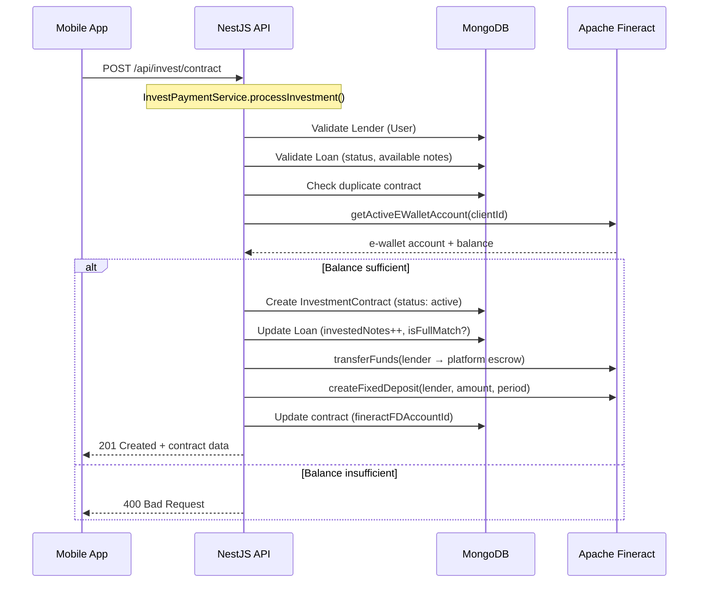

# Investment Flow — Architecture Reference

> Technical architecture for the P2P investment pipeline.
> Covers payment flow, Fineract integration, and error handling.

---

## Payment Pipeline



---

## Fineract Integration Points

| Operation | Fineract API | Service |
|-----------|-------------|---------|
| Check balance | `GET /savingsaccounts/{id}` | `FineractSavingsService.getSavingsAccountDetails()` |
| Find e-wallet | `GET /clients/{id}/accounts` | `FineractSavingsService.getActiveEWalletAccount()` |
| Transfer funds | `POST /accounttransfers` | `FineractSavingsService.transferFunds()` |
| Create FD | `POST /fixeddepositaccounts` | `FineractFDService.createFixedDeposit()` |
| FD interest rate | `GET /fixeddepositproducts` | `FineractFDService.getFDProductAnnualRate()` |
| FD product config | `GET /fixeddepositproducts/{id}` | `FineractFDService.getFDProductConfig()` |

### Wallet Type Detection

FD accounts created via investment MUST NOT appear as payment wallets. Detection logic:

```typescript
// fineract-savings.service.ts → getWalletType()
depositType.id === 100 → 'e_wallet'      // Regular savings
depositType.id === 200 → 'fixed_deposit'  // FD (investment)
depositType.id === 300 → 'recurring_deposit'
```

---

## Schedule Calculation — FD Compound Interest

> ⚠️ **IMPORTANT**: Lãi nhà đầu tư tính theo **FD Compound Interest** (lãi kép gộp), **KHÔNG phải** PMT declining balance.
> Tham số tính lãi được lấy **động** từ cấu hình sản phẩm FD trên Fineract.

### 1. Lấy cấu hình FD Product

```typescript
// FineractFDService.getFDProductConfig(shortName)
// → Fineract API: GET /fixeddepositproducts/{id}
{
  annualInterestRate: 15,        // từ activeChart.chartSlabs[0].annualInterestRate
  compoundingPeriod: 'Monthly',  // interestCompoundingPeriodType.value
  postingPeriod: 'Monthly',      // interestPostingPeriodType.value
  calculationType: 'Daily Balance', // interestCalculationType.value
  daysInYear: 365,               // interestCalculationDaysInYearType.id
  inMultiplesOf: 1000,           // currency.inMultiplesOf (làm tròn)
}
```

### 2. Resolve lãi suất

```
1. loan.productId → GET /loanproducts/{id} → shortName (e.g., "PVHP")
2. FineractFDService.getFDProductConfig(shortName) → annualInterestRate
3. Fallback: loan.monthlyRatePercent × 12
```

### 3. Công thức tính lãi mỗi kỳ

**Daily Balance** (tính theo ngày thực):
```
periodInterest = compoundedBalance × (annualRate / 100) / 365 × daysInMonth
```

**Monthly Compounding** (simplified):
```
periodInterest = compoundedBalance × (annualRate / 100) / 12
```

### 4. Schedule Structure (FD model)

| Kỳ | Gốc | Lãi | Tổng | Ghi chú |
|----|-----|-----|------|---------|
| 1 → n-1 | **0** | compound interest | interest only | Gốc giữ nguyên, lãi gộp vào balance |
| n (đáo hạn) | **capital** | final interest | capital + interest | Trả gốc + lãi cuối |

- **compoundedBalance** tăng mỗi kỳ: `balance += periodInterest`
- Kỳ sau lãi tính trên balance mới (lãi kép)

### 5. Ví dụ: 500.000đ, 15%/năm, 12 tháng

```
Kỳ 1:  balance=500k  → interest = 500k × 15% / 365 × 31 = 6k  → balance=506k
Kỳ 2:  balance=506k  → interest = 506k × 15% / 365 × 28 = 6k  → balance=512k
...
Kỳ 12: balance=575k  → interest = 6k + principal=500k         → total=506k
─────────────────────────────────────────────────────────────
Tổng nhận: ~581.000đ  |  Lợi nhuận: ~81.000đ  (match Mifos FD)
```

### 6. Code Reference

```
InvestmentContractService.getSchedulePreview()
  └── FineractFDService.getFDProductConfig(shortName)
       └── GET /fixeddepositproducts/{id}
            → annualInterestRate, compoundingPeriod, daysInYear, ...
```

---

## Error Handling Strategy

| Step | On Failure | Recovery |
|------|-----------|----------|
| Validate lender/loan | Throw 400/404 | Client retries |
| Create contract | Throw 500 | No side effects |
| Transfer funds | **Log warning, continue** | Contract created but unfunded → manual retry |
| Create FD | **Log warning, continue** | Contract created without FD → manual retry |

> ⚠️ **Known Design Decision**: Fund transfer and FD creation failures are non-blocking.
> The contract is still created. This prevents partial state but requires admin monitoring.

---

## Configuration

```yaml
# config/default.yaml or .env
invest:
  baseUnitPrice: 500000          # VND per note
defaults:
  platformClientId: 1            # Fineract client ID for escrow account
  officeId: 1                    # Fineract office ID
```
