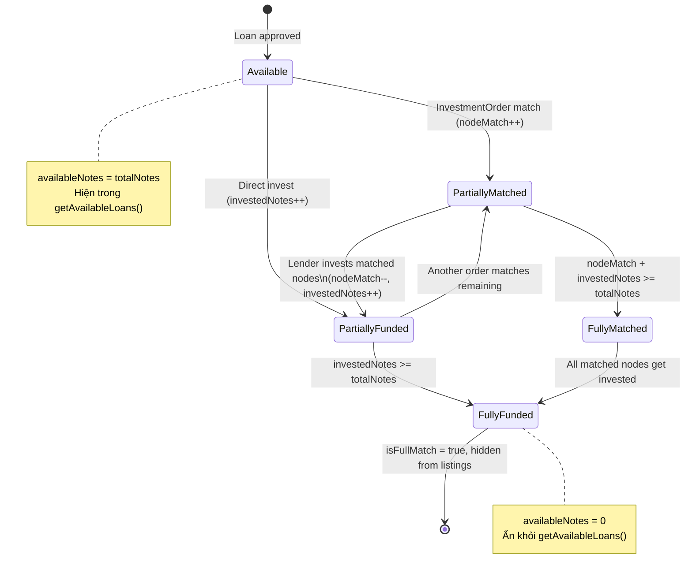

# Investment Domain — Glossary & Concepts

> Canonical reference for investment node matching and investing in P2P Lending.
> All agents, skills, and workflows MUST use these definitions consistently.

---

## Core Entities

| Entity | Schema | Description |
|--------|--------|-------------|
| **LoanApplication** | `loan-application.schema.ts` | Khoản vay đã phê duyệt. Chứa `capital`, `periodMonth`, `totalNotes`, `nodeMatch`, `investedNotes`, `isFullMatch`. |
| **InvestmentOrder** | `investment-order.schema.ts` | Lệnh đặt đầu tư (waiting room). Lender đặt tiêu chí → hệ thống auto-match → **giữ chỗ** (nodeMatch). |
| **InvestmentContract** | `investment-contract.schema.ts` | Hợp đồng ký quỹ đầu tư. Lender đã **chuyển tiền thật** → tạo Fixed Deposit trên Fineract. |

---

## Node Terminology

```
totalNotes = ⌈loan.capital / baseUnitPrice⌉     (e.g., 37M / 500K = 74 notes)
baseUnitPrice = 500,000 VND                       (configurable via invest.baseUnitPrice)
```

### 3 loại Node trên mỗi LoanApplication

| Field | Ý nghĩa | Thời điểm tăng |
|-------|---------|-----------------|
| `nodeMatch` | Số node đã **giữ chỗ** (reserved) bởi InvestmentOrder auto-matching | Khi `InvestService.createOrderWithMatching()` tìm thấy loan phù hợp |
| `investedNotes` | Số node đã **chuyển tiền thật** (funded) qua InvestmentContract | Khi `InvestmentContractService.createContract()` hoàn tất |
| `isFullMatch` | `true` khi `nodeMatch + investedNotes >= totalNotes` | Cập nhật mỗi khi nodeMatch hoặc investedNotes thay đổi |

### Available Notes Calculation

```
availableNotes = totalNotes - nodeMatch - investedNotes
```

Khi `availableNotes <= 0` → khoản vay **không còn hiện** trong danh sách đầu tư.

---

## Node Counting Rules

### Rule 1: Giữ chỗ rồi đầu tư (cùng 1 người)

> Khi lender A **giữ chỗ** 5 nodes (qua InvestmentOrder) rồi **đầu tư** 5 nodes đó →
> **Tính là 5 nodes** (không phải 10).

**Logic**: Khi tạo contract từ InvestmentOrder, `investedNotes += numNotes` nhưng `nodeMatch` phải `-= numNotes` tương ứng. Cùng 1 slot, chuyển từ "giữ chỗ" sang "đã đầu tư".

### Rule 2: Giữ chỗ và đầu tư (khác người)

> Lender A **giữ chỗ** 5 nodes. Lender B **đầu tư trực tiếp** 3 nodes (không qua Order) →
> **Tính là 8 nodes** bị chiếm. `availableNotes = totalNotes - 5 - 3`.

**Logic**: `nodeMatch` (5 từ A) + `investedNotes` (3 từ B) = 8 nodes. Hai slot khác nhau, hai lender khác nhau.

### Rule 3: Available = Total - Matched - Invested

```
totalNotes:     74
nodeMatch:       5  (Lender A giữ chỗ)
investedNotes:   3  (Lender B đã rót vốn)
────────────────────
availableNotes: 66  (còn trống cho đầu tư/giữ chỗ tiếp)
```

---

## State Diagram



---

## API Endpoints

| Method | Path | Service | Action |
|--------|------|---------|--------|
| `GET` | `/api/invest/available-loans` | `InvestService.getAvailableLoans()` | Liệt kê loans có `availableNotes > 0` |
| `POST` | `/api/invest/investment-order` | `InvestService.createOrderWithMatching()` | Tạo lệnh + auto-match → tăng `nodeMatch` |
| `POST` | `/api/invest/contract` | `InvestPaymentService.processInvestment()` | Đầu tư trực tiếp → tăng `investedNotes` |
| `POST` | `/api/invest/schedule-preview` | `InvestmentContractService.getSchedulePreview()` | Preview lịch nhận tiền (FD compound interest, config lấy động từ Fineract) |

> **Note**: `getSchedulePreview()` gọi `FineractFDService.getFDProductConfig(shortName)` để lấy cấu hình tính lãi (compounding, daysInYear, rate) rồi tính FD compound interest. Xem chi tiết tại `invest-architecture.md`.

---

## File Map

```
server_do_an_new/src/modules/invest/
├── invest.service.ts                  # Order CRUD + auto-matching + getAvailableLoans
├── invest-payment.service.ts          # Full payment flow (validate → transfer → FD)
├── investment-contract.service.ts     # Contract CRUD + schedule calculation
├── matching.service.ts                # Purpose matching + node calculation
├── invest.controller.ts              # REST API endpoints
├── schemas/
│   ├── investment-order.schema.ts    # InvestmentOrder (waiting room)
│   └── investment-contract.schema.ts # InvestmentContract (funded)
└── dto/
    ├── create-investment-order.dto.ts
    └── update-investment-order.dto.ts
```
