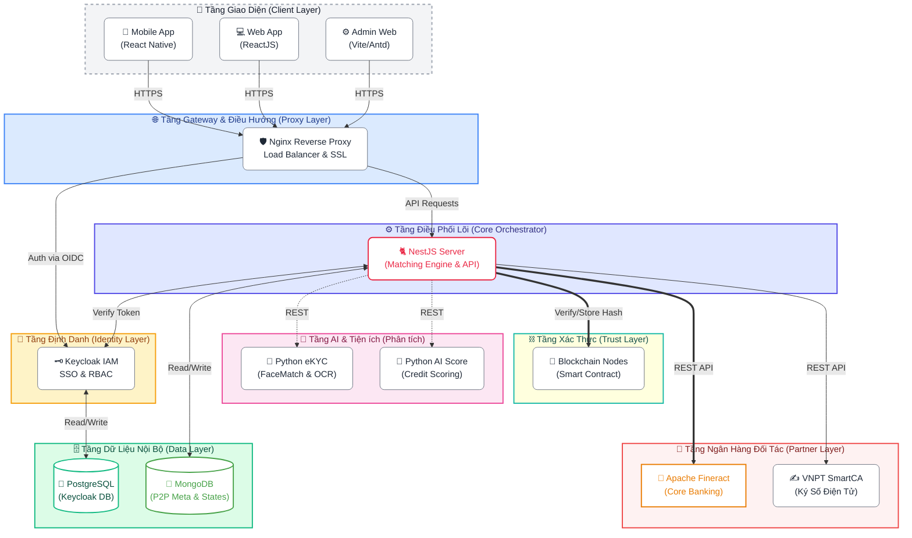

# Tài liệu Kiến trúc Hệ thống P2P Lending (Siêu Chi tiết)

Tài liệu này mô tả chi tiết kiến trúc phần mềm, luồng giao tiếp và các thành phần cấu thành hệ thống P2P Lending, bao gồm các thành phần nội bộ (Internal) và các kết nối với đối tác bên ngoài (Partners).

---

## 1. Sơ đồ Tổng quan Hệ thống (System Landscape)

Hệ thống được thiết kế theo kiến trúc **Microservices Orchestration**, trong đó NestJS đóng vai trò là "nhạc trưởng" điều phối toàn bộ luồng nghiệp vụ.

---

## 2. Chi tiết các thành phần chính

### 2.1. Tầng Nginx (Reverse Proxy & API Gateway)
- **Vai trò**: Cổng vào duy nhất của hệ thống.
- **Nhiệm vụ chính**:
    - **SSL Termination**: Quản lý chứng chỉ HTTPS.
    - **Routing**: Phân luồng request đến Web Admin (Port 5174), Client Web (Port 5173/3000), hoặc NestJS API (Port 3001).
    - **Security**: Chống các cuộc tấn công cơ bản (DDoS, Rate Limit), ẩn IP thật của các server hạ tầng.
    - **CORS Management**: Kiểm soát quyền truy cập từ các domain khác nhau.

### 2.2. Keycloak (Identity & Access Management - IAM)
- **Vai trò**: Quản lý định danh và quyền truy cập tập trung.
- **Tính năng**:
    - **SSO (Single Sign-On)**: Đăng nhập một lần cho cả hệ thống.
    - **OIDC/SAML**: Cung cấp token JWT cho NestJS server xác thực.
    - **Realm Management**: Quản lý tách biệt môi trường (vú dụ: `fineract` realm).
    - **RBAC**: Quản lý quyền của Admin, Staff và Client.

### 2.3. NestJS Core Server (Orchestrator)
Đây là "trái tim" của hệ thống, điều phối mọi nghiệp vụ P2P:
- **P2P Matching Engine**: Logic ghép nối giữa Lệnh đầu tư (Investment Order) và Hồ sơ vay (Loan Application).
- **Fineract Bridge**: Chuyển đổi logic P2P sang các nghiệp vụ ngân hàng tương ứng (tạo tài khoản, giải ngân, trả gốc lãi) trên Fineract.
- **Workflow Controller**: Quản lý luồng hồ sơ từ Đăng ký -> eKYC -> AI Scoring -> Phê duyệt -> Ký số -> Giải ngân.
- **State Management**: Lưu trữ trạng thái trung gian, cấu hình hệ thống và lịch sử khớp lệnh vào MongoDB.

### 2.4. Python Services (EKYC & AI Score)
Sử dụng thế mạnh của Python trong xử lý dữ liệu và AI:
- **EKYC Service**:
    - **OCR**: Trích xuất thông tin từ CCCD/CMND.
    - **Face Matching**: So khớp khuôn mặt người dùng với ảnh trên giấy tờ.
- **AI Scoring Service**: Tính toán điểm tín dụng dựa trên hành vi và dữ liệu hồ sơ để hỗ trợ ra quyết định cho vay.

### 2.5. Blockchain Layer (Internal)
- **Vai trò**: Đảm bảo tính minh bạch và không thể chối bỏ của các hợp đồng đầu tư.
- **Nghiệm vụ**:
    - **Smart Contract Verification**: Kiểm tra tính hợp lệ của các điều khoản hợp đồng.
    - **Digital Evidence**: Lưu trữ Hash của hợp đồng và giao dịch khớp lệnh lên chuỗi khối để phục vụ đối soát, tránh sửa đổi dữ liệu trái phép.

---

## 3. Thành phần Đối tác (Partners)

### 3.1. Apache Fineract (Core Banking)
- **Mô tả**: Đây là hệ thống của Ngân hàng đối tác.
- **Tương tác**: Hệ thống nội bộ P2P gọi sang Fineract qua REST API để thực hiện các thao tác chuyên sâu về kế toán ngân hàng:
    - Quản lý danh mục khoản vay (Loan Portfolio).
    - Quản lý tài khoản thanh toán (Savings/E-Wallet).
    - Tính toán lịch trả nợ (Repayment Schedule).
- **Lưu ý**: DB MySQL của Fineract nằm ngoài phạm vi quản lý trực tiếp của hệ thống P2P.

### 3.2. VNPT SmartCA
- **Vai trò**: Cung cấp giải pháp ký số từ xa (Remote Signing).
- **Luồng**: Khi hồ sơ được phê duyệt, NestJS gọi SmartCA để người dùng xác nhận ký hợp đồng tín dụng số thông qua App VNPT SmartCA.

---

## 4. Kiến trúc Dữ liệu (Internal Data Topology)

Hệ thống chỉ tập trung quản lý 2 thực thể DB chính:

1.  **MongoDB (P2P Database)**:
    - **Collections**: `investment_orders`, `loan_applications`, `matched_nodes`, `document_types`, `kyc_records`, v.v.
    - **Đặc điểm**: Lưu trữ dữ liệu phi cấu trúc, linh hoạt cho việc mở rộng các thuộc tính hồ sơ và logic ghép lệnh real-time.
2.  **PostgreSQL (Keycloak Persistence)**:
    - Lưu trữ thông tin User, Password Hash, Roles, Clients và Sessions.

---

## 5. Luồng Dữ liệu Điển hình (Loan-Investment Matching)

1.  **Giai đoạn 1**: Người vay gửi yêu cầu -> NestJS gọi EKYC/AIScore -> Nếu đạt, tạo Hồ sơ chờ khớp trên MongoDB.
2.  **Giai đoạn 2**: Nhà đầu tư tạo lệnh đầu tư -> Lưu MongoDB.
3.  **Giai đoạn 3 (Matching Engine)**: NestJS tìm khớp giữa Lệnh và Hồ sơ -> Tạo `matched_nodes` trên MongoDB.
4.  **Giai đoạn 4**: Sau khi khớp 100%, NestJS gọi sang VNPT SmartCA để ký hợp đồng.
5.  **Giai đoạn 5**: Hợp đồng được ký -> NestJS gọi Blockchain để lưu hash xác thực.
6.  **Giai đoạn 6**: NestJS lệnh cho Fineract thực hiện giải ngân (Disbursement) từ tài khoản nhà đầu tư sang người vay.

---
*Tài liệu này được cập nhật vào: 21/04/2026*
