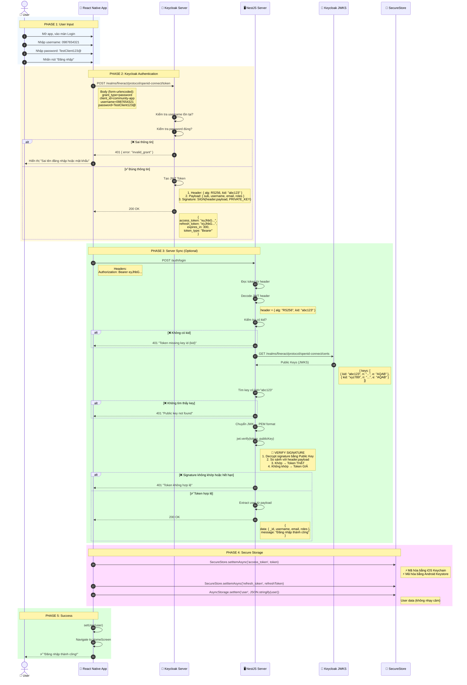
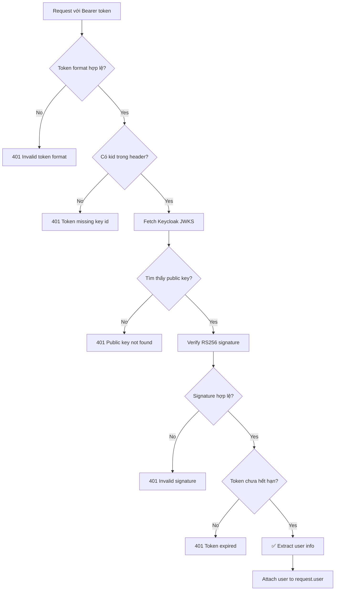

# Auth Module Documentation

## Tổng quan

Module Authentication sử dụng **Keycloak** làm Identity Provider với JWT RS256 tokens.

---

## 🔄 Full Login Flow (Sequence Diagram)



### Giải thích các Phase

| Phase | Mô tả | Thành phần liên quan |
|-------|-------|---------------------|
| **1. User Input** | User nhập username/password trên màn hình Login | React Native App |
| **2. Keycloak Auth** | App gửi credentials đến Keycloak, nhận JWT token | App ↔ Keycloak |
| **3. Server Sync** | App gửi token đến Server để sync user data + Server verify token bằng Public Key | App ↔ Server ↔ Keycloak JWKS |
| **4. Secure Storage** | Lưu tokens vào SecureStore (mã hóa) | App ↔ SecureStore |
| **5. Success** | Cập nhật UI, chuyển đến màn Home | App ↔ User |

### Cơ chế xác thực JWT (RS256)

```
┌──────────────────────────────────────────────────────────────────┐
│                        JWT TOKEN                                 │
│  ┌───────────────┐   ┌───────────────┐   ┌───────────────────┐  │
│  │    HEADER     │ . │    PAYLOAD    │ . │    SIGNATURE      │  │
│  │ alg: RS256    │   │ sub: user-id  │   │ ENCRYPT(          │  │
│  │ kid: abc123   │   │ username: ... │   │   header.payload, │  │
│  │               │   │ exp: ...      │   │   PRIVATE_KEY     │  │
│  └───────────────┘   └───────────────┘   │ )                 │  │
│         │                   │            └───────────────────┘  │
│         │                   │                     │              │
│         └───────────────────┴─────────────────────┘              │
│                             │                                    │
│                      Base64 encoded                              │
└──────────────────────────────────────────────────────────────────┘

Server Verify:
1. Lấy kid từ header → "abc123"
2. Download Public Key từ Keycloak JWKS (có kid = "abc123")
3. DECRYPT(signature, PUBLIC_KEY) → result
4. So sánh result với header.payload
5. Khớp → ✅ Token thật    |    Không khớp → ❌ Token giả
```

---

## 🔑 Data Types & Fields

### User

| Field | Type | Required | Mô tả |
|-------|------|----------|-------|
| `_id` | `string` | ✅ | ID người dùng (= Keycloak sub) |
| `keycloakUserId` | `string` | ✅ | Keycloak user ID (UUID) |
| `username` | `string` | ✅ | Tên đăng nhập (số điện thoại) |
| `email` | `string` | ❌ | Email (optional) |
| `name` | `string` | ❌ | Tên hiển thị |
| `roles` | `string[]` | ❌ | Danh sách roles từ Keycloak |
| `fineractClientId` | `string` | ❌ | ID client trong Fineract (nếu có) |

```typescript
interface User {
    _id: string;
    keycloakUserId: string;
    username: string;
    email?: string;
    name?: string;
    roles?: string[];
    fineractClientId?: string;
}
```

---

### KeycloakTokenResponse

Response từ Keycloak `/token` endpoint:

| Field | Type | Mô tả |
|-------|------|-------|
| `access_token` | `string` | JWT access token (RS256) |
| `refresh_token` | `string` | JWT refresh token |
| `expires_in` | `number` | Thời gian hết hạn access token (seconds) |
| `refresh_expires_in` | `number` | Thời gian hết hạn refresh token (seconds) |
| `token_type` | `string` | Loại token ("Bearer") |
| `scope` | `string` | OAuth2 scopes |

```typescript
interface KeycloakTokenResponse {
    access_token: string;
    refresh_token: string;
    expires_in: number;
    refresh_expires_in: number;
    token_type: string;
    scope: string;
}
```

---

### KeycloakTokenPayload

Decoded JWT payload từ Keycloak access_token:

| Field | Type | Mô tả |
|-------|------|-------|
| `sub` | `string` | Subject - Keycloak user ID |
| `preferred_username` | `string` | Username |
| `email` | `string` | Email |
| `name` | `string` | Full name |
| `given_name` | `string` | First name |
| `family_name` | `string` | Last name |
| `realm_access.roles` | `string[]` | Realm-level roles |
| `fineractClientId` | `string` | Custom attribute: Fineract client ID |
| `iat` | `number` | Issued at (Unix timestamp) |
| `exp` | `number` | Expiration (Unix timestamp) |

```typescript
interface KeycloakTokenPayload {
    sub: string;
    preferred_username: string;
    email?: string;
    name?: string;
    given_name?: string;
    family_name?: string;
    realm_access?: {
        roles: string[];
    };
    fineractClientId?: string;
    iat: number;
    exp: number;
}
```

---

### RegisterData

Data để đăng ký user mới:

| Field | Type | Required | Validation |
|-------|------|----------|------------|
| `username` | `string` | ✅ | Số điện thoại Việt Nam |
| `password` | `string` | ✅ | 12-50 ký tự, có chữ hoa, thường, số, ký tự đặc biệt |
| `email` | `string` | ✅ | Email format hợp lệ |
| `firstName` | `string` | ✅ | Tên |
| `lastName` | `string` | ✅ | Họ |

```typescript
interface RegisterData {
    username: string;
    password: string;
    email: string;
    firstName: string;
    lastName: string;
}
---

## 📝 DTO Validation (class-validator)

> [!NOTE]
> Server sử dụng DTOs với class-validator để validate input. File: `src/auth/dto/auth.dto.ts`

### RegisterDto

```typescript
class RegisterDto {
    @IsString()
    @Matches(/^0[0-9]{9}$/)  // Vietnamese phone number
    username: string;

    @MinLength(12)
    @MaxLength(50)
    @Matches(/^(?=.*[a-z])(?=.*[A-Z])(?=.*\d)(?=.*[^a-zA-Z0-9\s]).+$/)
    password: string;

    @IsEmail()
    email: string;

    @IsOptional()
    firstName?: string;

    @IsOptional()
    lastName?: string;
}
```

### ResetPasswordDto / ChangePasswordDto

```typescript
class ResetPasswordDto {
    @IsString()
    userId: string;

    @MinLength(12) @MaxLength(50)
    newPassword: string;  // Same password rules as RegisterDto
}

class ChangePasswordDto {
    @IsString()
    currentPassword: string;

    @MinLength(12) @MaxLength(50)
    newPassword: string;
}
```

---

## 🔐 Security Features

| Feature | Implementation | File |
|---------|----------------|------|
| **Rate Limiting** | 20 req/min global, 5 req/min login | `app.module.ts`, `auth.controller.ts` |
| **CORS** | Whitelist origins via `CORS_ORIGINS` env | `main.ts` |
| **Helmet** | Security headers (XSS, CSP, etc.) | `main.ts` |
| **Secure Storage** | expo-secure-store for tokens | `storage.service.ts` |
| **No Hardcoded Credentials** | Throw error if not configured | `keycloak.service.ts` |

---

## 🌐 API Endpoints

### Server Endpoints (NestJS)

#### POST `/auth/login`

Đăng nhập với Keycloak token.

**Headers:**
```
Authorization: Bearer <keycloak_access_token>
```

**Response:**
```json
{
    "statusCode": 200,
    "message": "Đăng nhập thành công",
    "data": {
        "_id": "f7a8b9c0-d1e2-3f45-g678-h9i0j1k2l3m4",
        "keycloakUserId": "f7a8b9c0-d1e2-3f45-g678-h9i0j1k2l3m4",
        "username": "0987654321",
        "email": "user@example.com",
        "name": "Nguyen Van A",
        "roles": ["user"]
    },
    "accessToken": "eyJ...",
    "refreshToken": "eyJ..."
}
```

---

#### GET `/auth/me`

Lấy thông tin user từ token.

**Headers:**
```
Authorization: Bearer <keycloak_access_token>
```

**Response:**
```json
{
    "data": {
        "keycloakUserId": "f7a8b9c0-d1e2-3f45-g678-h9i0j1k2l3m4",
        "username": "0987654321",
        "email": "user@example.com",
        "name": "Nguyen Van A",
        "roles": ["user"]
    }
}
```

---

#### GET `/auth/userinfo`

Lấy thông tin chi tiết user từ Keycloak Admin API.

**Headers:**
```
Authorization: Bearer <keycloak_access_token>
```

**Response:**
```json
{
    "data": {
        "keycloakUserId": "f7a8b9c0-d1e2-3f45-g678-h9i0j1k2l3m4",
        "username": "0987654321",
        "email": "user@example.com",
        "name": "Nguyen Van A",
        "roles": ["user"],
        "keycloakDetails": {
            "id": "f7a8b9c0-d1e2-3f45-g678-h9i0j1k2l3m4",
            "username": "0987654321",
            "firstName": "A",
            "lastName": "Nguyen Van",
            "email": "user@example.com",
            "emailVerified": true,
            "enabled": true,
            "createdTimestamp": 1702915200000
        }
    }
}
```

---

#### POST `/auth/logout`

Đăng xuất user.

**Headers:**
```
Authorization: Bearer <keycloak_access_token>
```

**Response:**
```json
{
    "message": "Đăng xuất thành công"
}
```

---

### Keycloak Endpoints (Direct)

#### POST `/realms/{realm}/protocol/openid-connect/token`

Lấy token từ Keycloak.

**Login Request:**
```
Content-Type: application/x-www-form-urlencoded

grant_type=password
client_id=community-app
username=0987654321
password=TestClient123@
```

**Refresh Request:**
```
Content-Type: application/x-www-form-urlencoded

grant_type=refresh_token
client_id=community-app
refresh_token=<refresh_token>
```

**Response:**
```json
{
    "access_token": "eyJhbGciOiJSUzI1NiIsInR5cCIgOiAiSldUIiwia2lkIiA6IC...",
    "refresh_token": "eyJhbGciOiJSUzI1NiIsInR5cCIgOiAiSldUIiwia2lkIiA6IC...",
    "expires_in": 300,
    "refresh_expires_in": 1800,
    "token_type": "Bearer",
    "scope": "openid profile email"
}
```

---

## 🔒 Password Policy

Keycloak yêu cầu mật khẩu phải:

| Tiêu chí | Yêu cầu |
|----------|---------|
| Độ dài | 12-50 ký tự |
| Chữ thường | Ít nhất 1 (a-z) |
| Chữ hoa | Ít nhất 1 (A-Z) |
| Chữ số | Ít nhất 1 (0-9) |
| Ký tự đặc biệt | Ít nhất 1 (!@#$%^&*...) |
| Khoảng trắng | Không được chứa |

**Ví dụ mật khẩu hợp lệ:** `TestClient123@`

---

## 🛡️ Token Validation (DualAuthGuard)

Server validate Keycloak token theo các bước:



---

## 📱 Client Storage

> [!IMPORTANT]
> Tokens được lưu trong **expo-secure-store** (mã hóa trên iOS Keychain / Android Keystore). User data lưu trong AsyncStorage (non-sensitive).

### Storage Architecture

| Data | Storage | Encryption | Platform |
|------|---------|------------|----------|
| `access_token` | SecureStore | ✅ Yes | iOS/Android |
| `refresh_token` | SecureStore | ✅ Yes | iOS/Android |
| `user` | AsyncStorage | ❌ No | All |

> [!NOTE]
> Trên Web, fallback về AsyncStorage vì SecureStore không khả dụng.

### Storage Keys

| Key | Storage | Mô tả |
|-----|---------|-------|
| `secure_access_token` | SecureStore | Keycloak access token (encrypted) |
| `secure_refresh_token` | SecureStore | Keycloak refresh token (encrypted) |
| `@auth/user` | AsyncStorage | User data (JSON serialized) |

### Storage Service Methods

```typescript
class StorageService {
    // Token methods (SecureStore - encrypted)
    saveAccessToken(token: string): Promise<void>
    getAccessToken(): Promise<string | null>
    saveRefreshToken(token: string): Promise<void>
    getRefreshToken(): Promise<string | null>
    saveTokens(accessToken: string, refreshToken: string): Promise<void>
    
    // User methods (AsyncStorage - non-sensitive)
    saveUser(user: User): Promise<void>
    getUser(): Promise<User | null>
    
    // Utility
    clearAll(): Promise<void>
    hasValidSession(): Promise<boolean>
}
```

---

## ⚠️ Error Codes

| HTTP Status | Error | Mô tả |
|-------------|-------|-------|
| 401 | `Missing or invalid authorization header` | Thiếu header Authorization |
| 401 | `Invalid token format` | Token không đúng format JWT |
| 401 | `Token missing key id (kid)` | Token không phải Keycloak RS256 |
| 401 | `Public key not found for token` | Không tìm thấy public key trong JWKS |
| 401 | `Token không hợp lệ hoặc đã hết hạn` | Signature invalid hoặc expired |
| 401 | `invalid_grant` (Keycloak) | Sai username/password |
