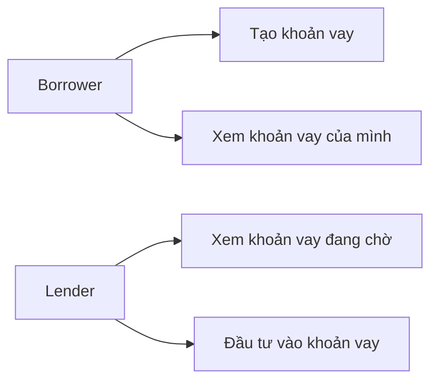
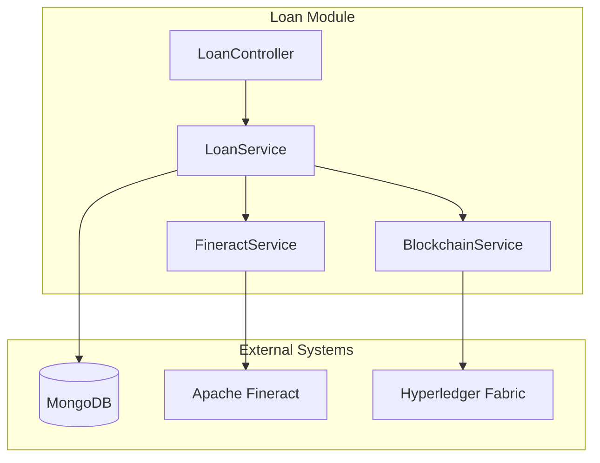
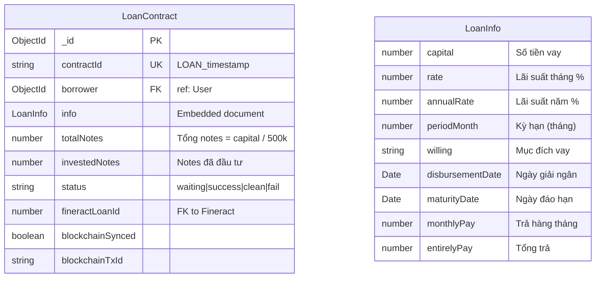
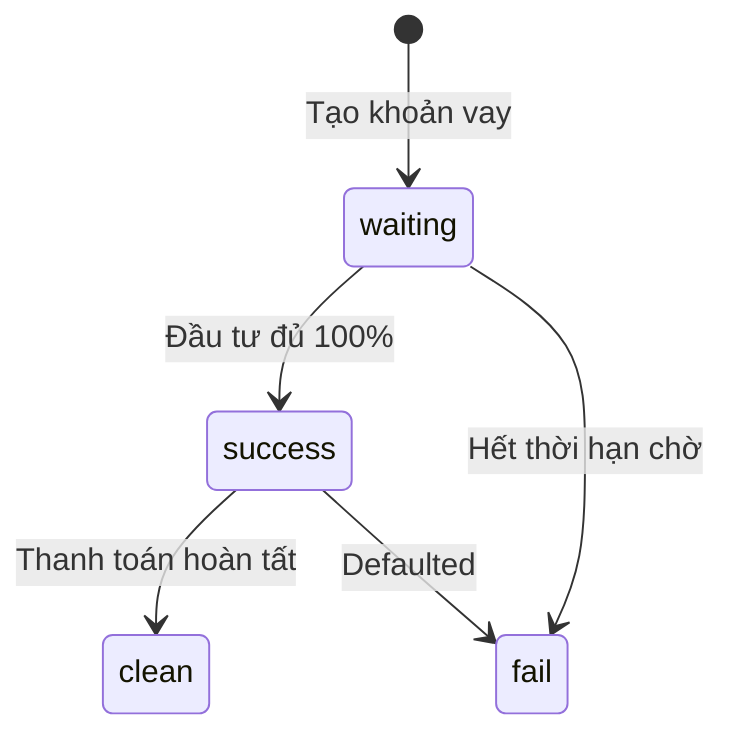
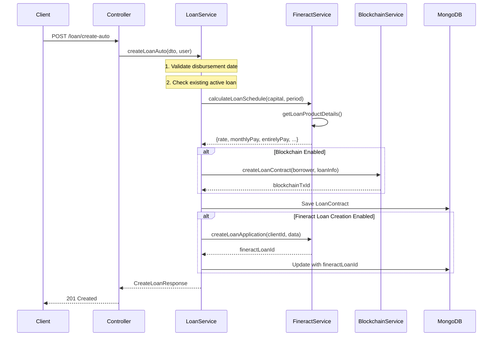
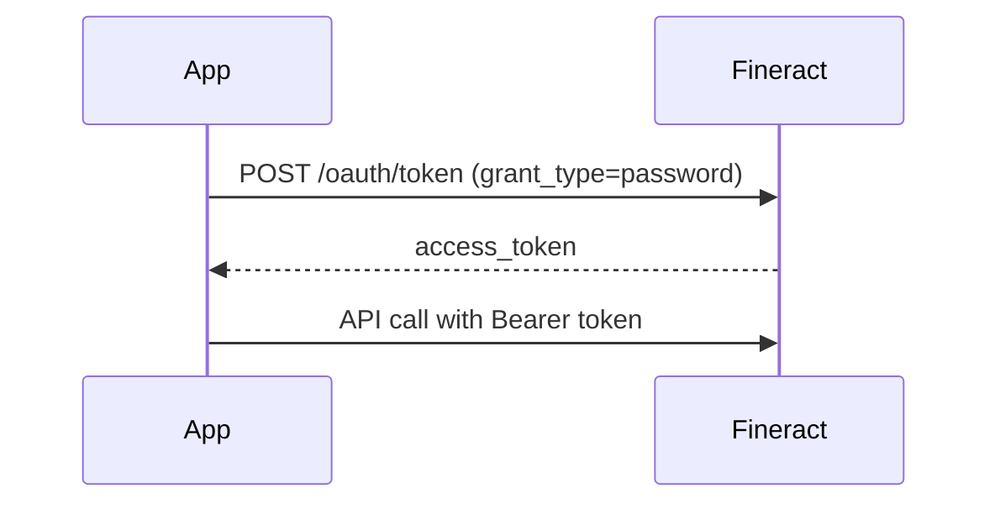

# Module Loan - Tài liệu Kỹ thuật

> Tài liệu mô tả chi tiết kiến trúc, luồng xử lý và cách tích hợp của module Loan trong hệ thống P2P Lending.

## Mục lục

- [Tổng quan](#tổng-quan)
- [Kiến trúc Module](#kiến-trúc-module)
- [Database Schema](#database-schema)
- [API Endpoints](#api-endpoints)
- [Luồng xử lý](#luồng-xử-lý)
- [Tích hợp Fineract](#tích-hợp-fineract)
- [Tích hợp Blockchain](#tích-hợp-blockchain)
- [Client App](#client-app)
- [Cấu hình](#cấu-hình)

---

## Tổng quan

Module Loan là thành phần cốt lõi của hệ thống P2P Lending, xử lý toàn bộ vòng đời khoản vay từ khi tạo đến khi thanh toán hoàn tất.

### Tính năng chính

| Tính năng | Mô tả |
|-----------|-------|
| **Tạo khoản vay** | Borrower tạo yêu cầu vay với số tiền, kỳ hạn, mục đích |
| **Kiểm tra lãi suất** | Preview lãi suất trước khi tạo (public API) |
| **Quản lý khoản vay** | Xem danh sách, chi tiết, thống kê khoản vay |
| **Tích hợp Fineract** | Đồng bộ với Apache Fineract để quản lý loan lifecycle |
| **Tích hợp Blockchain** | Ghi nhận giao dịch lên Hyperledger Fabric |

### Roles & Permissions



---

## Kiến trúc Module

### Cấu trúc thư mục Server

```
server_do_an/src/loan/
├── dto/                          # Data Transfer Objects
│   ├── check-rate.dto.ts         # DTO kiểm tra lãi suất
│   ├── create-loan.dto.ts        # DTO tạo khoản vay
│   └── index.ts
├── guards/                       # Authorization Guards
│   ├── borrower.guard.ts         # Guard cho Borrower
│   └── lender.guard.ts           # Guard cho Lender
├── schemas/                      # MongoDB Schemas
│   └── loan-contract.schema.ts   # Schema LoanContract
├── services/                     # Business Services
│   ├── blockchain.service.ts     # Tích hợp Hyperledger Fabric
│   ├── fineract.service.ts       # Tích hợp Apache Fineract
│   └── index.ts
├── loan.controller.ts            # REST API Controller
├── loan.service.ts              # Main Business Logic
├── loan.module.ts               # NestJS Module
└── index.ts
```

### Dependency Diagram



---

## Database Schema

### LoanContract Collection



### Loan Status Flow



---

## API Endpoints

### Public Endpoints

| Method | Endpoint | Mô tả |
|--------|----------|-------|
| `POST` | `/loan/rate` | Kiểm tra lãi suất (preview) |

### Borrower Endpoints (Yêu cầu role `Borrower`)

| Method | Endpoint | Mô tả |
|--------|----------|-------|
| `POST` | `/loan/create-auto` | Tạo khoản vay mới |
| `GET` | `/loan/me` | Lấy danh sách khoản vay của tôi |
| `GET` | `/loan/:id` | Xem chi tiết khoản vay |
| `GET` | `/loan/:id/statistics` | Thống kê khoản vay |

### Lender Endpoints (Yêu cầu role `Lender`)

| Method | Endpoint | Mô tả |
|--------|----------|-------|
| `GET` | `/loan/current/waiting` | Lấy khoản vay đang chờ đầu tư |

### Request/Response Examples

#### POST /loan/rate - Kiểm tra lãi suất

**Request:**
```json
{
    "capital": 10000000,
    "periodMonth": 12,
    "disbursementDate": "2025-01-15"
}
```

**Response:**
```json
{
    "statusCode": 200,
    "message": "Thông tin lãi suất",
    "data": {
        "rate": 5.5,
        "annualRate": 66,
        "monthlyPrincipalPay": 833333,
        "monthlyInterestPay": 550000,
        "monthlyPay": 1383333,
        "entirelyPay": 16599996,
        "capital": 10000000,
        "periodMonth": 12,
        "disbursementDate": "2025-01-15",
        "maturityDate": "2026-01-15",
        "interestType": "Flat",
        "rateSource": "Fineract Loan Product"
    }
}
```

#### POST /loan/create-auto - Tạo khoản vay

**Request:**
```json
{
    "capital": 10000000,
    "periodMonth": 12,
    "willing": "Tiêu dùng cá nhân",
    "disbursementDate": "2025-01-15"
}
```

**Response:**
```json
{
    "statusCode": 201,
    "message": "Tạo khoản vay thành công",
    "data": {
        "contractId": "LOAN_1703123456789",
        "info": {
            "capital": 10000000,
            "rate": 5.5,
            "annualRate": 66,
            "periodMonth": 12,
            "willing": "Tiêu dùng cá nhân",
            "disbursementDate": "2025-01-15T00:00:00.000Z",
            "maturityDate": "2026-01-15T00:00:00.000Z",
            "monthlyPay": 1383333,
            "entirelyPay": 16599996,
            "interestType": "Flat"
        },
        "status": "waiting",
        "totalNotes": 20,
        "fineractLoanId": 123,
        "blockchainSynced": true
    }
}
```

---

## Luồng xử lý

### Tạo khoản vay (createLoanAuto)



### Tính toán lãi suất

> [!IMPORTANT]
> Lãi suất được lấy từ **Fineract Loan Product**, KHÔNG tính toán local.

Hệ thống hỗ trợ 2 loại lãi suất từ Fineract:

| Loại | Công thức | Mô tả |
|------|-----------|-------|
| **Flat** | `Interest = Capital × Rate × Period` | Lãi cố định mỗi tháng |
| **Declining Balance** | EMI formula | Lãi giảm dần theo gốc còn lại |

**Flat Interest Calculation:**
```typescript
monthlyPrincipalPay = capital / periodMonth;
monthlyInterestPay = capital * monthlyRate / 100;
monthlyPay = monthlyPrincipalPay + monthlyInterestPay;
entirelyPay = monthlyPay * periodMonth;
```

**Declining Balance (EMI):**
```typescript
r = monthlyRate / 100;
monthlyPay = capital * r * Math.pow(1 + r, period) / (Math.pow(1 + r, period) - 1);
```

---

## Tích hợp Fineract

### Tổng quan

[Apache Fineract](https://fineract.apache.org/) là nền tảng core banking mã nguồn mở, được sử dụng để:

- Lấy thông tin Loan Product (lãi suất, điều kiện)
- Tạo và quản lý loan lifecycle
- Theo dõi repayment schedule
- Xử lý thanh toán

### Các phương thức chính

| Method | Mô tả |
|--------|-------|
| `getLoanProductDetails()` | Lấy chi tiết Loan Product (cached 1h) |
| `getInterestRateFromProduct()` | Lấy lãi suất từ product |
| `calculateLoanSchedule()` | Tính toán schedule dựa trên rate |
| `createLoanApplication()` | Tạo loan trên Fineract |
| `approveLoan()` | Approve loan |
| `disburseLoan()` | Giải ngân |
| `makeRepayment()` | Ghi nhận thanh toán |
| `getOutstandingBalance()` | Lấy dư nợ còn lại |

### Authentication

Fineract sử dụng OAuth2 với flow:



---

## Tích hợp Blockchain

### Tổng quan

Hyperledger Fabric được sử dụng để:

- Ghi nhận loan contract immutable
- Tracking trạng thái khoản vay
- Audit trail cho các giao dịch

> [!NOTE]
> Blockchain là **optional**. Nếu disabled hoặc không kết nối được, hệ thống vẫn hoạt động bình thường với MongoDB.

### Các phương thức chính

| Method | Mô tả |
|--------|-------|
| `createLoanContract()` | Tạo contract trên blockchain |
| `updateLoanStatus()` | Cập nhật status |
| `updateInvestmentProgress()` | Cập nhật tiến độ đầu tư |
| `queryLoanContract()` | Query loan by ID |
| `queryWaitingLoans()` | Query các loan đang chờ |
| `syncLoanWithFineract()` | Sync data với Fineract |

### Chaincode Functions

```javascript
// p2p-lending-contract.js
createLoanContract(loanId, borrowerJson, loanInfoJson, fineractLoanId)
updateLoanStatus(loanId, status)
updateInvestmentProgress(loanId, investedNotes)
queryLoanContract(loanId)
queryWaitingLoans()
queryLoansByBorrower(borrowerId)
```

---

## Client App

### Cấu trúc thư mục

```
client_app/src/
├── screens/loan/
│   ├── LoanCreateScreen.tsx      # Màn hình tạo khoản vay
│   └── LoanListScreen.tsx        # Danh sách khoản vay
├── services/loan/
│   └── loan.api.ts               # API service
└── types/
    └── loan.types.ts             # TypeScript definitions
```

### API Service

```typescript
// loan.api.ts
export const loanApi = {
    checkRate(data: CheckRateRequest): Promise<RateCheckResponse>,
    createLoan(data: CreateLoanRequest): Promise<CreateLoanResponse>,
    getMyLoans(): Promise<LoanContract[]>,
    getLoanDetail(loanId: string): Promise<LoanContract>,
    getLoanStatistics(loanId: string): Promise<LoanStatistics>,
    getWaitingLoans(): Promise<LoanContract[]>,
};
```

### Mục đích vay có sẵn

```typescript
export const LOAN_WILLINGS = [
    'Tiêu dùng cá nhân',
    'Mua sắm',
    'Sửa chữa nhà cửa',
    'Y tế',
    'Giáo dục',
    'Kinh doanh nhỏ',
    'Du lịch',
    'Cưới hỏi',
    'Khác',
];
```

### Kỳ hạn vay có sẵn

| Giá trị | Hiển thị |
|---------|----------|
| 3 | 3 tháng |
| 6 | 6 tháng |
| 9 | 9 tháng |
| 12 | 12 tháng |
| 18 | 18 tháng |
| 24 | 24 tháng |

---

## Cấu hình

### Environment Variables

```bash
# === FINERACT ===
FINERACT_ENABLED=true
FINERACT_LOAN_CREATION=true
FINERACT_BASE_URL=http://localhost:8443
FINERACT_TENANT_ID=default
FINERACT_USERNAME=mifos
FINERACT_PASSWORD=password
FINERACT_P2P_LOAN_PRODUCT_ID=1
FINERACT_OAUTH_CLIENT_ID=community-app
FINERACT_OAUTH_CLIENT_SECRET=123

# === BLOCKCHAIN ===
BLOCKCHAIN_ENABLED=true
BLOCKCHAIN_CHANNEL=mychannel
BLOCKCHAIN_CHAINCODE=p2plending
BLOCKCHAIN_CONNECTION_PROFILE=/path/to/connection.json
BLOCKCHAIN_WALLET_PATH=/path/to/wallet
BLOCKCHAIN_ADMIN_IDENTITY=admin

# === LOAN CONFIG ===
TIMEZONE=Asia/Ho_Chi_Minh
MAX_DISBURSEMENT_DAYS=30
NOTE_UNIT_PRICE=500000
```

### Feature Flags

| Flag | Default | Mô tả |
|------|---------|-------|
| `FINERACT_ENABLED` | `false` | Bật/tắt tích hợp Fineract |
| `FINERACT_LOAN_CREATION` | `false` | Cho phép tạo loan trên Fineract |
| `BLOCKCHAIN_ENABLED` | `false` | Bật/tắt tích hợp Blockchain |

---

## Xử lý lỗi

### Các lỗi thường gặp

| HTTP Code | Error | Mô tả |
|-----------|-------|-------|
| 400 | `BadRequestException` | Dữ liệu không hợp lệ |
| 403 | `ForbiddenException` | Không có quyền truy cập |
| 404 | `NotFoundException` | Không tìm thấy khoản vay |
| 409 | `ConflictException` | Đã có khoản vay đang hoạt động |

### Error Messages

```typescript
// Validation errors
'Số tiền vay phải từ 1,000,000 VND'
'Ngày giải ngân không hợp lệ'
'Ngày giải ngân không được ở quá khứ'
'Ngày giải ngân không được quá 30 ngày kể từ hôm nay'

// Business errors
'Bạn đã có khoản vay đang hoạt động. Vui lòng thanh toán trước khi tạo khoản vay mới.'
'Không tìm thấy khoản vay'
```

---

## Best Practices

> [!TIP]
> **Khi phát triển tính năng mới:**
> 1. Luôn validate input ở DTO level
> 2. Sử dụng Guards để kiểm tra quyền
> 3. Log đầy đủ các bước quan trọng
> 4. Handle errors gracefully - không để crash service

> [!CAUTION]
> **Lưu ý quan trọng:**
> - Lãi suất PHẢI lấy từ Fineract Loan Product
> - KHÔNG tính toán lãi suất local
> - Blockchain là optional - code phải hoạt động khi disabled
