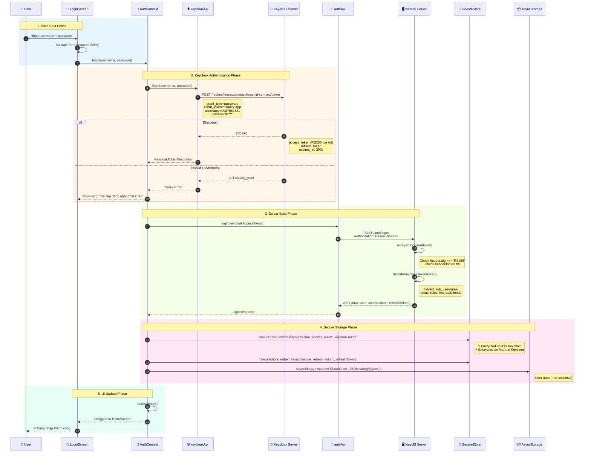
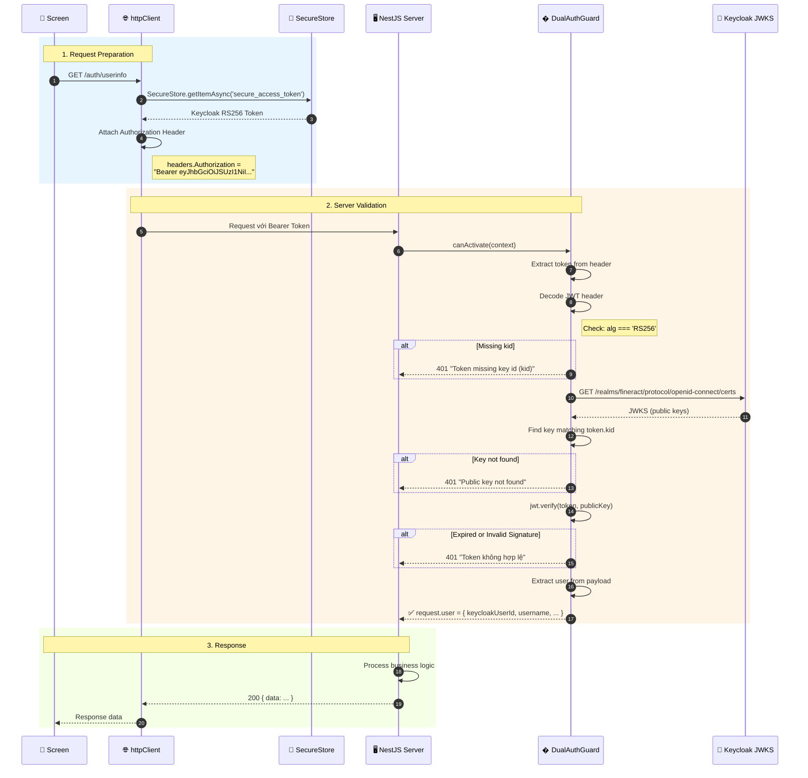
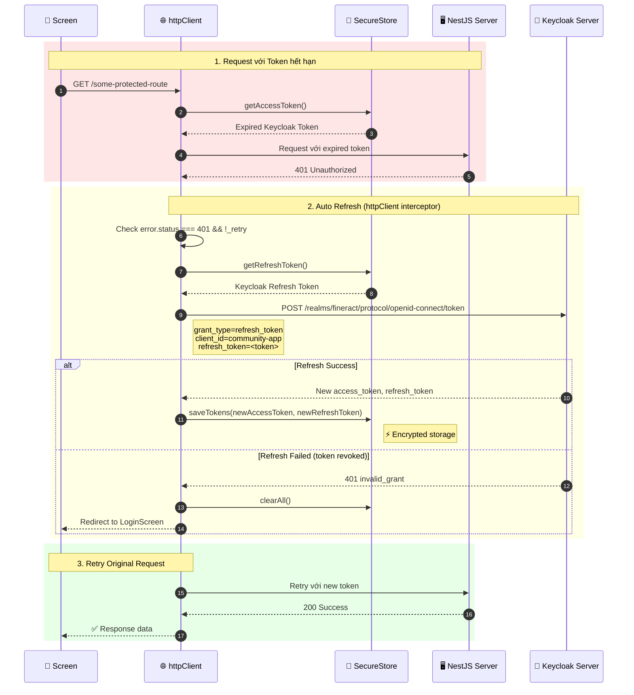

# Workflow & Design Patterns

## Tổng quan

Dự án P2P sử dụng kiến trúc Client-Server với:
- **Server**: NestJS + Keycloak (Authentication)
- **Client**: React Native (Expo)

---

## 🔄 Authentication Flow

### Login Flow (Chi tiết)



---

### API Request Flow (Sau khi đăng nhập)



---

### Token Refresh Flow (Khi token hết hạn)



---

## 📝 Quy trình Development

### 1. Tạo Feature mới

```
1. Tạo branch từ main: git checkout -b feature/ten-feature
2. Implement theo các patterns đã định nghĩa
3. Test locally
4. Commit với conventional commits: feat(auth): add login feature
5. Push và tạo Pull Request
```

### 2. Commit Message Format

```
<type>(<scope>): <description>

Types:
- feat: Tính năng mới
- fix: Sửa bug
- docs: Tài liệu
- style: Formatting, không thay đổi logic
- refactor: Refactor code
- test: Thêm tests
- chore: Maintenance tasks

Ví dụ:
- feat(auth): add Keycloak login integration
- fix(client): resolve token refresh issue
- docs(readme): update API documentation
```

### 3. Code Review Checklist

- [ ] Code theo design patterns đã định nghĩa
- [ ] TypeScript types đầy đủ, không dùng `any` nếu có thể tránh
- [ ] Error handling cho tất cả async operations
- [ ] Logging đúng format `[Module] Action: details`
- [ ] No hardcoded values, dùng config/env

---

## 🚀 Environment Setup

### Server (.env)

```env
# Keycloak
KEYCLOAK_BASE_URL=http://118.69.41.95:9000
KEYCLOAK_REALM=fineract
KEYCLOAK_ADMIN_USERNAME=admin
KEYCLOAK_ADMIN_PASSWORD=admin

# JWT
JWT_SECRET=your-secret
JWT_EXPIRE=1d
JWT_REFRESH_SECRET=your-refresh-secret
JWT_REFRESH_EXPIRE=7d

# CORS (comma-separated)
CORS_ORIGINS=http://localhost:8081,http://localhost:19006
```

### Client (.env)

```env
API_BASE_URL=http://10.10.2.230:8080
KEYCLOAK_BASE_URL=http://118.69.41.95:9000
KEYCLOAK_REALM=fineract
KEYCLOAK_CLIENT_ID=community-app
```
