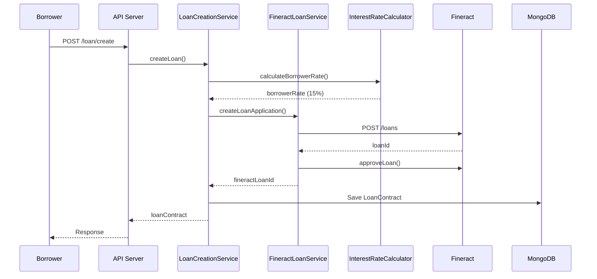
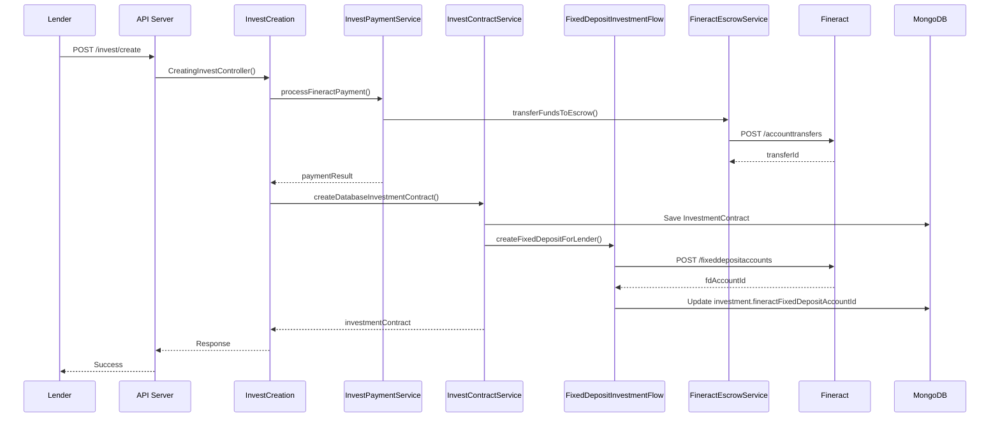
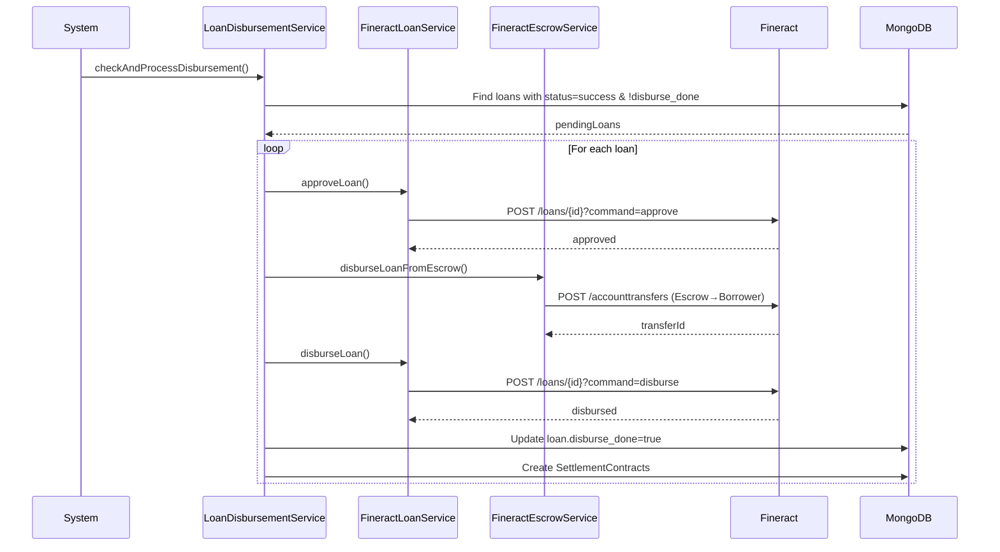
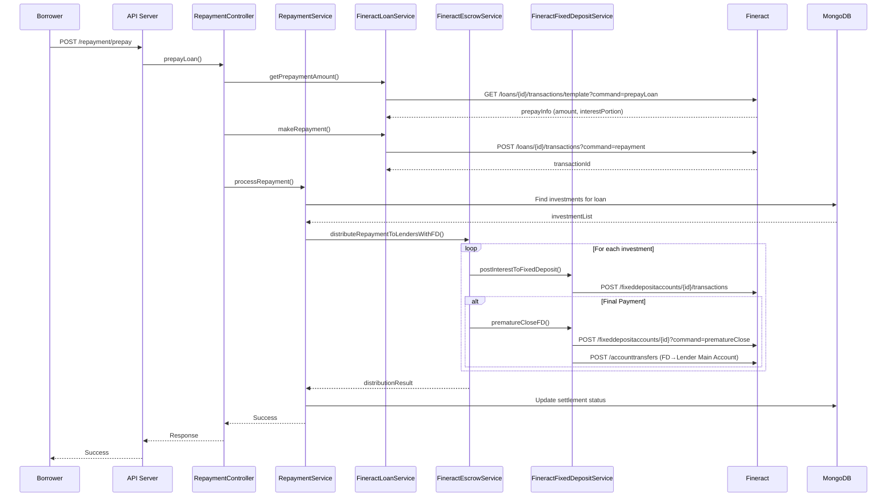

# P2P Lending Platform - Flow Documentation

Tài liệu này mô tả chi tiết các luồng nghiệp vụ chính trong hệ thống P2P Lending và ánh xạ đến các file code cụ thể.

---

## 1. Luồng Vay (Loan Flow)

### 1.1 Tổng Quan
Người vay tạo yêu cầu vay → Hệ thống tính toán lãi suất → Tạo hợp đồng vay trên Fineract và MongoDB.

### 1.2 Quy Trình Chi Tiết



### 1.3 File Code Mapping

#### Controller Layer
- [LoanController.js](file:///c:/P2P/p2p-test-4/p2p/server/interators/controllers/LoanControllers.js)
  - Entry point cho loan creation requests

#### Service Layer
- [LoanCreationService.js](file:///c:/P2P/p2p-test-4/p2p/server/interators/services/LoanCreationService.js)
  - `createLoan()`: Main logic tạo khoản vay
  - `checkLoanRate()`: Tính toán lãi suất và monthly payment
  - `createFineractLoan()`: Tích hợp với Fineract

- [FineractLoanService.js](file:///c:/P2P/p2p-test-4/p2p/server/interators/services/FineractLoanService.js)
  - `createLoanApplication()`: Tạo loan trên Fineract
  - `approveLoan()`: Approve loan
  - `getLoanDetails()`: Lấy thông tin loan từ Fineract

#### Utility Layer
- [InterestRateCalculator.js](file:///c:/P2P/p2p-test-4/p2p/server/utils/InterestRateCalculator.js)
  - `calculateBorrowerRate()`: Tính lãi suất borrower dựa trên credit score
  - `calculateLenderRate()`: Tính lãi suất lender (borrowerRate - 3% spread)
  - `calculateRates()`: Tính toán đầy đủ các tỷ lệ

#### Model Layer
- [LoanContract.js](file:///c:/P2P/p2p-test-4/p2p/server/data/model/LoanContract.js)
  - Schema lưu trữ thông tin khoản vay

### 1.4 Key Logic Points

**Tính Lãi Suất:**
```javascript
// Base rate: 15% annual
// Credit score discount: 0.01% per FICO point above 500
borrowerRate = 15 - ((creditScore - 500) * 0.01)
lenderRate = borrowerRate - 3  // Platform spread 3%
```

**Loan Status Flow:**
```
waiting → success (full match) → disbursed → active → closed
```

---

## 2. Luồng Đầu Tư (Investment Flow)

### 2.1 Tổng Quan
Lender chọn khoản vay → Chuyển tiền vào escrow → Tạo Fixed Deposit account → Cập nhật loan status.

### 2.2 Quy Trình Chi Tiết



### 2.3 File Code Mapping

#### Controller Layer
- [InvestCreation.js](file:///c:/P2P/p2p-test-4/p2p/server/interators/controllers/invest/InvestCreation.js)
  - `CreatingInvestController()`: Main controller cho investment creation

#### Service Layer
- [InvestPaymentService.js](file:///c:/P2P/p2p-test-4/p2p/server/interators/controllers/invest/InvestPaymentService.js)
  - `processFineractPayment()`: Xử lý payment qua Fineract
  - `processWalletPayment()`: Xử lý payment qua wallet
  - `processUSDTPayment()`: Xử lý payment qua USDT

- [InvestContractService.js](file:///c:/P2P/p2p-test-4/p2p/server/interators/controllers/invest/InvestContractService.js)
  - `createDatabaseInvestmentContract()`: Tạo investment contract trong DB
  - `updateLoanContractWithInvestment()`: Update loan invested notes
  - `handleFullMatchDisbursement()`: Auto-disburse khi loan full match

- [FixedDepositInvestmentFlow.js](file:///c:/P2P/p2p-test-4/p2p/server/interators/controllers/invest/FixedDepositInvestmentFlow.js)
  - `createFixedDepositForLender()`: Tạo FD account cho lender
  - `calculateDynamicFDRate()`: Tính lãi suất FD động

#### Escrow Layer
- [FineractEscrowService.js](file:///c:/P2P/p2p-test-4/p2p/server/interators/connectors/FineractEscrowService.js)
  - `transferFundsToEscrow()`: Chuyển tiền vào escrow
  - `calculateDynamicSpread()`: Tính spread động

#### Model Layer
- [InvestmentContract.js](file:///c:/P2P/p2p-test-4/p2p/server/data/model/InvestmentContract.js)
  - Schema lưu investment contract

### 2.4 Key Logic Points

**Investment Profit Calculation:**
```javascript
// Capital ratio
ratio = investmentAmount / loanCapital

// Monthly income
monthlyPrincipalIncome = loan.monthlyPrincipalPay * ratio
monthlyInterestIncome = loan.monthlyInterestPay * ratio * (lenderRate / borrowerRate)
monthlyIncome = monthlyPrincipalIncome + monthlyInterestIncome

// Total profit
entirelyProfit = (monthlyIncome * periodMonth) - investmentAmount
```

**Fixed Deposit Integration:**
- Mỗi investment tạo 1 FD account trên Fineract
- FD rate = lenderRate (borrowerRate - 3%)
- FD maturity = loan maturity date
- Lãi tích lũy vào FD account

---

## 3. Luồng Giải Ngân (Disbursement Flow)

### 3.1 Tổng Quan
Loan đạt 100% funded → Auto approve & disburse → Chuyển tiền từ escrow sang borrower → Tạo settlement contracts.

### 3.2 Quy Trình Chi Tiết



### 3.3 File Code Mapping

#### Service Layer
- [LoanDisbursementService.js](file:///c:/P2P/p2p-test-4/p2p/server/interators/services/LoanDisbursementService.js)
  - `checkAndProcessPendingDisbursements()`: Main logic kiểm tra và giải ngân
  - `processDisbursement()`: Xử lý giải ngân cho 1 loan
  - `processDisbursementFineract()`: Giải ngân qua Fineract

- [FineractLoanService.js](file:///c:/P2P/p2p-test-4/p2p/server/interators/services/FineractLoanService.js)
  - `approveLoan()`: Approve loan trên Fineract
  - `disburseLoan()`: Disburse loan trên Fineract

#### Escrow Layer
- [FineractEscrowService.js](file:///c:/P2P/p2p-test-4/p2p/server/interators/connectors/FineractEscrowService.js)
  - `disburseLoanFromEscrow()`: Transfer từ escrow → borrower
  - `getEscrowAccountDetails()`: Lấy thông tin escrow account

#### Database Layer
- [DatabaseService.js](file:///c:/P2P/p2p-test-4/p2p/server/interators/connectors/DatabaseService.js)
  - `createSettlementContract()`: Tạo settlement contracts cho repayment

### 3.4 Key Logic Points

**Disbursement Conditions:**
```javascript
// Loan must meet all conditions:
- loan.status === 'success'
- loan.disburse_done === false
- loan.fineractLoanId exists
- loan.investedNotes >= loan.totalNotes
- borrower.fineractClientId exists
```

**Settlement Creation:**
```javascript
// Create N settlement contracts (N = periodMonth)
for (let i = 0; i < periodMonth; i++) {
  maturityDate = disbursementDate + (i + 1) months
  settlement = {
    principalAmount: monthlyPrincipal,
    interestAmount: monthlyInterest,
    totalAmount: monthlyPay,
    maturityDate: maturityDate,
    status: 'undue'
  }
}
```

---

## 4. Luồng Trả Nợ (Repayment Flow)

### 4.1 Tổng Quan
Borrower trả nợ → Hệ thống xác nhận payment trên Fineract → Phân phối tiền cho lenders qua FD accounts → Đóng FD (nếu final payment).

### 4.2 Quy Trình Chi Tiết



### 4.3 File Code Mapping

#### Controller Layer
- [RepaymentController.js](file:///c:/P2P/p2p-test-4/p2p/server/interators/controllers/RepaymentController.js)
  - `prepayLoan()`: Xử lý prepayment (tất toán sớm)
  - `makeRepayment()`: Xử lý repayment thông thường

#### Service Layer
- [RepaymentService.js](file:///c:/P2P/p2p-test-4/p2p/server/interators/services/RepaymentService.js)
  - `processRepayment()`: Main logic phân phối repayment
  - `getInvestmentDataForRepayment()`: Lấy danh sách investments

- [FineractLoanService.js](file:///c:/P2P/p2p-test-4/p2p/server/interators/services/FineractLoanService.js)
  - `getPrepaymentAmount()`: Lấy số tiền prepayment
  - `makeRepayment()`: Thực hiện repayment trên Fineract

#### Escrow & FD Layer
- [FineractEscrowService.js](file:///c:/P2P/p2p-test-4/p2p/server/interators/connectors/FineractEscrowService.js)
  - `distributeRepaymentToLendersWithFD()`: Phân phối repayment qua FD
  - `calculateDynamicSpread()`: Tính spread để giữ lại phần admin

- [FineractFixedDepositService.js](file:///c:/P2P/p2p-test-4/p2p/server/interators/connectors/FineractFixedDepositService.js)
  - `postInterestToFixedDeposit()`: Post lãi vào FD
  - `prematureCloseFD()`: Đóng FD sớm (prepayment case)
  - `transferFDToMainAccount()`: Chuyển tiền từ FD về main account

#### Utility Layer
- [InterestRateCalculator.js](file:///c:/P2P/p2p-test-4/p2p/server/utils/InterestRateCalculator.js)
  - `calculateLenderRate()`: Tính lãi suất lender để phân phối đúng

### 4.4 Key Logic Points

**Interest Distribution with Admin Spread:**
```javascript
// Get actual interest from prepayment template
interestPortion = prepayInfo.interestPortion  // e.g., 829,000 VND

// For each lender investment
ratio = investment.capital / loan.capital
lenderRate = calculateLenderRate(borrowerRate)  // borrowerRate - 3%

// Calculate lender's interest share
lenderInterestShare = Math.floor(
  interestPortion * (lenderRate / borrowerRate) * ratio
)

// Admin keeps the difference
adminSpread = interestPortion - totalLenderInterestShares
```

**Fixed Deposit Closure Logic:**
```javascript
// Regular payment: Only post interest
await postInterestToFixedDeposit(fdAccountId, interestShare)

// Final payment: Close FD + transfer all to lender
if (isFinalPayment) {
  await prematureCloseFD(fdAccountId, maturityDate)
  totalAmount = fdBalance + interestShare
  await transferFDToMainAccount(fdAccountId, lenderMainAccountId, totalAmount)
}
```

**Prepayment vs Regular Payment:**
```javascript
// Prepayment
- repaymentAmount = full principal + accrued interest
- interestPortion from Fineract template (accurate)
- Close all FD accounts
- Status: loan.closed

// Regular Monthly Payment  
- repaymentAmount = monthlyPay
- interestPortion calculated from formula
- Keep FD accounts active
- Status: loan.active
```

---

## 5. Admin Profit Mechanisms

### 5.1 Interest Rate Spread (Primary Revenue)

**Configuration:**
- [InterestRateCalculator.js:L12](file:///c:/P2P/p2p-test-4/p2p/server/utils/InterestRateCalculator.js#L12)
  ```javascript
  this.adminSpread = 3.0;  // Fixed 3% annual spread
  ```

**Implementation:**
- Borrower pays: 15% annual (example)
- Lender receives: 12% annual (15% - 3%)
- Admin keeps: 3% annual

**Retention Mechanism:**
```javascript
// During repayment distribution
lenderInterest = totalInterest * (lenderRate / borrowerRate)
adminProfit = totalInterest - lenderInterest
// Admin profit stays in escrow account
```

### 5.2 Service Fee (1% Origination Fee)

**Configuration:**
- [LoanCreationService.js:L432](file:///c:/P2P/p2p-test-4/p2p/server/interators/services/LoanCreationService.js#L432)
  ```javascript
  const serviceFeeAmount = Math.round(loanData.capital * 0.01);  // 1%
  ```

**Application:**
- Charged once at loan creation
- 1% of loan principal
- Example: 10M VND loan → 100K VND fee

### 5.3 Late Fee (Configured but Optional)

**Configuration:**
- [setup-complete.js](file:///c:/P2P/p2p-test-4/p2p/server/scripts/setup-complete.js)
  - Creates "P2P Late Fee" charge in Fineract
  - Can be attached to loans manually or via rules

---

## 6. Key Data Flow

### 6.1 Loan Lifecycle

```
CREATE → WAITING → SUCCESS → DISBURSED → ACTIVE → CLOSED
   ↓         ↓          ↓         ↓          ↓        ↓
MongoDB  MongoDB   MongoDB   Fineract   Fineract  Fineract
```

### 6.2 Investment Lifecycle

```
CREATE → FUNDED → FD_CREATED → ACTIVE → MATURED
   ↓        ↓         ↓          ↓         ↓
MongoDB  Fineract  Fineract   Fineract  Fineract
```

### 6.3 Data Sync Points

**MongoDB ← Fineract:**
- Loan creation: Store fineractLoanId
- Disbursement: Update disburse_done, disburse_date
- Repayment: Update settlement status
- Investment: Store fineractFixedDepositAccountId

**Fineract ← MongoDB:**
- Use MongoDB rates for loan creation
- Use MongoDB investment data for FD creation

---

## 7. Important Configuration Files

### 7.1 Environment Config
- [data.json](file:///c:/P2P/p2p-test-4/p2p/server/config/data.json)
  - `FINERACT_ENABLED`: Enable/disable Fineract
  - `ENABLE_FIXED_DEPOSIT_FLOW`: Enable FD flow
  - `FINERACT_BASE_URL`: Fineract API URL
  - `FINERACT_TENANT`: Tenant ID

### 7.2 Constants
- [constant.js](file:///c:/P2P/p2p-test-4/p2p/server/data/constant.js)
  - `baseUnitPrice`: 500,000 VND (1 investment note)
  - `serviceFee`: 0.1% (USDT transfer fee)
  - Loan/Investment status constants

### 7.3 Setup Scripts
- [setup-complete.js](file:///c:/P2P/p2p-test-4/p2p/server/scripts/setup-complete.js)
  - Initialize Fineract: accounts, products, charges
  - Create GL accounts for escrow, income tracking

---

## 8. Testing & Debugging

### 8.1 Test Files
- [test-p2p-api.js](file:///c:/P2P/p2p-test-4/p2p/server/tests/test-p2p-api.js)
- [test-loan-investment-flow.js](file:///c:/P2P/p2p-test-4/p2p/server/tests/test-loan-investment-flow.js)
- [test-full-p2p-flow.js](file:///c:/P2P/p2p-test-4/p2p/server/tests/test-full-p2p-flow.js)

### 8.2 Debug Commands
```bash
# Check Fineract loan
curl http://fineract/api/v1/loans/{id}

# Check FD account  
curl http://fineract/api/v1/fixeddepositaccounts/{id}

# Check escrow balance
curl http://fineract/api/v1/savingsaccounts/{escrowId}
```

---

## 9. Known Issues & Solutions

### 9.1 Prepayment Interest Distribution
**Problem:** Lender receives less interest than borrower pays during prepayment.

**Root Cause:** System calculated interest using monthly formula instead of using actual `interestPortion` from Fineract.

**Solution:** 
- [RepaymentController.js:L768](file:///c:/P2P/p2p-test-4/p2p/server/interators/controllers/RepaymentController.js#L768): Capture `interestPortion` from prepayment template
- [FineractEscrowService.js:L784](file:///c:/P2P/p2p-test-4/p2p/server/interators/connectors/FineractEscrowService.js#L784): Use explicit `interestPortion` for final payments

### 9.2 Investment Profit Display
**Problem:** Investment list shows `entirelyProfit: 0`.

**Root Cause:** Static data from MongoDB, not fetching real-time from FD account.

**Solution:**
- [LoanRetrieval.js:L318](file:///c:/P2P/p2p-test-4/p2p/server/interators/controllers/loan/LoanRetrieval.js#L318): Enrich investment data with FD account balance from Fineract API

---

## 10. Architecture Patterns

### 10.1 Dual-Write Pattern
- Write to both MongoDB (app database) and Fineract (financial ledger)
- MongoDB: Fast queries, app logic
- Fineract: Source of truth for financial transactions

### 10.2 Event-Driven Disbursement
- Loan reaches 100% funded → Auto-trigger disbursement
- Async processing to avoid blocking investment API

### 10.3 Fixed Deposit as Interest Accumulator
- Each investment = 1 FD account
- Interest accumulates in FD
- Admin spread retained in escrow (not distributed)

---

**Last Updated:** 2025-12-27  
**Version:** 1.0  
**Maintainer:** P2P Development Team
