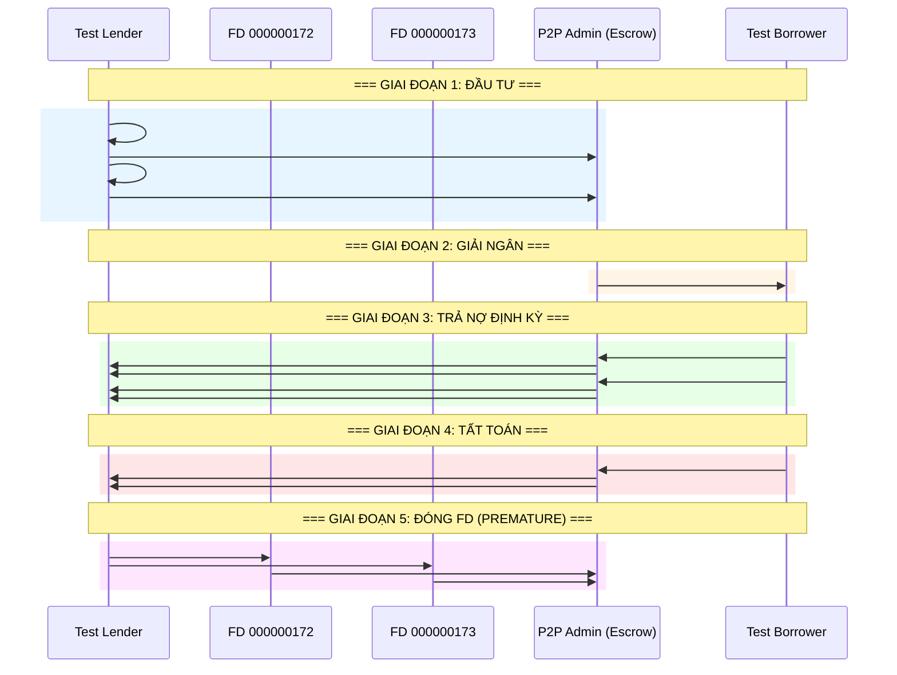
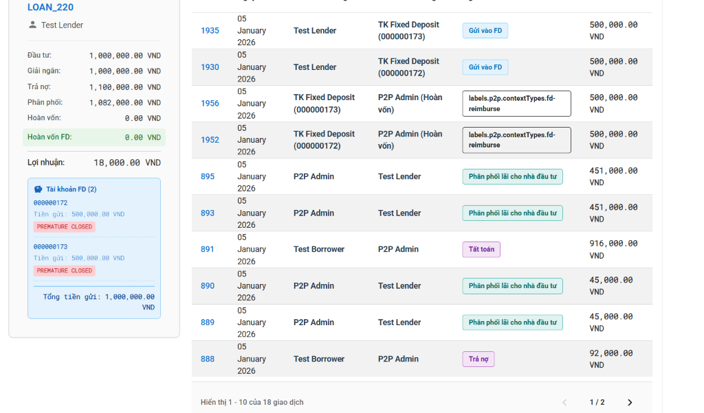
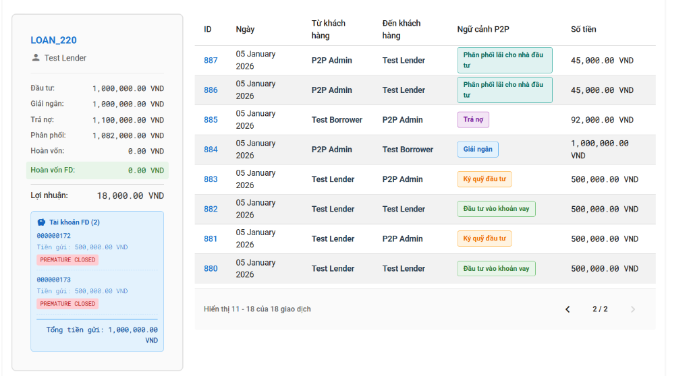

# 📊 Luồng Giao Dịch P2P - LOAN_220 Case Study

> **Phân tích chi tiết 18 giao dịch của LOAN_220 với FD Tracking và Prepayment**

---

## 📋 Tổng Quan LOAN_220

| Chỉ số | Giá trị | Ghi chú |
|--------|---------|---------|
| **Đầu tư** | 1,000,000 VND | 2 lender × 500,000 VND |
| **Giải ngân** | 1,000,000 VND | Escrow → Borrower |
| **Trả nợ** | 1,100,000 VND | Borrower trả (2 kỳ + tất toán) |
| **Phân phối** | 1,082,000 VND | Escrow → Lender |
| **Hoàn vốn** | 0 VND | Không có refund |
| **Hoàn vốn FD** | 0 VND | ✅ FD đóng về Admin (PREMATURE) |
| **Lợi nhuận** | 18,000 VND | = 1,100,000 - 1,082,000 |

### FD Accounts (PREMATURE CLOSED)

| Account No | Số tiền gửi | Trạng thái |
|------------|-------------|------------|
| 000000172 | 500,000 VND | `PREMATURE CLOSED` |
| 000000173 | 500,000 VND | `PREMATURE CLOSED` |

---

## 🔄 Chi Tiết 18 Giao Dịch (Theo Thứ Tự Thời Gian)



---

## 📝 Bảng Chi Tiết Từng Giao Dịch

### Page 2 (Giao dịch cũ → mới)

| ID | Ngày | Từ | Đến | Context | Số tiền | Code Reference |
|----|------|-----|-----|---------|---------|----------------|
| **880** | 05/01/2026 | Test Lender | Test Lender | `Đầu tư vào khoản vay` | 500,000 | `invest.service.ts:createInvestment` |
| **881** | 05/01/2026 | Test Lender | P2P Admin | `Ký quỹ đầu tư` | 500,000 | `escrow.service.ts:transferToEscrow` |
| **882** | 05/01/2026 | Test Lender | Test Lender | `Đầu tư vào khoản vay` | 500,000 | `invest.service.ts:createInvestment` |
| **883** | 05/01/2026 | Test Lender | P2P Admin | `Ký quỹ đầu tư` | 500,000 | `escrow.service.ts:transferToEscrow` |
| **884** | 05/01/2026 | P2P Admin | Test Borrower | `Giải ngân` | 1,000,000 | `invest.service.ts:handleFullMatchDisbursement` |
| **885** | 05/01/2026 | Test Borrower | P2P Admin | `Trả nợ` | 92,000 | `repayment.controller.ts:processRepayment` |
| **886** | 05/01/2026 | P2P Admin | Test Lender | `Phân phối lãi cho nhà đầu tư` | 45,000 | `repayment.service.ts:distributeRepaymentToLendersWithFD` |
| **887** | 05/01/2026 | P2P Admin | Test Lender | `Phân phối lãi cho nhà đầu tư` | 45,000 | `repayment.service.ts:distributeRepaymentToLendersWithFD` |

### Page 1 (Giao dịch mới → cũ)

| ID | Ngày | Từ | Đến | Context | Số tiền | Code Reference |
|----|------|-----|-----|---------|---------|----------------|
| **888** | 05/01/2026 | Test Borrower | P2P Admin | `Trả nợ` | 92,000 | `repayment.controller.ts:processRepayment` |
| **889** | 05/01/2026 | P2P Admin | Test Lender | `Phân phối lãi cho nhà đầu tư` | 45,000 | `repayment.service.ts:distributeRepaymentToLendersWithFD` |
| **890** | 05/01/2026 | P2P Admin | Test Lender | `Phân phối lãi cho nhà đầu tư` | 45,000 | `repayment.service.ts:distributeRepaymentToLendersWithFD` |
| **891** | 05/01/2026 | Test Borrower | P2P Admin | `Tất toán` | 916,000 | `repayment.controller.ts:processRepayment(isFinal=true)` |
| **893** | 05/01/2026 | P2P Admin | Test Lender | `Phân phối lãi cho nhà đầu tư` | 451,000 | `repayment.service.ts:sumPendingPeriodsFromSchedule` → distribute |
| **895** | 05/01/2026 | P2P Admin | Test Lender | `Phân phối lãi cho nhà đầu tư` | 451,000 | `repayment.service.ts:sumPendingPeriodsFromSchedule` → distribute |
| **1930** | 05/01/2026 | Test Lender | TK Fixed Deposit (172) | `Gửi vào FD` | 500,000 | `fixed-deposit.service.ts:createFDAtMaturity` |
| **1935** | 05/01/2026 | Test Lender | TK Fixed Deposit (173) | `Gửi vào FD` | 500,000 | `fixed-deposit.service.ts:createFDAtMaturity` |
| **1952** | 05/01/2026 | TK FD (172) | P2P Admin (Hoàn vốn) | `fd-reimburse` | 500,000 | `fineract-fd.service.ts:prematureCloseFD` |
| **1956** | 05/01/2026 | TK FD (173) | P2P Admin (Hoàn vốn) | `fd-reimburse` | 500,000 | `fineract-fd.service.ts:prematureCloseFD` |

---

## 🔗 Ánh Xạ Vào Code p2p-do-an

### 1. Đầu Tư (Investment)

**File:** `server_do_an/src/invest/invest.service.ts`

```typescript
// Line 146-513: createInvestment()
async createInvestment(user: AuthUser, dto: CreateInvestmentDto) {
    // Tạo #880, #882: "Đầu tư vào khoản vay"
    // Không tạo transfer, chỉ ghi nhận investment

    // Tạo #881, #883: "Ký quỹ đầu tư" 
    // Line 395-440: Transfer Lender → Escrow
    const transferResult = await this.fineractService.accountTransfer(
        lenderSavingsId,      // From: Lender's Savings
        escrowAccountId,      // To: Admin Escrow
        amount,
        `Investment to Escrow loan: ${contractId}`
    );
}
```

### 2. Giải Ngân (Disbursement)

**File:** `server_do_an/src/invest/invest.service.ts`

```typescript
// Line 515-670: handleFullMatchDisbursement()
async handleFullMatchDisbursement(loanContract: any) {
    // Tạo #884: "Giải ngân"
    // Khi loan đạt 100% funding → auto disburse
    
    // Line 600-620: Transfer Escrow → Borrower
    const disbursementResult = await this.escrowService.disburseToBorrower(
        loanContract._id,
        totalCapital,
        borrowerSavingsId
    );
    
    // Tạo FD accounts cho mỗi lender
    // → Ghi nhận #1930, #1935 (Gửi vào FD)
    for (const investment of investments) {
        await this.fixedDepositService.createFDAtMaturity(investment);
    }
}
```

### 3. Trả Nợ Định Kỳ (Regular Repayment)

**File:** `server_do_an/src/repayment/repayment.controller.ts`

```typescript
// Line 50-120: processRepayment endpoint
@Post(':loanId/repay')
async processRepayment(@Param('loanId') loanId: string, @Body() body: any) {
    // Nhận #885, #888: "Trả nợ" từ Borrower
    return this.repaymentService.processRepayment(loanId, body.amount, new Date());
}
```

**File:** `server_do_an/src/repayment/services/repayment.service.ts`

```typescript
// Line 212-547: distributeRepaymentToLendersWithFD()
async distributeRepaymentToLendersWithFD(...) {
    for (const investment of investments) {
        // Lấy kỳ hiện tại từ lenderSchedule
        const currentPeriod = this.getCurrentPeriodFromSchedule(fullInvestment.lenderSchedule);
        
        // Tạo #886, #887, #889, #890: "Phân phối lãi cho nhà đầu tư"
        // Line 420-450
        const totalRemaining = principalShare + interestShare;
        await this.fineractService.accountTransfer(
            escrowAccountId,        // From: Escrow
            lenderSavingsAccountId, // To: Lender
            totalRemaining,
            `Repayment distribution (P+I) for loan: ${loanId} [Fineract:${fineractLoanId}]`
        );
        
        // Update schedule status
        await this.updateScheduleStatus(investment._id, currentPeriod.period, totalRemaining);
    }
}
```

### 4. Tất Toán (Prepayment)

**File:** `server_do_an/src/repayment/services/repayment.service.ts`

```typescript
// Line 276-350: Xử lý prepayment trong distributeRepaymentToLendersWithFD
if (isFinalPayment) {
    // ✅ KEY: Sum all PENDING periods (không tính các kỳ đã paid)
    const pendingTotals = this.sumPendingPeriodsFromSchedule(fullInvestment?.lenderSchedule);
    
    // Tính principal từ các kỳ còn lại
    principalShare = pendingTotals.principal;  // ~451,000 VND mỗi lender
    
    // Tính interest tỷ lệ
    if (interestPortion != null && interestPortion > 0) {
        const ratio = investment.amount / totalCapital;
        interestShare = Math.floor((interestPortion * (lenderAnnualRate / borrowerRate) * ratio) / 1000) * 1000;
    }
    
    // Tạo #893, #895: Phân phối P+I cho prepayment
    // totalRemaining = 451,000 VND (mỗi lender)
}
```

**Line 574-592: sumPendingPeriodsFromSchedule**

```typescript
// ✅ KEY FIX: Chỉ tính các kỳ CHƯA TRẢ
private sumPendingPeriodsFromSchedule(schedule: any[]) {
    const pendingPeriods = schedule.filter(p => p.status !== 'paid');
    return {
        principal: pendingPeriods.reduce((sum, p) => sum + (p.principal || 0), 0),
        interest: pendingPeriods.reduce((sum, p) => sum + (p.interest || 0), 0),
        pendingCount: pendingPeriods.length
    };
}
```

### 5. Đóng FD (Premature Close → Admin)

**File:** `server_do_an/src/repayment/services/repayment.service.ts`

```typescript
// Line 380-420: Đóng FD khi prepayment
if (isFinalPayment && fullInvestment?.fineractFixedDepositAccountId) {
    // Lấy Admin Escrow Account ID
    const adminSavingsId = this.escrowService['adminEscrowAccountId'];
    
    // Tạo #1952, #1956: "Hoàn vốn FD → Admin"
    // FD được đóng PREMATURE và hoàn vốn về Admin (không phải Lender)
    await this.fdService.prematureCloseFD(
        fullInvestment.fineractFixedDepositAccountId,
        adminSavingsId  // ✅ To: Admin (Hoàn vốn)
    );
}
```

**File:** `server_do_an/src/loan/services/fineract-fd.service.ts`

```typescript
// prematureCloseFD method
async prematureCloseFD(fdAccountId: number, toAccountId: number) {
    // POST /fixeddepositaccounts/{accountId}?command=prematureClose
    await this.adminApi.post(
        `/fixeddepositaccounts/${fdAccountId}?command=prematureClose`,
        {
            closedOnDate: this.formatDate(new Date()),
            onAccountClosureId: 200,      // Transfer to Savings
            toSavingsAccountId: toAccountId,  // Admin Escrow Account
            note: 'REIMBURSEMENT: Premature close due to prepayment'
        }
    );
}
```

---

## 📈 Tính Toán Lợi Nhuận

```
┌────────────────────────────────────────────────────────────────────────────┐
│ PROFIT CALCULATION - LOAN_220                                              │
├────────────────────────────────────────────────────────────────────────────┤
│                                                                            │
│ BORROWER TRẢ:                                                              │
│   Kỳ 1: #885 = 92,000 VND                                                 │
│   Kỳ 2: #888 = 92,000 VND                                                 │
│   Tất toán: #891 = 916,000 VND                                            │
│   ─────────────────────────────                                           │
│   TỔNG TRẢ NỢ = 1,100,000 VND                                             │
│                                                                            │
├────────────────────────────────────────────────────────────────────────────┤
│                                                                            │
│ LENDER NHẬN (từ Escrow):                                                  │
│   Kỳ 1: #886 + #887 = 45,000 + 45,000 = 90,000 VND                       │
│   Kỳ 2: #889 + #890 = 45,000 + 45,000 = 90,000 VND                       │
│   Tất toán: #893 + #895 = 451,000 + 451,000 = 902,000 VND                │
│   ─────────────────────────────                                           │
│   TỔNG PHÂN PHỐI = 1,082,000 VND                                          │
│                                                                            │
├────────────────────────────────────────────────────────────────────────────┤
│                                                                            │
│ FD HOÀN VỐN (về Admin - KHÔNG trừ profit):                                │
│   #1952: FD 172 → Admin = 500,000 VND (EXCLUDED from lender payout)       │
│   #1956: FD 173 → Admin = 500,000 VND (EXCLUDED from lender payout)       │
│   ─────────────────────────────                                           │
│   HOÀN VỐN FD = 0 VND (vì đã về Admin, không phải Lender)                 │
│                                                                            │
├────────────────────────────────────────────────────────────────────────────┤
│                                                                            │
│ ✅ LỢI NHUẬN = Trả nợ - Phân phối = 1,100,000 - 1,082,000 = 18,000 VND    │
│                                                                            │
└────────────────────────────────────────────────────────────────────────────┘
```

---

## 🖼️ Screenshots từ Cash Flow UI

### Page 1 - Giao dịch mới nhất


### Page 2 - Giao dịch cũ


---

## 📁 File References Quick Lookup

| Chức năng | File | Line Numbers |
|-----------|------|--------------|
| Tạo đầu tư | `invest/invest.service.ts` | 146-513 |
| Chuyển vào Escrow | `repayment/services/escrow.service.ts` | 50-120 |
| Giải ngân | `invest/invest.service.ts` | 515-670 |
| Trả nợ controller | `repayment/repayment.controller.ts` | 50-150 |
| Phân phối với FD | `repayment/services/repayment.service.ts` | 212-547 |
| Lấy kỳ hiện tại | `repayment/services/repayment.service.ts` | 553-572 |
| Sum pending periods | `repayment/services/repayment.service.ts` | 574-592 |
| Đóng FD premature | `loan/services/fineract-fd.service.ts` | API call |

---

*Document created: 2026-01-05*
