# P2P Lending Platform

Chào mừng đến với trang tài liệu kỹ thuật của **Hệ thống Cho vay Ngang hàng (P2P Lending Platform)**. Tài liệu này cung cấp toàn bộ thông tin cần thiết để hiểu, tích hợp và vận hành hệ thống.

## P2P Lending là gì?

Nền tảng của chúng tôi kết nối trực tiếp **Nhà đầu tư** (Lenders) với **Người vay** (Borrowers), loại bỏ các trung gian ngân hàng truyền thống để tối ưu hóa lợi nhuận. Hệ thống kết hợp sức mạnh của **Blockchain** (minh bạch) và **Core Banking** (chính xác).

:::tip Giá Trị Cốt Lõi
- **Minh Bạch Tuyệt Đối**: Mọi hợp đồng vay đều được ghi nhận (audit) trên Blockchain Hyperledger Fabric.
- **Tự Động Hóa**: Cơ chế khớp lệnh (Matching Engine) và giải ngân tự động.
- **An Toàn Vốn**: Mô hình Escrow đảm bảo dòng tiền được kiểm soát chặt chẽ cho đến khi khoản vay thành công.
:::

---

## Kiến trúc Tổng quan

```mermaid
graph TD
    User["👤 Người dùng Mobile/Web"] -->|HTTPS/REST| ClientApp["📱 Ứng dụng Client React Native"]
    
    subgraph "P2P Server Core - Node.js/Express"
        API_GW[API Gateway / Routes]
        AuthModule[Module Xác thức]
        LoanModule[Module Vay & Khớp lệnh]
        InvModule[Module Đầu tư]
        RepayModule[Module Trả nợ]
    end
    
    ClientApp -->|Bearer Token| API_GW
    
    subgraph "Cơ sở hạ tầng & Tích hợp"
        KC["🔑 Keycloak Identity Provider"]
        
        subgraph "Fineract Ecosystem"
            direction LR
            Fineract["🏦 Fineract Core|Loans, Products, Clients, Code Values"]
            FineractML["🤖 Fineract ML Server|Credit Scoring TensorFlow/scikit-learn"]
        end
        
        Blockchain["⛓️ Hyperledger Fabric Ledger"]
        DB[("💾 MongoDB")]
    end

    AuthModule -->|OIDC/OAuth2| KC
    LoanModule -->|"Fetch Purposes & Config"| Fineract
    LoanModule -->|"Credit Assessment"| FineractML
    InvModule -->|Create FD| Fineract
    RepayModule -->|Transactions| Fineract
    LoanModule -->|Submit Hash| Blockchain
    API_GW -->|Mongoose| DB
    
    FineractML -.->|Read Client Data| Fineract
    FineractML -.->|Save Credit Score| Fineract
    
    style Fineract fill:#1e3a5f,stroke:#4a90e2,color:#fff
    style FineractML fill:#3d3d00,stroke:#f0db4f,color:#fff
    style API_GW fill:#2d1b2e,stroke:#9b59b6,color:#fff
```

> **📌 Lưu ý**: 
> - **Loan Purposes** lấy từ Fineract Code Values (không lưu MongoDB)
> - **Rounding (inMultiplesOf)** lấy từ Fineract Loan Product config
> - **Credit Score** từ Fineract ML → lưu vào Fineract Client DataTable

---

## Các Đối tượng Tham gia

| Vai trò | Mô tả | Chức năng chính |
|---------|-------|-----------------|
| **Borrower** (Người vay) | Khách hàng có nhu cầu vay vốn | Tạo hồ sơ vay, xem lịch trả nợ, thực hiện thanh toán |
| **Lender** (Nhà đầu tư) | Khách hàng có vốn nhàn rỗi | Nạp tiền vào ví, duyệt và đầu tư vào khoản vay, nhận lãi |
| **Admin** (Quản trị viên) | Nhân viên vận hành hệ thống | Duyệt hồ sơ vay, quản lý Escrow, đối soát dữ liệu |

---

## Cấu trúc Tài liệu

  

    

      

        <h3>🏗️ Kiến trúc Hệ thống</h3>
      

      

        

          Hiểu sâu về các thành phần kỹ thuật: <strong>Express.js</strong>, <strong>Keycloak</strong>, <strong>Blockchain</strong> và <strong>Fineract</strong>.
        

      

      

        <a href="/docs/architecture/high-level-design" className="button button--primary button--block">Xem Kiến Trúc</a>
      

    

  

  

    

      

        <h3>💡 Luồng Nghiệp vụ</h3>
      

      

        

          Nắm vững logic vận hành: <strong>Cơ chế Khớp lệnh</strong>, <strong>Vòng đời khoản vay</strong> và vai trò của <strong>Fineract</strong>.
        

      

      

        <a href="/docs/backend-services/service-loan/loan-creation-flow" className="button button--secondary button--block">Tìm hiểu Nghiệp vụ</a>
      

    

  

---

## Bắt đầu từ đâu?

### Nếu bạn là Developer mới:
1. Đọc **[Onboarding](./onboarding)** - Checklist ngày đầu tiên
2. Setup môi trường với **[Environment Setup](./environment-setup)**
3. Xem **[Kiến trúc Tổng quan](../architecture/high-level-design)**

### Nếu bạn là Product Owner / BA:
- Đọc **[Luồng Tạo Khoản Vay](../backend-services/service-loan/loan-creation-flow)** để hiểu quy trình vay, trả và cơ chế khớp lệnh của sàn.
