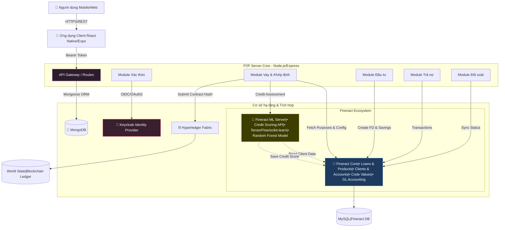
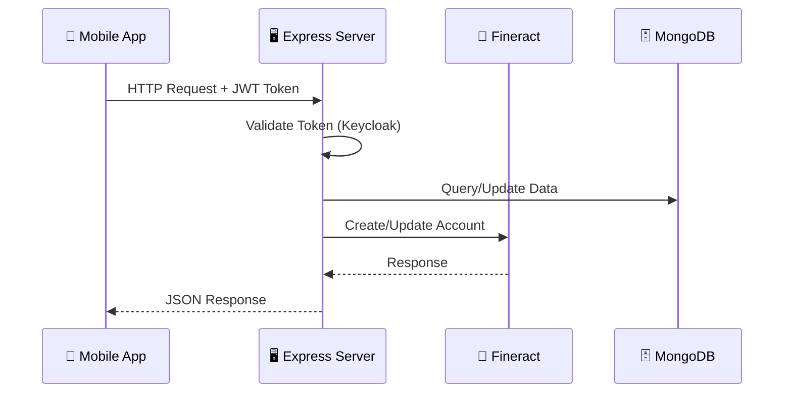

# 🏗️ Tổng quan Kiến trúc Hệ thống

Hệ thống P2P Lending được xây dựng dựa trên kiến trúc **3-tier** hiện đại, đảm bảo tính mở rộng, bảo mật và khả năng tích hợp cao. Hệ thống kết hợp giữa các nghiệp vụ tài chính truyền thống (thông qua Core Banking Fineract) và công nghệ sổ cái phân tán tiên tiến (Blockchain Hyperledger Fabric).

---

## Sơ đồ Kiến trúc Cấp cao



> **📌 Luồng Dữ liệu từ Fineract:**
> - **Loan Purposes**: Lấy từ Fineract Code Values (`/codes/{id}/codevalues`)
> - **Rounding Config**: Lấy `inMultiplesOf` từ Fineract Loan Product  
> - **Credit Scoring**: Fineract ML API → Lưu vào Fineract Client DataTable (không lưu MongoDB)

---

## Các Thành phần Chính

### 1. P2P Server (Backend)

| Thuộc tính | Giá trị |
|------------|---------|
| **Công nghệ** | Node.js + Express.js |
| **Ngôn ngữ** | JavaScript |
| **Database** | MongoDB (Mongoose) |
| **Port** | 3000 |

**Chức năng**:
- Là trung tâm xử lý logic nghiệp vụ của sàn P2P
- Quản lý người dùng, hồ sơ vay, hồ sơ đầu tư
- **Matching Engine**: Thuật toán tự động khớp lệnh giữa người vay và nhà đầu tư
- Tích hợp và điều phối các dịch vụ bên dưới

**Cấu trúc thư mục**:
```
server/
├── server.js                 # Entry point
├── config/                   # Configuration
├── interfaces/               # Routes layer (API endpoints)
├── interators/               # Business logic layer
│   ├── controllers/          # Request handlers
│   ├── services/             # Business services
│   ├── connectors/           # External API wrappers
│   └── middlewares/          # Auth, validation
├── data/                     # Data layer
│   └── model/                # Mongoose schemas
└── utils/                    # Utility functions
```

---

### 2. Apache Fineract (Core Banking)

| Thuộc tính | Giá trị |
|------------|---------|
| **Phiên bản** | 1.8.x |
| **Giao thức** | REST API |
| **Port** | 8443 (HTTPS) |

**Vai trò**: Đóng vai trò là hệ thống lõi ngân hàng (Core Banking System).

**Chức năng**:
- Quản lý Tài khoản (Loan Account, Savings Account, Fixed Deposit)
- Tính toán lịch trả nợ, lãi suất, phí phạt
- Quản lý giao dịch tài chính (Giải ngân, Trả nợ, Chuyển tiền)
- **Ledger**: Ghi nhận bút toán kế toán (Accounting entries) chuẩn mực
- **Code Values**: Quản lý danh mục dùng chung (Loan Purposes, etc.)
- **Loan Products**: Config sản phẩm vay (rate, rounding, amortization)

---

### 2.1. Fineract ML Server (Credit Scoring)

| Thuộc tính | Giá trị |
|------------|---------|
| **Công nghệ** | Python + TensorFlow/scikit-learn |
| **Model** | Random Forest Classifier |
| **API Endpoint** | `/creditScorecard/predict` |

**Vai trò**: Đánh giá tín dụng tự động bằng Machine Learning.

**Chức năng**:
- Nhận dữ liệu vay (loan_amnt, annual_inc, dti, etc.)
- Predict risk level: `low`, `medium`, `high`
- Map risk → credit score (750, 650, 550)
- Lưu kết quả vào **Fineract Client DataTable** (không lưu MongoDB)
- Đọc lịch sử client từ Fineract DB để training model

**Data Flow**:
```
P2P Server → Fineract ML: POST /creditScorecard/predict
Fineract ML → Fineract DB: Read client history
Fineract ML → Fineract Core: POST /clients/{id}/datatables/credit_assessment
Fineract ML → P2P Server: Return {score, risk, category}
```

---

### 3. Keycloak (IAM)

| Thuộc tính | Giá trị |
|------------|---------|
| **Phiên bản** | 21.x+ |
| **Realm** | fineract |
| **Giao thức** | OAuth2, OpenID Connect |

**Vai trò**: Quản lý định danh và quyền truy cập (Identity and Access Management).

**Chức năng**:
- Đăng ký, Đăng nhập, Quên mật khẩu (SSO)
- Quản lý Roles (Admin, Investor, Borrower)
- Bảo mật API thông qua JWT (JSON Web Tokens)

---

### 4. Hyperledger Fabric (Blockchain)

| Thuộc tính | Giá trị |
|------------|---------|
| **Phiên bản** | 2.5.x |
| **Loại** | Permissioned Blockchain |

**Vai trò**: Sổ cái phi tập trung, bất biến (Immutable Ledger).

**Chức năng**:
- Lưu trữ "hash" của các hợp đồng vay để chống chối bỏ
- Ghi nhận lịch sử giao dịch quan trọng (Giải ngân, Trả nợ)
- Cho phép các bên thứ 3 (Auditor) tham gia xác thực dữ liệu

---

### 5. Client Application

| Thuộc tính | Giá trị |
|------------|---------|
| **Framework** | React Native + Expo |
| **UI Style** | Glassmorphism |
| **State** | React Hooks + AsyncStorage |

**Cấu trúc thư mục**:
```
client/src/
├── presentation/             # UI Components
│   └── component/
│       ├── common/           # Reusable components
│       └── scene/            # Screen components
├── domain/                   # Business logic (UseCases)
├── data/                     # API & Local storage
│   ├── network/              # API clients
│   └── local/                # AsyncStorage
└── services/                 # Auth, Socket services
```

---

## Luồng Xử Lý Request



---

## Design Patterns

| Pattern | Mô tả |
|---------|-------|
| **MVC Pattern** | Routes → Controllers → Models |
| **Service Layer Pattern** | Controllers → Services → Connectors/Models |
| **Adapter Pattern** | HTTPRequest, HTTPResponse formatters |
| **Middleware Pattern** | Auth, Validation, Transformation |
| **Repository Pattern** | Mongoose Models as repositories |
