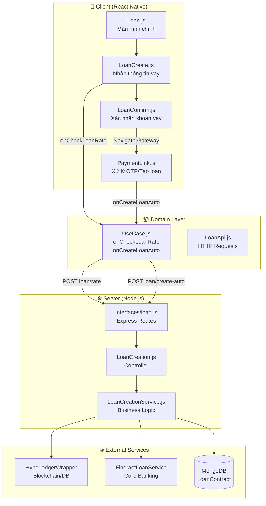
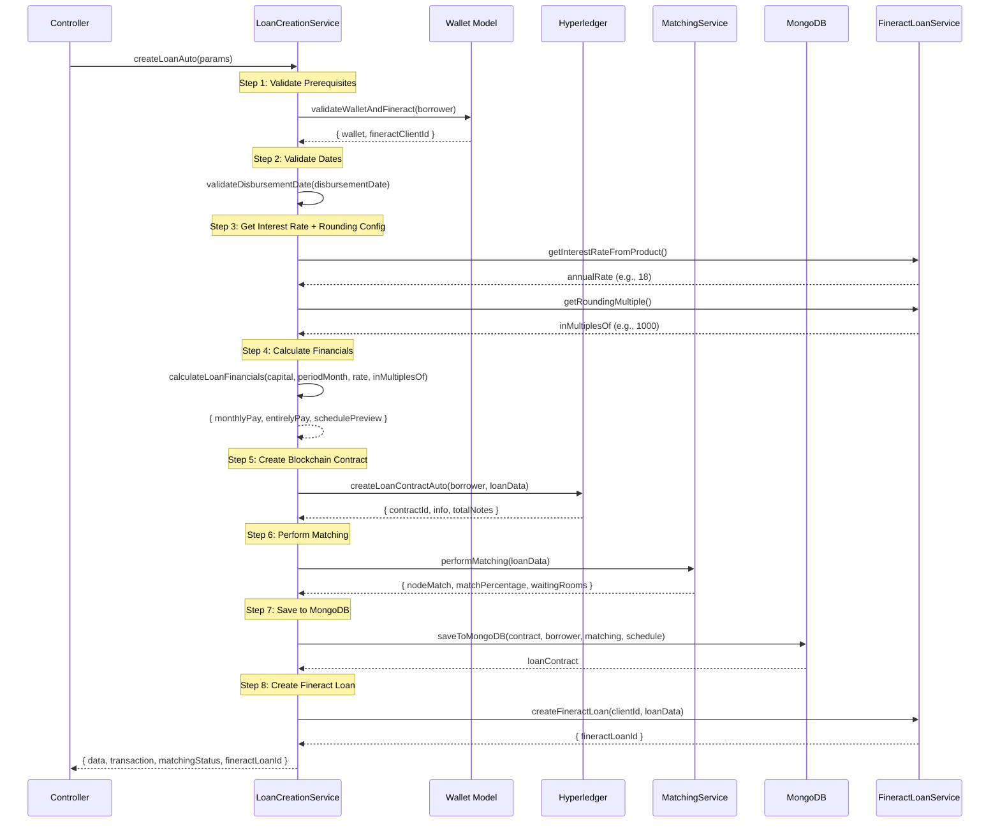

# Luồng Tạo Khoản Vay (Loan Creation Flow)

Tài liệu này mô tả chi tiết quy trình tạo khoản vay thực tế trên hệ thống P2P Lending, dựa trên phân tích mã nguồn thực tế.

---

## 1. Tổng Quan Kiến Trúc

### 1.1 Các Thành Phần Chính

| Component | Mô tả | Công nghệ |
|-----------|-------|-----------|
| **Client App** | Ứng dụng Mobile cho Borrower | React Native (Expo) |
| **P2P Server** | Backend xử lý nghiệp vụ P2P | Node.js, Express |
| **Hyperledger** | Blockchain hoặc Database Mock | Fabric / DatabaseService |
| **Fineract Core** | Core Banking System | Apache Fineract |
| **MongoDB** | Lưu trữ dữ liệu | Mongoose |

### 1.2 Sơ Đồ Tổng Quan



---

## 2. Luồng Client-Side (React Native)

### 2.1 Các Màn Hình Liên Quan

| File | Vai trò | Navigation |
|------|---------|------------|
| `Loan.js` | Dashboard khoản vay, điều hướng | → `LoanCreate` |
| `LoanCreate.js` | Thu thập input, gọi `onCheckLoanRate` | → `LoanConfirm` |
| `LoanConfirm.js` | Hiển thị preview, xác nhận | → `Gateway` |
| `PaymentLink.js` | Xử lý OTP, gọi `onCreateLoanAuto` | → `BorrowerTabNavigator` |

### 2.2 Chi Tiết Từng Màn Hình

#### `Loan.js` - Dashboard Khoản Vay
**File**: `client/src/presentation/component/scene/borrower/loan/Loan.js`

- Hiển thị khoản vay hiện tại (nếu có)
- Hiển thị nhắc nhở thanh toán nếu có kỳ hạn đến hạn/quá hạn
- Các danh mục vay: Học Phí, Xe Máy, Du Lịch, Khác
- Navigate đến `LoanCreate` với `money` và `willing` mặc định

#### `LoanCreate.js` - Form Nhập Thông Tin
**File**: `client/src/presentation/component/scene/borrower/loan/LoanCreate.js`

**Input Form:**
| Field | Validation | Mô tả |
|-------|------------|-------|
| `money` | `Minimum.LOAN` → `Maximum.LOAN`, chia hết cho `LOAN_NODE` | Số tiền vay |
| `month` | 1-18 tháng | Kỳ hạn |
| `willing` | Bắt buộc (dropdown từ Fineract) | Mục đích vay |
| `date` | ≥ today, ≤ today + 30 ngày | Ngày giải ngân |
| `interestRate` | Tùy chọn | Lãi suất mong muốn |

**API Calls:**
```javascript
// Lấy danh sách mục đích vay từ Fineract
const result = await getLoanPurposes(token);

// Kiểm tra lãi suất - gọi onCheckLoanRate
onCheckLoanRate(capital, periodMonth, willing, disbursementDate, rate);
```

**Navigate Result:**
```javascript
const previewData = {
    ...apiData,
    _previewOnly: true,  // Flag đánh dấu chưa tạo loan thật
    _loanParams: { capital, periodMonth, willing, disbursementDate }
};
this.props.navigation.navigate('LoanConfirm', { data: previewData });
```

#### `LoanConfirm.js` - Xác Nhận Khoản Vay
**File**: `client/src/presentation/component/scene/borrower/loan/LoanConfirm.js`

- Hiển thị chi tiết khoản vay (`Detail` component)
- Hiển thị bảng kế hoạch trả nợ (`schedulePreview`)
- Navigate đến `Gateway` với `action: Action.CREATE_LOAN`

```javascript
ConfirmDialog('Xác nhận tạo khoản vay', '...', true)
    .then(() => this.props.navigation.navigate('Gateway', { 
        data, 
        action: Action.CREATE_LOAN 
    }));
```

#### `PaymentLink.js` - Xử Lý Tạo Loan
**File**: `client/src/presentation/component/scene/payment_link/PaymentLink.js`

**Luồng xử lý khi `action === Action.CREATE_LOAN`:**

```javascript
if (data._previewOnly) {
    // Tạo loan thật từ preview data
    const { capital, periodMonth, willing, disbursementDate } = data._loanParams;
    const loanResult = await onCreateLoanAuto(
        capital, periodMonth, willing, disbursementDate, 
        creditAssessment, schedulePreview
    );
    
    // Tự động lưu disbursement account (nếu có)
    if (loanResult.data?.contractId && (eWalletAccount || accountNum)) {
        await onSaveDisbursementAccount(loanResult.data.contractId, disbursementAccount);
    }
    
    return resolve(loanResult);
}
```

---

## 3. Domain Layer

### 3.1 UseCase.js
**File**: `client/src/domain/UseCase.js`

| Function | Mô tả |
|----------|-------|
| `onCheckLoanRate(capital, periodMonth, willing, disbursementDate, rate)` | Preview khoản vay |
| `onCreateLoanAuto(capital, periodMonth, willing, disbursementDate, creditAssessment, schedulePreview)` | Tạo khoản vay thật |
| `onGetLoan()` | Lấy thông tin khoản vay hiện tại |

### 3.2 LoanApi.js
**File**: `client/src/data/network/LoanApi.js`

| Function | Endpoint | Method |
|----------|----------|--------|
| `checkLoanRate` | `loan/rate` | POST |
| `createLoanAuto` | `loan/create-auto` | POST |
| `getLoan` | `loan/me` | GET |
| `getLoanPurposes` (InvestmentApi) | `loan/purposes` | GET |

---

## 4. Server-Side

### 4.1 Routes - `interfaces/loan.js`
**File**: `server/interfaces/loan.js`

```javascript
// Tạo khoản vay tự động
Loan.post('/create-auto', 
    AuthBorrowerMiddleware,      // Xác thực borrower
    issueIdentityMiddleware,     // Issue blockchain identity
    recoverUserCardMiddleware,   // Recover user card
    CreatingLoanAutoController
);

// Kiểm tra lãi suất
Loan.post('/rate', 
    AuthBothRolesMiddleware, 
    CheckingRateController
);

// Lấy mục đích vay
Loan.get('/purposes', 
    AuthBothRolesMiddleware,
    LoanDetailsController.getLoanPurposes
);
```

### 4.2 Controller - `LoanCreation.js`
**File**: `server/interators/controllers/loan/LoanCreation.js`

#### `CreatingLoanAutoController`

```javascript
const CreatingLoanAutoController = async (req, res) => {
    // 1. Validate input
    const { capital, periodMonth, willing, disbursementDate, schedulePreview } = req.body;
    const loanConditionMsg = checkLoanData(loanData);
    
    // 2. Prepare borrower details
    const borrower = req.user;
    const score = userDetail.score || Constant.defaultScore || 600;
    
    // 3. Create service với dependencies
    const loanCreationService = new LoanCreationService({
        fineractService: req.app.locals.fineractService,
        hyperledger: Hyperledger,
        matchingService: require('../../../utils/matchingService'),
        config: req.app.locals.config
    });
    
    // 4. Call service
    const result = await loanCreationService.createLoanAuto({
        borrower, borrowerDetails, loanData, creditAssessment, schedulePreview
    });
    
    return HTTPResponse.sendData(res, feature, successResCode, null, result);
};
```

#### `CheckingRateController`

```javascript
const CheckingRateController = async (req, res) => {
    const { capital, periodMonth, willing, disbursementDate, rate } = req.body;
    
    const data = await loanCreationService.checkLoanRate(
        capital, periodMonth, willing, disbursementDate, rate, borrowerScore
    );
    
    return HTTPResponse.sendData(res, feature, successResCode, null, data);
};
```

### 4.3 Service - `LoanCreationService.js` (CORE)
**File**: `server/interators/services/LoanCreationService.js`

**Đây là file QUAN TRỌNG NHẤT - Chứa toàn bộ business logic.**

#### Luồng xử lý `createLoanAuto` - 8 Bước



#### Chi tiết từng bước

| # | Method | Mô tả |
|---|--------|-------|
| 1 | `validateWalletAndFineract()` | Kiểm tra Wallet + Fineract Client. Auto-create nếu chưa có |
| 2 | `validateDisbursementDate()` | Ngày giải ngân ≥ today và ≤ today + 30 ngày |
| 3a | `getInterestRate()` | Lấy lãi suất từ Fineract Loan Product (KHÔNG hardcode) |
| 3b | `getRoundingMultiple()` | **Lấy bội số làm tròn từ Fineract** (`inMultiplesOf`, e.g., 1000 VND) |
| 4 | `calculateLoanFinancials()` | Tính EMI/Flat, làm tròn theo `inMultiplesOf` để khớp với Fineract |
| 5 | `createBlockchainContract()` | Tạo contract trên Hyperledger/Database, lấy `contractId` |
| 6 | `performMatching()` | Quét WaitingRoom để khớp lệnh với các Lender đang chờ |
| 7 | `saveToMongoDB()` | Lưu `LoanContract` với schedule, matching info |
| 8 | `createFineractLoan()` | Tạo Loan Application trên Fineract, kèm service fee |

---

## 5. External Integrations

### 5.1 HyperledgerWrapper
**File**: `server/interators/connectors/HyperledgerWrapper.js`

Wrapper chuyển đổi giữa Blockchain và Database mode:

```javascript
const isBlockchainEnabled = () => {
    return process.env.BLOCKCHAIN_ENABLED === 'true';
};
```

| Mode | Service | Mô tả |
|------|---------|-------|
| Blockchain | `FabricService` | Hyperledger Fabric thật |
| Database | `DatabaseService` | Mô phỏng blockchain bằng MongoDB |

**Key function:**
```javascript
createLoanContractAuto(borrower, capital, periodMonth, score, willing, disbursementDate)
// Returns: { contractId, info, totalNotes, status }
```

### 5.2 FineractLoanService
**File**: `server/interators/services/FineractLoanService.js`

| Method | Mô tả |
|--------|-------|
| `getInterestRateFromProduct()` | Lấy lãi suất từ Loan Product |
| `getRoundingMultiple()` | Lấy bội số làm tròn (1000 VND) |
| `createLoanApplication()` | Tạo loan trên Fineract |
| `getLoanPurposeCodeValues()` | Lấy danh sách mục đích vay |
| `approveLoan()` | Approve loan khi đủ vốn |
| `disburseLoan()` | Giải ngân loan |

**Fineract Loan Payload:**
```json
{
    "clientId": 123,
    "productId": 1,
    "principal": 10000000,
    "loanTermFrequency": 6,
    "loanTermFrequencyType": 2,
    "numberOfRepayments": 6,
    "repaymentEvery": 1,
    "repaymentFrequencyType": 2,
    "interestRatePerPeriod": 1.5,
    "interestType": 0,
    "amortizationType": 1,
    "expectedDisbursementDate": "2026-01-15",
    "loanPurposeId": 10,
    "externalId": "LOAN_1704628800000",
    "charges": [
        { "chargeId": 5, "amount": 100000 }
    ]
}
```

### 5.3 MongoDB - LoanContract Model
**File**: `server/data/model/LoanContract.js`

```javascript
{
    // Identifiers
    contractId: String,           // Blockchain/DB generated ID
    borrower: ObjectId,           // Ref to User
    fineractLoanId: Number,       // Fineract Loan ID
    
    // Matching info
    nodeMatch: Number,            // Số notes đã match
    matchedAmount: Number,        // Số tiền đã match
    matchPercentage: Number,      // % match
    isFullMatch: Boolean,         // Đã đủ 100% chưa
    waitingRooms: [ObjectId],     // Các WaitingRoom đã match
    
    // Loan details
    info: {
        capital: Number,
        rate: Number,             // Annual rate
        periodMonth: Number,
        monthlyPay: Number,
        monthlyPrincipalPay: Number,
        monthlyInterestPay: Number,
        entirelyPay: Number,
        disbursementDate: Date,
        maturityDate: Date,
        willing: String,          // Mục đích vay
        interestType: String,     // "Dư nợ giảm dần" | "Lãi cố định"
        inMultiplesOf: Number     // Bội số làm tròn
    },
    
    // Status
    status: ['waiting', 'success', 'clean', 'fail'],
    fineractStatus: String,
    
    // Repayment schedule
    repaymentSchedule: [{
        period: Number,
        dueDate: Date,
        principal: Number,
        interest: Number,
        total: Number,
        status: ['pending', 'paid', 'overdue']
    }],
    
    // Disbursement
    disbursement_account: {
        account_type: String,     // 'mobile_wallet' | 'bank_transfer'
        phone_number: String,
        is_default_phone: Boolean,
        account_name: String,
        bank_name: String
    },
    disburse_done: Boolean,
    disburse_date: Date
}
```

---

## 6. API Reference

### 6.1 Preview Rate

| | |
|---|---|
| **Endpoint** | `POST /loan/rate` |
| **Auth** | `x-auth: {token}` |
| **Controller** | `CheckingRateController` |
| **Service** | `LoanCreationService.checkLoanRate()` |

**Request:**
```json
{
    "capital": 10000000,
    "periodMonth": 6,
    "willing": "Kinh doanh",
    "disbursementDate": "2026-01-15T00:00:00.000Z",
    "rate": null
}
```

**Response:**
```json
{
    "ok": true,
    "result": {
        "rate": 18,
        "monthlyPay": 1792000,
        "monthlyPrincipalPay": 1667000,
        "monthlyInterestPay": 150000,
        "entirelyPay": 10752000,
        "inMultiplesOf": 1000,
        "interestType": "Dư nợ giảm dần",
        "schedulePreview": [
            { "period": 1, "principal": 1667000, "interest": 150000, "total": 1817000, "remainingAfter": 8333000 },
            { "period": 2, "principal": 1667000, "interest": 125000, "total": 1792000, "remainingAfter": 6666000 }
        ]
    }
}
```

### 6.2 Create Loan

| | |
|---|---|
| **Endpoint** | `POST /loan/create-auto` |
| **Auth** | `x-auth: {token}` |
| **Middleware** | `AuthBorrowerMiddleware`, `issueIdentityMiddleware`, `recoverUserCardMiddleware` |
| **Controller** | `CreatingLoanAutoController` |
| **Service** | `LoanCreationService.createLoanAuto()` |

**Request:**
```json
{
    "capital": 10000000,
    "periodMonth": 6,
    "willing": "Kinh doanh",
    "disbursementDate": "2026-01-15T00:00:00.000Z",
    "schedulePreview": [...]
}
```

**Response:**
```json
{
    "ok": true,
    "result": {
        "data": {
            "contractId": "LOAN_1704628800000",
            "info": {
                "capital": 10000000,
                "rate": 18,
                "periodMonth": 6,
                "monthlyPay": 1792000,
                "entirelyPay": 10752000,
                "disbursementDate": "2026-01-15",
                "maturityDate": "2026-07-15"
            },
            "totalNotes": 20,
            "status": "waiting"
        },
        "matchingStatus": {
            "nodeMatch": 5,
            "matchPercentage": 25,
            "isFullMatch": false,
            "waitingRooms": ["ObjectId..."]
        },
        "fineractLoanId": 456
    }
}
```

### 6.3 Get Loan Purposes

| | |
|---|---|
| **Endpoint** | `GET /loan/purposes` |
| **Auth** | `x-auth: {token}` |
| **Controller** | `LoanDetailsController.getLoanPurposes` |

**Response:**
```json
{
    "ok": true,
    "data": [
        { "id": 1, "name": "Kinh doanh", "position": 1 },
        { "id": 2, "name": "Học phí", "position": 2 },
        { "id": 3, "name": "Du lịch", "position": 3 }
    ]
}
```

---

## 7. Tính Toán Lãi Suất

### 7.1 Declining Balance (EMI)

```javascript
// Monthly rate from annual rate
const r = annualRate / 12 / 100;

// EMI calculation
const rawEmi = (capital * r * Math.pow(1 + r, periodMonth)) / (Math.pow(1 + r, periodMonth) - 1);
const monthlyPay = roundToCurrency(rawEmi, inMultiplesOf);

// Per period calculation
for (let i = 1; i <= periodMonth; i++) {
    const interest = roundToCurrency(outstanding * r, inMultiplesOf);
    const principal = (i < periodMonth) ? (monthlyPay - interest) : outstanding;
    const payment = (i < periodMonth) ? monthlyPay : (principal + interest);
    
    schedule.push({ period: i, principal, interest, total: payment });
    outstanding -= principal;
}
```

### 7.2 Flat Rate

```javascript
const monthlyPrincipalPay = roundToCurrency(capital / periodMonth, inMultiplesOf);
const monthlyInterestPay = roundToCurrency(capital * monthlyRate / 100, inMultiplesOf);
const monthlyPay = monthlyPrincipalPay + monthlyInterestPay;
```

### 7.3 Rounding Configuration (Bội Số Làm Tròn)

**Tầm quan trọng:** Bội số làm tròn (`inMultiplesOf`) đảm bảo schedule preview trên P2P Server **khớp chính xác** với schedule trên Fineract.

#### Nguồn lấy giá trị

```javascript
// File: FineractLoanService.js - getRoundingMultiple()
async getRoundingMultiple() {
    const product = await this.getLoanProductDetails();
    
    // Priority:
    // 1. installmentAmountInMultiplesOf (từ Loan Product)
    // 2. currency.inMultiplesOf (từ Currency config)
    // 3. Fallback: 1000 (mặc định cho VND)
    
    return product?.installmentAmountInMultiplesOf 
        || product?.currency?.inMultiplesOf 
        || 1000;
}
```

#### Fineract Loan Product Response

```json
{
    "id": 1,
    "name": "P2P Consumer Loan",
    "currency": {
        "code": "VND",
        "name": "Vietnamese Dong",
        "decimalPlaces": 0,
        "inMultiplesOf": 1000
    },
    "installmentAmountInMultiplesOf": 1000,
    "interestRatePerPeriod": 1.5
}
```

#### Hàm Làm Tròn

```javascript
// File: utils/RoundingUtils.js
const roundToCurrency = (value, inMultiplesOf = 1000) => {
    if (!inMultiplesOf || inMultiplesOf <= 0) return Math.round(value);
    return Math.round(value / inMultiplesOf) * inMultiplesOf;
};

// Ví dụ:
// roundToCurrency(1,666,667, 1000) → 1,667,000
// roundToCurrency(125,500, 1000)   → 126,000
```

#### Tại sao cần đồng bộ?

| Trường hợp | P2P Preview | Fineract Actual | Kết quả |
|------------|-------------|-----------------|---------|
| **Không làm tròn** | 1,666,667 VND | 1,667,000 VND | ❌ Chênh lệch |
| **Làm tròn đúng** | 1,667,000 VND | 1,667,000 VND | ✅ Khớp |


---

## 8. Error Handling

| Error | Message | Nguyên nhân | Giải pháp |
|-------|---------|-------------|-----------|
| `WALLET_NOT_LINKED` | Bạn cần liên kết ví điện tử | Chưa có Wallet hoặc fineractClientId | User liên kết ví trước |
| `INVALID_DISBURSEMENT_DATE` | Ngày giải ngân không hợp lệ | Ngày quá khứ hoặc > 30 ngày | Chọn ngày hợp lệ |
| `FINERACT_RATE_ERROR` | Không lấy được lãi suất | Fineract Loan Product chưa config | Admin cấu hình Product |
| `FINERACT_CREATE_ERROR` | Không thể tạo khoản vay | Fineract API lỗi + Rollback MongoDB | Check Fineract logs |
| `LOAN_ALREADY_EXIST` | Đã có khoản vay đang xử lý | Borrower có loan active | Đợi loan hiện tại hoàn tất |

---

## 9. Tóm Tắt File Liên Quan

| Layer | File | Vai trò |
|-------|------|---------|
| Client | `Loan.js` | Dashboard, điều hướng |
| Client | `LoanCreate.js` | Thu thập input, preview |
| Client | `LoanConfirm.js` | Preview + confirm |
| Client | `PaymentLink.js` | OTP + create loan |
| Domain | `UseCase.js` | Business logic client |
| Domain | `LoanApi.js` | HTTP requests |
| Server Route | `interfaces/loan.js` | Express routes |
| Server Controller | `LoanCreation.js` | Request handling |
| Server Service | `LoanCreationService.js` | **Core business logic** |
| Server Service | `FineractLoanService.js` | Fineract integration |
| Server Connector | `HyperledgerWrapper.js` | Blockchain wrapper |
| Server Model | `LoanContract.js` | MongoDB schema |
| Config | `client/src/config/envConfig.js` | API endpoints |

---

## 10. Xem Thêm

- [Trạng Thái Khoản Vay](./loan-status) - Chi tiết về các trạng thái trong MongoDB và Fineract
- [Quy Trình Giải Ngân](./loan-disbursement) - Luồng xử lý khi đủ vốn
- [Quy Trình Trả Nợ](./loan-repayment) - Luồng xử lý thanh toán kỳ hạn
