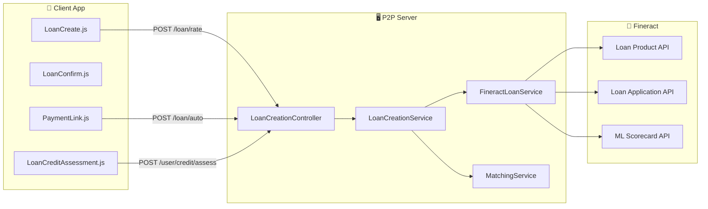
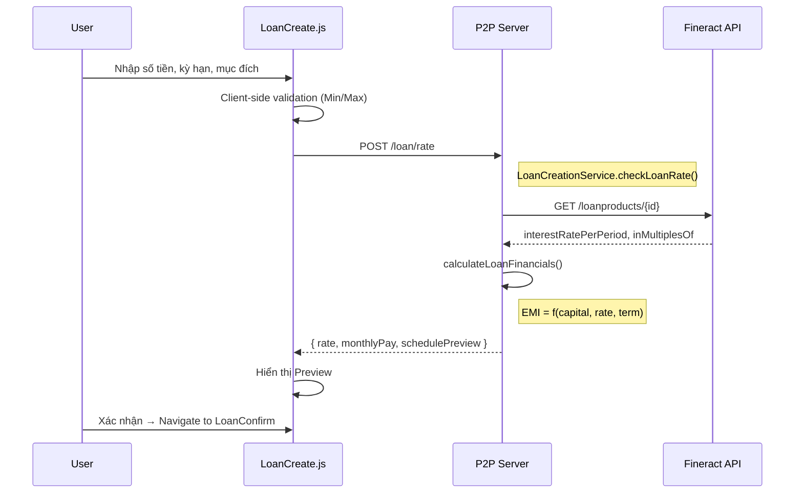
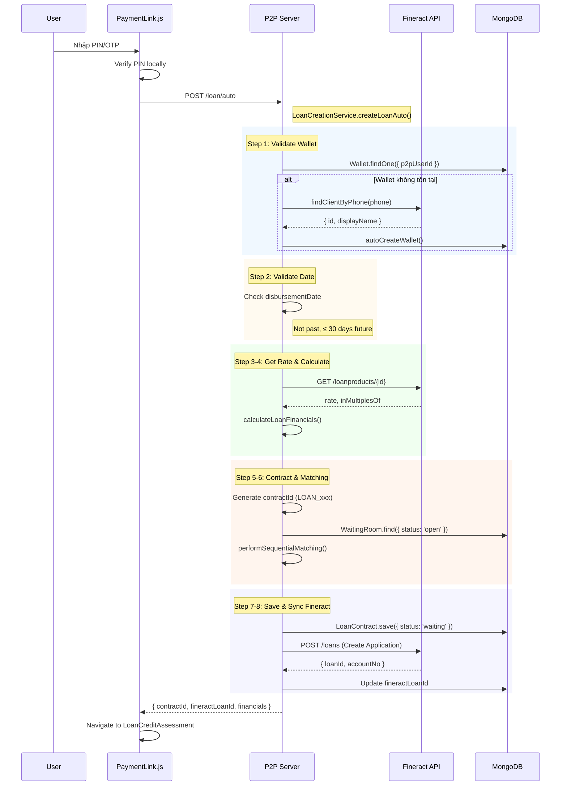
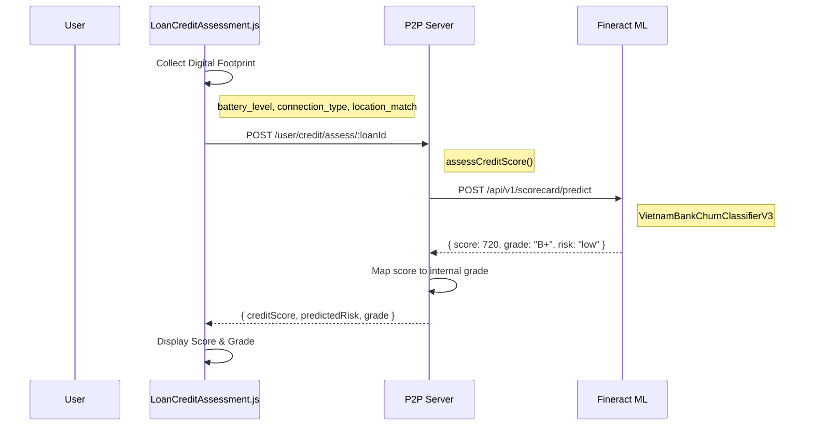
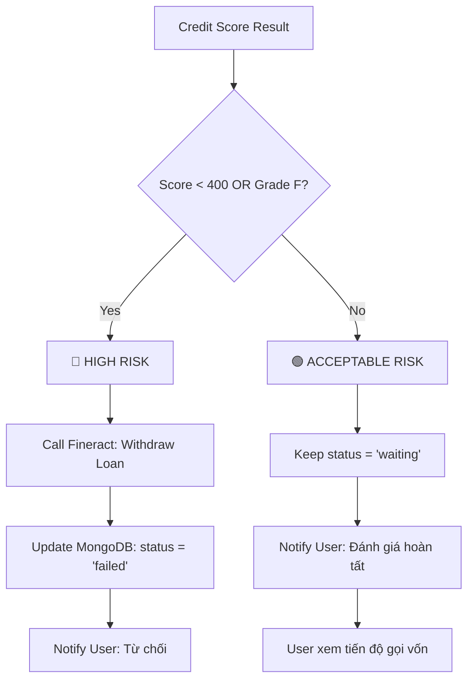

# Luồng Tạo Khoản Vay (Loan Creation Flow)

Tài liệu này mô tả chi tiết quy trình tạo khoản vay thực tế trên hệ thống P2P Lending, bao gồm các bước từ **Client App** (Mobile), qua **P2P Server**, đến **Fineract Core Banking** và **Fineract ML** (Credit Scoring).

---

## 1. Tổng Quan Kiến Trúc

### 1.1 Các Thành Phần Chính

| Component | Mô tả | Công nghệ |
|-----------|-------|-----------|
| **Client App** | Ứng dụng Mobile cho Borrower | React Native (Expo) |
| **P2P Server** | Backend xử lý nghiệp vụ P2P | Node.js, Express, MongoDB |
| **Fineract Core** | Core Banking System | Apache Fineract |
| **Fineract ML** | Credit Scoring Engine | Python, ML Models |

### 1.2 Sơ Đồ Tổng Quan



---

## 2. Quy Trình Chi Tiết (4 Phases)

### Phase 1: Input & Preview

**Mục tiêu**: User nhập thông tin khoản vay và xem trước lịch trả nợ.



**Chi tiết xử lý Server (`checkLoanRate`):**

| Bước | Action | Source Code |
|------|--------|-------------|
| 1 | Lấy Rate từ Fineract Product | `getInterestRateFromProduct()` |
| 2 | Lấy Rounding Config | `getRoundingMultiple()` |
| 3 | Tính EMI theo Declining Balance | `calculateLoanFinancials()` |
| 4 | Generate Schedule Preview | Loop từng kỳ, tính Principal + Interest |

**API Response Example:**
```json
{
  "rate": 1.5,
  "monthlyPay": 1792000,
  "entirelyPay": 10752000,
  "inMultiplesOf": 1000,
  "schedulePreview": [
    { "period": 1, "principal": 1667000, "interest": 150000, "total": 1817000 }
  ]
}
```

---

### Phase 2: Authorization & Creation

**Mục tiêu**: Xác thực PIN/OTP và tạo khoản vay trên hệ thống.



**Chi tiết 8 Bước xử lý (`createLoanAuto`):**

| # | Bước | Mô tả chi tiết | Function |
|---|------|----------------|----------|
| 1 | **Validate Wallet** | Kiểm tra User có Wallet liên kết Fineract Client. Nếu không → tìm theo SĐT → tự động tạo Wallet | `validateWalletAndFineract()` |
| 2 | **Validate Date** | Ngày giải ngân phải ≥ today và ≤ today + 30 ngày | `validateDisbursementDate()` |
| 3 | **Get Rate** | Lấy lãi suất từ Fineract Loan Product (KHÔNG hardcode) | `getInterestRate()` |
| 4 | **Calculate Financials** | Tính EMI, Total Interest, Schedule theo Declining Balance hoặc Flat | `calculateLoanFinancials()` |
| 5 | **Generate Contract ID** | Tạo unique ID: `LOAN_{timestamp}` | `createBlockchainContract()` |
| 6 | **Perform Matching** | Quét WaitingRoom để khớp lệnh real-time với các Lender đang chờ | `performMatching()` |
| 7 | **Save to MongoDB** | Lưu `LoanContract` với status `waiting`, thông tin matching | `saveToMongoDB()` |
| 8 | **Create Fineract Loan** | Gọi API tạo Loan Application, kèm Service Fee Charge | `createFineractLoan()` |

**Fineract Loan Creation Payload:**
```json
{
  "clientId": 123,
  "productId": 1,
  "principal": 10000000,
  "loanTermFrequency": 6,
  "loanTermFrequencyType": 2,
  "numberOfRepayments": 6,
  "repaymentEvery": 1,
  "repaymentFrequencyType": 2,
  "interestRatePerPeriod": 1.5,
  "expectedDisbursementDate": "2026-01-15",
  "submittedOnDate": "2026-01-07",
  "charges": [
    { "chargeId": 5, "amount": 100000 }
  ]
}
```

---

### Phase 3: Credit Assessment (Digital Footprint)

**Mục tiêu**: Thu thập dữ liệu thiết bị và chấm điểm tín dụng.



**Digital Footprint Data:**

| Field | Mô tả | Nguồn |
|-------|-------|-------|
| `battery_level` | Mức pin thiết bị (%) | expo-battery |
| `connection_type` | Loại kết nối (wifi/4g) | expo-network |
| `location_match` | Đã cấp quyền location? | expo-location |
| `submission_hour` | Giờ gửi đơn (0-23) | new Date().getHours() |
| `device_score` | Điểm thiết bị tổng hợp | Calculated |

**Grade Mapping:**

| Credit Score | Grade | Risk Level |
|-------------|-------|------------|
| 750-850 | A+ | Low |
| 700-749 | A | Low |
| 650-699 | B+ | Low |
| 600-649 | B | Medium |
| 550-599 | C+ | Medium |
| 500-549 | C | Medium |
| 400-499 | D | High |
| < 400 | F | High → **AUTO REJECT** |

---

### Phase 4: Decision (Auto-Approval / Auto-Rejection)

**Mục tiêu**: Quyết định duyệt hoặc từ chối tự động.



**Auto-Rejection Logic (Server):**
```javascript
if (predictedRisk === 'high' || creditScore < 400) {
    // Withdraw loan on Fineract
    await fineractLoanService.withdrawLoan(fineractLoanId);
    
    // Update MongoDB
    await LoanContract.findByIdAndUpdate(loanId, { 
        status: 'failed',
        rejectionReason: 'HIGH_RISK_AUTO_REJECT'
    });
}
```

---

## 3. Data Models

### LoanContract (MongoDB)

```javascript
{
  contractId: "LOAN_1704628800000",      // P2P unique ID
  fineractLoanId: 456,                   // Fineract Loan ID
  borrower: ObjectId("..."),             // Reference to User
  
  info: {
    capital: 10000000,                   // Số tiền vay
    rate: 1.5,                           // Lãi suất %/tháng
    periodMonth: 6,                      // Kỳ hạn (tháng)
    willing: "Kinh doanh",               // Mục đích vay
    monthlyPay: 1792000,                 // Tiền trả hàng tháng
    entirelyPay: 10752000,               // Tổng phải trả
    interestType: "Dư nợ giảm dần",
    disbursementDate: "2026-01-15",
    maturityDate: "2026-07-15"
  },
  
  // Matching Result
  nodeMatch: 10,                         // Số phiếu đã khớp
  matchedAmount: 5000000,                // Số tiền đã khớp
  matchPercentage: 50,                   // % đã khớp
  isFullMatch: false,
  waitingRooms: [ObjectId("...")],
  
  // Credit Score
  creditScore: 720,
  grade: "B+",
  predictedRisk: "low",
  
  // Status
  status: "waiting",                     // waiting | success | clean | failed
  fineractStatus: "submittedAndPendingApproval",
  
  createdAt: ISODate("2026-01-07T11:30:00Z")
}
```

### SettlementContract (MongoDB)

> Được tạo sau khi **Giải ngân (Disbursement)** thành công.

```javascript
{
  contractId: "SETTLE_LOAN_456_1",        // Settlement ID
  loanContract: ObjectId("..."),          // Reference to LoanContract
  borrower: ObjectId("..."),
  
  principalAmount: 1667000,
  interestAmount: 150000,
  penaltyAmount: 0,
  totalAmount: 1817000,
  
  maturityDate: "2026-02-15",
  status: "undue",                        // undue | due | settled | overdue
  
  createdAt: ISODate("2026-01-15T00:00:00Z")
}
```

---

## 4. API Reference

### 4.1 Preview Rate

| | |
|---|---|
| **Endpoint** | `POST /loan/rate` |
| **Auth** | `x-auth: {token}` |
| **Controller** | `LoanCreationController.checkLoanRate` |

**Request:**
```json
{
  "capital": 10000000,
  "periodMonth": 6,
  "willing": "Kinh doanh"
}
```

**Response:**
```json
{
  "ok": true,
  "result": {
    "rate": 1.5,
    "monthlyPay": 1792000,
    "entirelyPay": 10752000,
    "schedulePreview": [...]
  }
}
```

### 4.2 Create Loan

| | |
|---|---|
| **Endpoint** | `POST /loan/auto` |
| **Auth** | `x-auth: {token}` |
| **Controller** | `LoanCreationController.createLoanAuto` |

**Request:**
```json
{
  "capital": 10000000,
  "periodMonth": 6,
  "willing": "Kinh doanh",
  "disbursementDate": "2026-01-15T00:00:00.000Z"
}
```

**Response:**
```json
{
  "ok": true,
  "result": {
    "data": {
      "contractId": "LOAN_1704628800000",
      "info": { ... },
      "totalNotes": 20
    },
    "matchingStatus": { ... },
    "fineractLoanId": 456
  }
}
```

### 4.3 Assess Credit

| | |
|---|---|
| **Endpoint** | `POST /user/credit/assess/:loanId` |
| **Auth** | `x-auth: {token}` |
| **Controller** | `LoanCreationController.assessCreditScore` |

**Request:**
```json
{
  "battery_level": 85,
  "connection_type": "wifi",
  "location_match": "true",
  "submission_hour": 14
}
```

**Response:**
```json
{
  "success": true,
  "data": {
    "creditScore": 720,
    "predictedRisk": "low",
    "grade": "B+",
    "label": "Rủi ro thấp"
  }
}
```

---

## 5. Error Handling

| Error Code | Message | Nguyên nhân | Giải pháp |
|------------|---------|-------------|-----------|
| `WALLET_NOT_LINKED` | Bạn cần liên kết ví điện tử | Chưa có Wallet hoặc fineractClientId | User liên kết ví trước |
| `INVALID_DISBURSEMENT_DATE` | Ngày giải ngân không hợp lệ | Ngày quá khứ hoặc > 30 ngày | Chọn ngày hợp lệ |
| `FINERACT_RATE_ERROR` | Không lấy được lãi suất | Fineract Loan Product chưa config | Admin cấu hình Product |
| `FINERACT_CREATE_ERROR` | Không thể tạo khoản vay | Fineract API lỗi | Check Fineract logs |
| `HIGH_RISK_AUTO_REJECT` | Điểm tín dụng không đủ | Score < 400 hoặc Grade F | User không đủ điều kiện |

---

## 6. Xem Thêm

- [Trạng Thái Khoản Vay](./loan-status) - Chi tiết về các trạng thái trong MongoDB và Fineract
- [Quy Trình Giải Ngân](./loan-disbursement) - Luồng xử lý khi đủ vốn
- [Quy Trình Trả Nợ](./loan-repayment) - Luồng xử lý thanh toán kỳ hạn
