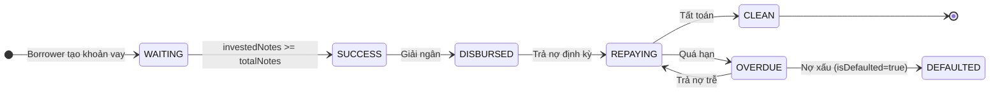
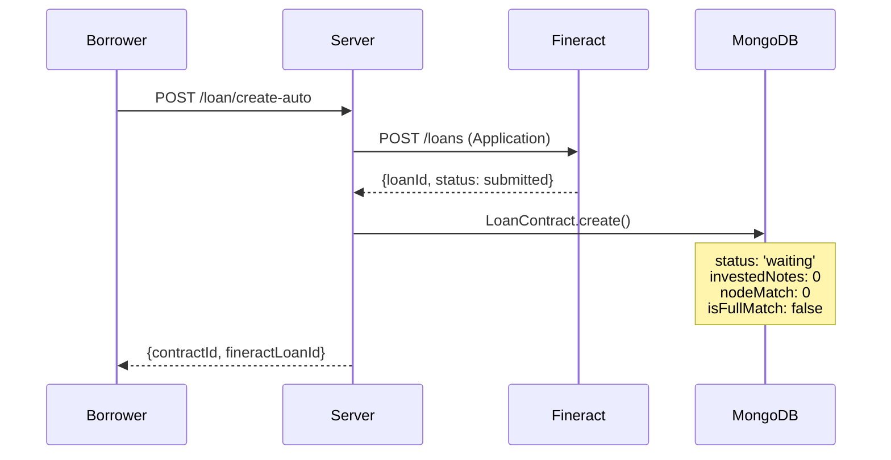
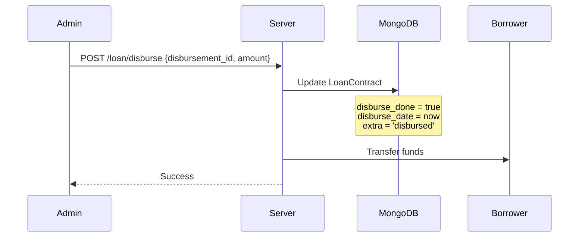
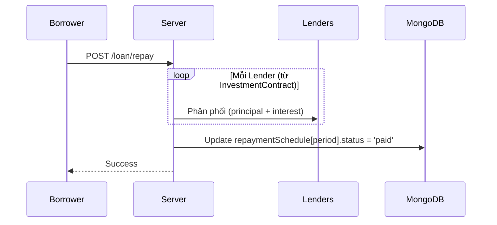

# Vòng Đời Khoản Vay (Loan Life-Cycle)

Tài liệu mô tả toàn bộ vòng đời của một khoản vay trong hệ thống P2P Lending **DỰA TRÊN CODE THỰC TẾ**.

---

## 1. Tổng Quan



---

## 2. Các Trạng Thái Chi Tiết

### 2.1 Trạng Thái MongoDB (`status`)

Đây là **SOURCE OF TRUTH** cho logic nghiệp vụ.

| Status | Mô tả | Điều kiện chuyển | File |
|--------|-------|------------------|------|
| `waiting` | Đang chờ đầu tư | Loan vừa tạo, `investedNotes < totalNotes` | LoanCreation.js |
| `success` | **Đã đủ vốn** | `investedNotes >= totalNotes` | InvestContractService.js:442-444 |
| `clean` | Đã tất toán | Trả hết nợ | RepaymentService.js |
| `fail` | Thất bại | Bị từ chối hoặc hủy | - |

> **CRITICAL**: Status chuyển từ `waiting` → `success` dựa HOÀN TOÀN vào `investedNotes`, **KHÔNG** dùng `nodeMatch` hay `matchedAmount`.

**Code thực tế (InvestContractService.js:437-445):**
```javascript
// CRITICAL: isFullMatch CHỈ TRUE khi TẤT CẢ nodes đã được INVESTED thực sự
// KHÔNG dùng matchedAmount vì nó bị double-count (WaitingRoom + Investment)
const isFullMatch = newInvestedNotes >= totalNotes;
loanContract.isFullMatch = isFullMatch;

if (isFullMatch && loanContract.status === 'waiting') {
    loanContract.status = 'success';
    console.log(`Loan ${loanId} đã đủ 100% vốn, cập nhật status: success`);
}
```

### 2.2 Trạng Thái Fineract (`fineractStatus`)

Enum values (InvestContractService.js:38-49):
```javascript
[
    'SUBMITTED_AND_PENDING_APPROVAL',  // Đã nộp
    'APPROVED',                        // Đã duyệt
    'ACTIVE',                          // Đang hoạt động (đã giải ngân)
    'REJECTED',
    'CLOSED_OBLIGATIONS_MET',          // Đã đóng, hoàn thành
    'CLOSED_WRITTEN_OFF',
    'WITHDRAWN_BY_CLIENT',
    'OVERPAID'
]
```

---

## 3. Flow Chi Tiết Từng Giai Đoạn

### Phase 1: Tạo Khoản Vay



**Fields khởi tạo (LoanContract.js:101-112):**
```javascript
{
    contractId: "LOAN_xxx",
    status: "waiting",           // enum: ['waiting', 'success', 'clean', 'fail']
    totalNotes: 20,              // capital / 500,000
    investedNotes: 0,            // Số nodes đã INVESTED thực sự
    nodeMatch: 0,                // Số nodes đã RESERVED bởi WaitingRoom
    matchedAmount: 0,
    matchPercentage: 0,
    isFullMatch: false,
    fineractLoanId: 123,
    fineractStatus: 'SUBMITTED_AND_PENDING_APPROVAL'
}
```

### Phase 2: Matching & Investment

#### 2a. WaitingRoom Matching (Reserve)

Khi có WaitingRoom phù hợp, hệ thống **reserve** nodes:

```javascript
// waitingRoom.js - Update LoanContract
loan.nodeMatch += nodesToMatch;      // RESERVED (không phải invested)
loan.waitingRooms.push(roomId);
// matchedAmount KHÔNG được cập nhật ở đây
```

> **QUAN TRỌNG**: `nodeMatch` chỉ là **giữ chỗ**, không làm loan chuyển sang `success`.

#### 2b. Investment (Thực sự đầu tư)

**Code thực tế (InvestContractService.js:419-445):**
```javascript
// 1. Update investedNotes
const newInvestedNotes = currentInvestedNotes + investNotes;
loanContract.investedNotes = newInvestedNotes;

// 2. Update matchedAmount - tích lũy số tiền đầu tư thực tế
const actualInvestAmount = investmentCapital > 0 
    ? investmentCapital  // Nếu có truyền capital trực tiếp
    : (investNotes * baseUnitPrice);  // Ngược lại tính từ số nodes
const newMatchedAmount = currentMatchedAmount + actualInvestAmount;
loanContract.matchedAmount = newMatchedAmount;

// 3. Update matchPercentage
const newMatchPercentage = Math.min(100, (newMatchedAmount / totalCapital) * 100);
loanContract.matchPercentage = newMatchPercentage;

// 4. Update isFullMatch and status
const isFullMatch = newInvestedNotes >= totalNotes;
loanContract.isFullMatch = isFullMatch;

if (isFullMatch && loanContract.status === 'waiting') {
    loanContract.status = 'success';  // ← STATUS TRANSITION HERE
}
```

#### Phân biệt `nodeMatch` vs `investedNotes`

| Field | Ý nghĩa | Cập nhật bởi | Ảnh hưởng status? |
|-------|---------|--------------|-------------------|
| `nodeMatch` | Nodes đã RESERVED bởi WaitingRoom | waitingRoom.js | **KHÔNG** |
| `investedNotes` | Nodes đã INVESTED thực sự | InvestContractService.js | **CÓ** (→ success khi >= totalNotes) |

**Công thức "Total Claimed":**
```javascript
totalClaimed = nodeMatch + investedNotes;
availableNotes = totalNotes - totalClaimed;
```

### Phase 3: Full Match → Status Success

Điều kiện chuyển status (InvestContractService.js:442-444):
```javascript
if (isFullMatch && loanContract.status === 'waiting') {
    loanContract.status = 'success';
}
```

**KHÔNG** có automatic approval của Fineract. Phải manual approve sau.

### Phase 4: Manual Approval (Fineract)

⚠️ **Process MANUAL** - không automatic trong code:
- Admin vào Fineract UI
- Click "Approve" loan
- `fineractStatus` chuyển sang `APPROVED`

### Phase 5: Giải Ngân (Disbursement)



**Code thực tế (LoanDisbursement.js:244-247):**
```javascript
loanContract.extra = 'disbursed';
loanContract.disburse_done = true;
loanContract.disburse_date = new Date();
loanContract.disburse_amount = amount;
```

**Điều kiện giải ngân (LoanDisbursement.js:182):**
```javascript
if (loanContract.status !== 'success') {
    throw new Error(`Loan is not ready for disbursement: ${loanContract.status}`);
}
```

### Phase 6: Trả Nợ (Repayment)



**Phân phối theo `lenderSchedule`** trong `InvestmentContract`.

### Phase 7: Tất Toán (Settlement)

```javascript
// RepaymentService.js
if (allPeriodsPaid) {
    loanContract.status = 'clean';
}
```

---

## 4. Ví Dụ Cụ Thể

### Scenario: Loan 10,000,000 VND (20 nodes)

| Step | Action | nodeMatch | investedNotes | Tổng Claimed | Status |
|------|--------|-----------|---------------|--------------|--------|
| 1 | Loan Created | 0 | 0 | 0 | `waiting` |
| 2 | WR A match 4 nodes | **4** | 0 | 4 | `waiting` |
| 3 | WR B match 6 nodes | **10** | 0 | 10 | `waiting` |
| 4 | WR A đầu tư 4 nodes | **6** (giảm 4) | **4** | 10 | `waiting` |
| 5 | Direct invest 10 nodes | 6 | **14** | 20 | `waiting` |
| 6 | WR B đầu tư 6 nodes | **0** (giảm 6) | **20** | 20 | **`success`** ← STATUS CHANGE |
| 7 | Manual approve (Fineract) | 0 | 20 | 20 | `success`, fineractStatus: `APPROVED` |
| 8 | Disburse | 0 | 20 | 20 | `success`, disburse_done: true |
| 9 | All repaid | 0 | 20 | 20 | **`clean`** |

> **Key Points**:
> - `nodeMatch` GIẢM khi chủ WaitingRoom thực sự đầu tư (InvestCreation.js)
> - Status chuyển `success` khi `investedNotes = 20` (step 6)
> - Fineract approval là manual (step 7)
> - Xem chi tiết tại [Luồng Ghép Nối](./matching-flow)

---

## 5. Logic Quyết Định

### Điều kiện Full Match

```javascript
// ✅ ĐÚNG: Dùng investedNotes (InvestContractService.js:439)
const isFullMatch = investedNotes >= totalNotes;

// ❌ SAI: Không dùng matchedAmount (bị double-count)
// ❌ SAI: Không dùng nodeMatch (chỉ là reserved)
```

### Điều kiện Giải Ngân

```javascript
// LoanDisbursement.js:182
const canDisburse = (
    loanContract.status === 'success'  // Đủ vốn
);
```

---

## 6. Files Liên Quan

| Layer | File | Chức năng | Lines |
|-------|------|-----------|-------|
| Model | `LoanContract.js` | MongoDB schema | 109-112 (status) |
| Server | `waitingRoom.js` | WR matching logic | - |
| Server | `InvestContractService.js` | **Investment + Full match** | **437-445 (status change)** |
| Server | `LoanDisbursement.js` | Disbursement | 244-247 |
| Server | `RepaymentService.js` | Repayment + Clean status | - |
| Client | `InvestDetail.js` | Available notes UI | - |

---

## 7. Xem Thêm

- [Luồng Ghép Nối](./matching-flow) - Chi tiết WaitingRoom → Loan matching
- [Luồng Tạo Khoản Vay](./loan-creation-flow) - Chi tiết tạo loan
- [Trạng Thái Khoản Vay](./loan-status) - Status mapping
