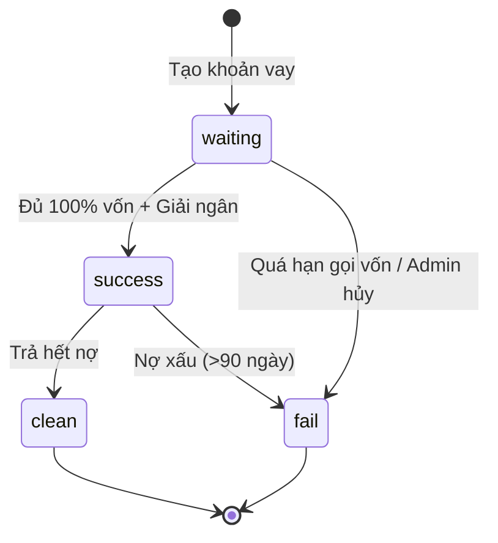
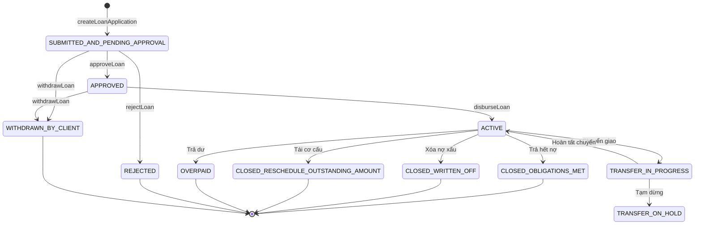
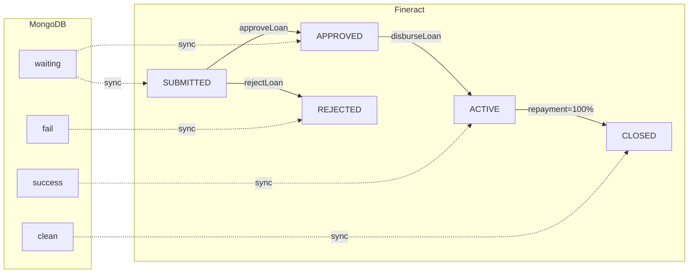

# Trạng Thái Khoản Vay (Loan Status)

Hệ thống P2P Lending sử dụng **2 nguồn dữ liệu** song song để quản lý trạng thái khoản vay:
1. **MongoDB** (`LoanContract.status`) - Trạng thái nội bộ của hệ thống P2P
2. **Fineract** (`LoanContract.fineractStatus`) - Trạng thái trên core banking

## Trạng Thái MongoDB

### Schema Definition

```javascript
// LoanContract.js
status: {
    type: String,
    enum: ['waiting', 'success', 'clean', 'fail'],
    default: 'waiting'
}
```

### Chi Tiết Các Trạng Thái

| Status | Tên Hiển Thị | Mô Tả | Điều Kiện Chuyển |
|--------|--------------|-------|------------------|
| `waiting` | Chờ duyệt | Khoản vay mới tạo, đang chờ đủ vốn đầu tư | Mặc định khi tạo loan |
| `success` | Đang vay | Đã giải ngân, borrower đang trả nợ | `investedNotes >= totalNotes` |
| `clean` | Đã tất toán | Borrower đã trả hết nợ | Fineract status = closed |
| `fail` | Thất bại | Khoản vay bị hủy hoặc quá hạn không thu hồi được | Admin action hoặc auto-cancel |

### State Diagram (MongoDB)



---

## Trạng Thái Fineract

### Schema Definition

```javascript
// LoanContract.js
fineractStatus: {
    type: String,  // Chấp nhận bất kỳ status code nào từ Fineract
    default: null
}
```

### Danh Sách Trạng Thái Fineract

| Status Code | Enum Value | Mô Tả | UI Display |
|-------------|------------|-------|------------|
| `loanStatusType.submitted.and.pending.approval` | `SUBMITTED_AND_PENDING_APPROVAL` | Đã gửi, chờ duyệt | 🟡 Chờ duyệt |
| `loanStatusType.approved` | `APPROVED` | Đã duyệt, chờ giải ngân | 🟢 Đã duyệt |
| `loanStatusType.active` | `ACTIVE` | Đang hoạt động (đã giải ngân) | 🔵 Đang vay |
| `loanStatusType.closed.obligations.met` | `CLOSED_OBLIGATIONS_MET` | Đã đóng - Trả hết nợ | ✅ Hoàn thành |
| `loanStatusType.closed.written.off` | `CLOSED_WRITTEN_OFF` | Đã đóng - Xóa nợ xấu | ❌ Xóa nợ |
| `loanStatusType.closed.reschedule.outstanding.amount` | `CLOSED_RESCHEDULE_OUTSTANDING_AMOUNT` | Đã đóng - Tái cơ cấu | 🔄 Tái cơ cấu |
| `loanStatusType.rejected` | `REJECTED` | Bị từ chối | ❌ Từ chối |
| `loanStatusType.withdrawn.by.client` | `WITHDRAWN_BY_CLIENT` | Borrower rút đơn | ⬅️ Đã rút |
| `loanStatusType.overpaid` | `OVERPAID` | Trả dư | 💰 Trả dư |
| `loanStatusType.transfer.in.progress` | `TRANSFER_IN_PROGRESS` | Đang chuyển giao | 🔄 Đang chuyển |
| `loanStatusType.transfer.on.hold` | `TRANSFER_ON_HOLD` | Chuyển giao tạm dừng | ⏸️ Tạm dừng |

### State Diagram (Fineract)



---

## Mapping Giữa MongoDB và Fineract

### Logic Chuyển Đổi

```javascript
// LoanRetrieval.js - mapStatus()
const mapStatus = (loan) => {
    const status = loan.status;
    if (!status) return 'waiting';
    
    // Active → success
    if (status.active || status.code === 'loanStatusType.active') 
        return 'success';
    
    // Closed → clean
    if (status.closedObligationsMet || status.closedWrittenOff || 
        status.closedRescheduled || status.closed || 
        status.code === 'loanStatusType.closed.obligations.met' || 
        status.code?.includes('closed')) 
        return 'clean';
    
    // Pending states → waiting
    if (status.waitingForDisbursal || status.pendingApproval || 
        status.code === 'loanStatusType.submitted.and.pending.approval' || 
        status.code === 'loanStatusType.approved') 
        return 'waiting';
    
    return 'waiting';
};
```

### Bảng Mapping

| Fineract Status | MongoDB Status | Ghi Chú |
|-----------------|----------------|---------|
| `SUBMITTED_AND_PENDING_APPROVAL` | `waiting` | Chờ đủ vốn đầu tư |
| `APPROVED` | `waiting` | Đã duyệt, chờ giải ngân |
| `ACTIVE` | `success` | Đang vay |
| `CLOSED_OBLIGATIONS_MET` | `clean` | Trả hết - tự động đóng |
| `CLOSED_WRITTEN_OFF` | `clean` | Xóa nợ - admin action |
| `CLOSED_RESCHEDULE_OUTSTANDING_AMOUNT` | `clean` | Tái cơ cấu |
| `REJECTED` | `fail` | Bị từ chối |
| `WITHDRAWN_BY_CLIENT` | `fail` | Borrower hủy |
| `OVERPAID` | `clean` | Trả dư (hiếm) |

---

## Lifecycle Tổng Hợp



---

## Các Trường Liên Quan Khác

### Disbursement Info

```javascript
disbursementInfo: {
    fineractDisbursementId: Number,  // ID giao dịch giải ngân trên Fineract
    disbursementDate: Date,          // Ngày giải ngân thực tế
    disbursementAmount: Number,      // Số tiền giải ngân
    status: ['pending', 'approved', 'completed', 'failed']
}
```

### Payment Status (trong mảng `payments`)

```javascript
payments: [{
    disbursement_id: String,
    amount: Number,
    disbursement_date: Date,
    disbursement_method: ['bank_transfer', 'wallet'],
    status: ['pending', 'processing', 'completed', 'failed']
}]
```

### Default Tracking

```javascript
isDefaulted: Boolean,     // Có phải nợ xấu không
defaultDate: Date,        // Ngày chuyển thành nợ xấu
daysOverdue: Number,      // Số ngày quá hạn
latePaymentCount: Number  // Số lần trả muộn
```

---

## Xử Lý Status Trong Code

### Normalize Fineract Status

```javascript
// InvestContractService.js
const normalizeFineractStatus = (statusCode) => {
    if (!statusCode) return null;

    const statusMap = {
        'loanStatusType.submitted.and.pending.approval': 'SUBMITTED_AND_PENDING_APPROVAL',
        'loanStatusType.approved': 'APPROVED',
        'loanStatusType.active': 'ACTIVE',
        // ... (xem file gốc)
    };

    // Nếu đã là enum value hợp lệ, return luôn
    if (validEnumValues.includes(statusCode)) {
        return statusCode;
    }

    // Convert từ code sang enum value
    return statusMap[statusCode] || null;
};
```

### Client-Side Status Display

```javascript
// LoanStatusUtils.js
export const getLoanStatusInfo = (statusInfo) => {
    if (statusInfo?.active || statusInfo?.code === 'loanStatusType.active') {
        return { text: 'Đang vay', color: '#3B82F6', icon: 'time' };
    }
    
    if (statusInfo?.closedObligationsMet || statusInfo?.code?.includes('closed')) {
        return { text: 'Đã trả hết', color: '#10B981', icon: 'checkmark-circle' };
    }
    
    if (statusInfo?.waitingForDisbursal || statusInfo?.pendingApproval) {
        return { text: 'Chờ duyệt', color: '#F59E0B', icon: 'hourglass' };
    }
    
    return { text: 'Không xác định', color: '#6B7280', icon: 'help-circle' };
};
```

---

## Xem Thêm

- [Luồng Tạo Khoản Vay](./loan-creation-flow) - Chi tiết luồng tạo khoản vay
- [Fineract Core](/docs/02-system-architecture/fineract-core) - Tổng quan về Apache Fineract
