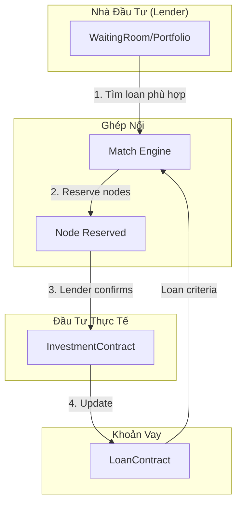
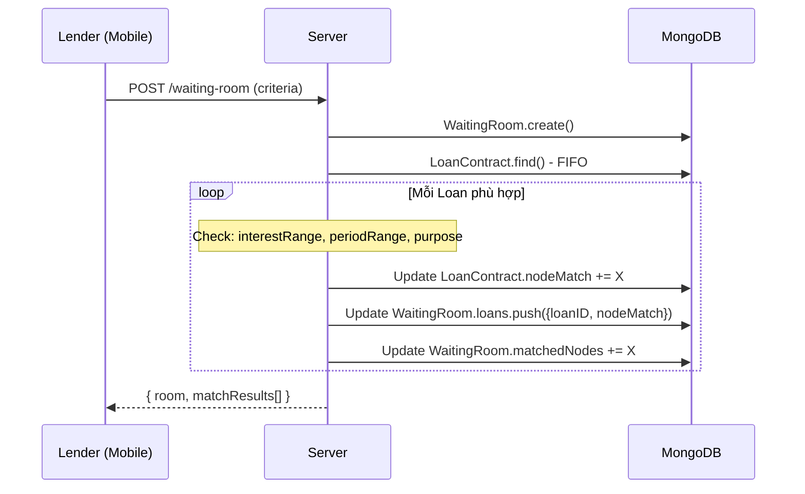
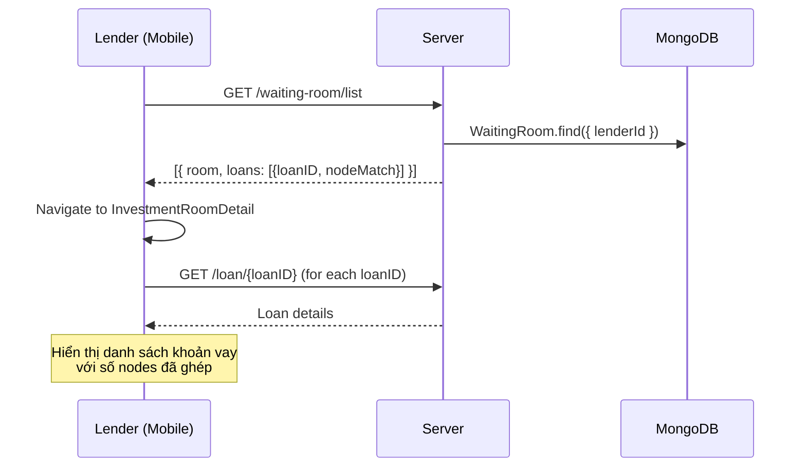
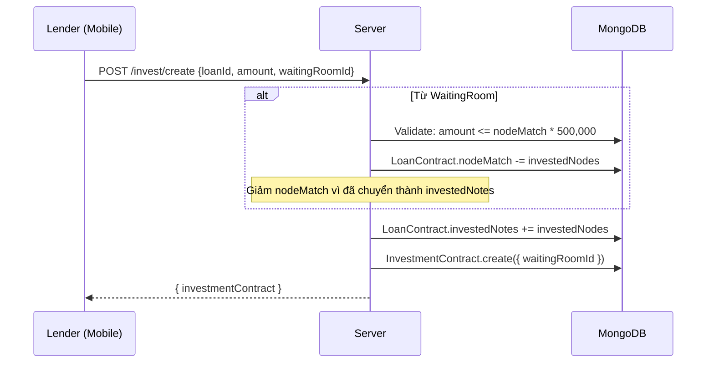
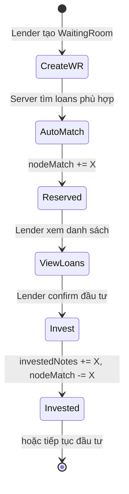

# Luồng Ghép Nối P2P (Matching Flow)

Mô tả chi tiết quy trình ghép nối giữa **Nhà đầu tư (WaitingRoom/Portfolio)** và **Khoản vay (Loan)** trong hệ thống P2P Lending.

---

## 1. Tổng Quan Kiến Trúc



---

## 2. Khái Niệm Quan Trọng

### 2.1 WaitingRoom (Danh mục đầu tư)

Khi Lender tạo WaitingRoom, họ đặt ra các tiêu chí đầu tư:

```javascript
{
    lenderId: ObjectId,
    phone: "0987654321",
    capital: 100000000,         // Vốn ban đầu
    maxCapital: 2000000,        // Vốn tối đa cho 1 khoản vay
    totalNodes: 200,            // Tổng nodes = capital / 500,000
    matchedNodes: 6,            // Nodes đã ghép với loans
    interestRange: { min: 1, max: 50 },  // Lãi suất chấp nhận
    periodRange: { min: 1, max: 50 },    // Kỳ hạn chấp nhận
    purpose: ["du lịch", "mua xe"],      // Mục đích cho vay
    loans: [                    // Danh sách khoản vay đã ghép
        { loanID: "LOAN_xxx", nodeMatch: 2 },
        { loanID: "LOAN_yyy", nodeMatch: 4 }
    ],
    status: "open"
}
```

### 2.2 Phân biệt `nodeMatch` vs `investedNotes`

| Trường | Ý nghĩa | Cập nhật bởi |
|--------|---------|--------------|
| `nodeMatch` (LoanContract) | Nodes đã **RESERVED** bởi WaitingRoom | Matching Engine |
| `investedNotes` (LoanContract) | Nodes đã **INVESTED** thực sự | Investment Flow |
| `matchedNodes` (WaitingRoom) | Nodes đã ghép từ phía WaitingRoom | Matching Engine |

> **Quan trọng**: `nodeMatch` chỉ là **giữ chỗ**, không phải đầu tư thực sự!

---

## 3. Luồng Chi Tiết

### Phase 1: Tạo WaitingRoom & Auto-Match



**Điều kiện Match:**
```javascript
const canMatch = (
    loan.info.rate >= room.interestRange.min &&
    loan.info.rate <= room.interestRange.max &&
    loan.info.periodMonth >= room.periodRange.min &&
    loan.info.periodMonth <= room.periodRange.max &&
    purposeMatch(loan.purpose, room.purpose) &&
    room.status === 'open' &&
    (room.totalNodes - room.matchedNodes) > 0
);
```

### Phase 2: Xem Khoản Vay Đã Ghép (Mobile)



**Client UI (InvestmentRoomDetail.js):**
- Hiển thị danh sách khoản vay từ `room.loans`
- Merge `nodeMatch` vào loan data để hiển thị progress

### Phase 3: Đầu Tư Thực Tế (Investment)



**Logic quan trọng trong InvestCreation.js:**
```javascript
// Khi đầu tư từ WaitingRoom
if (waitingRoomId) {
    // Giảm nodeMatch vì chuyển từ "reserved" → "invested"
    loan.nodeMatch = Math.max(0, loan.nodeMatch - info.numNotes);
}

// Tăng investedNotes (đầu tư thực sự)
loan.investedNotes = (loan.investedNotes || 0) + info.numNotes;
```

---

## 4. Tính Toán Available Notes

### 4.1 Từ WaitingRoom (fixedNodes)

```javascript
// InvestDetail.js
if (fixedNodes > 0) {
    availableNotes = fixedNodes;  // Giới hạn = số nodes đã reserved
}
```

### 4.2 Đầu Tư Trực Tiếp (Direct Investment)

```javascript
// Không qua WaitingRoom
const totalClaimed = nodeMatch + investedNotes;
availableNotes = totalNotes - totalClaimed;
```

---

## 5. Progress Bar Hiển Thị

### Dual-Segment Progress Bar

```
┌─────────────────────────────────────────────────────┐
│ 🟠 Reserved (nodeMatch) │ 🟢 Invested │ ⬜ Available │
└─────────────────────────────────────────────────────┘
```

**Công thức:**
```javascript
const matchedNodes = loan.nodeMatch || 0;      // Orange
const investedNotes = loan.investedNotes || 0; // Green
const totalNotes = loan.totalNotes;
const available = totalNotes - matchedNodes - investedNotes; // Gray
```

---

## 6. Sync với Odoo

### Model: `p2p.sync.portfolio.loan.match`

Odoo sync trực tiếp từ `WaitingRoom.loans`:

```python
# p2p_sync_service.py
loan_matches = data.get('loan_matches', [])
for lm in loan_matches:
    LoanMatch.create({
        'portfolio_id': portfolio.id,
        'loan_id': loan.id,
        'node_match': lm.get('node_match', 0)
    })
```

### Dashboard Data

```python
# Lấy từ loan_match_ids thay vì investment_ids
'pairings': [{
    'loan_id': match.loan_id.mongodb_id,
    'node_match': match.node_match,
    'amount': match.match_amount,  # node_match * 500,000
    'borrower': match.loan_id.borrower_name_sync,
} for match in p.loan_match_ids if match.loan_id]
```

---

## 7. Các Edge Cases

### 7.1 Duplicate Investment Prevention

```javascript
// Khi đầu tư từ WaitingRoom, giảm nodeMatch
if (waitingRoomId) {
    loan.nodeMatch = Math.max(0, loan.nodeMatch - info.numNotes);
}
// Tránh double-counting: nodeMatch + investedNotes
```

### 7.2 Room Closed When Full

```javascript
if (room.matchedNodes >= room.totalNodes) {
    room.status = 'closed';
}
```

### 7.3 Loan Full Match

```javascript
if (loan.investedNotes >= loan.totalNotes) {
    loan.isFullMatch = true;
    loan.status = 'success';
}
```

---

## 8. API Endpoints

| Endpoint | Method | Mô tả |
|----------|--------|-------|
| `/waiting-room` | POST | Tạo WaitingRoom + Auto-match |
| `/waiting-room/list` | GET | Danh sách WaitingRoom của Lender |
| `/waiting-room/:id` | GET | Chi tiết WaitingRoom |
| `/invest/create` | POST | Đầu tư (với waitingRoomId optional) |
| `/loan/match/:roomId` | GET | Danh sách loan phù hợp với room |

---

## 9. Tóm Tắt Flow


