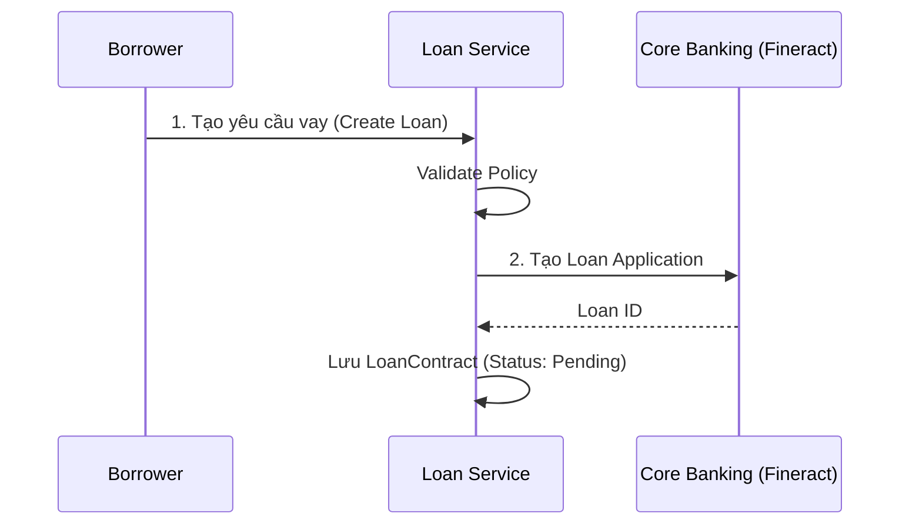

# 🏦 Loan Service (Dịch vụ Khoản vay)

**Loan Service** là trái tim của hệ thống P2P Lending, chịu trách nhiệm quản lý toàn bộ vòng đời của một khoản vay từ lúc khởi tạo, thẩm định, khớp lệnh (matching) đến khi giải ngân và tích hợp với Core Banking.

:::info Repository
Code nằm tại: `server/interators/services/LoanCreationService.js` và `server/interators/services/FineractLoanService.js`
:::

## 🎯 Chức năng Chính

1.  **Quản lý Hồ sơ Vay (Loan Application)**:
    *   Tiếp nhận yêu cầu vay từ Mobile App.
    *   Validate thông tin (KYC, điểm tín dụng).
    *   Tính toán bảng lịch trả nợ dự kiến (Repayment Schedule).

2.  **Cơ chế Khớp lệnh (Matching Engine)**:
    *   Tự động ghép nối (match) nhu cầu vay với các cam kết đầu tư từ Investor.
    *   Sử dụng mô hình **Room-based** để gom vốn.

3.  **Tích hợp Core Banking (Fineract)**:
    *   Đồng bộ dữ liệu khoản vay sang Apache Fineract.
    *   Đảm bảo tính chính xác về kế toán và lãi suất.

4.  **Tích hợp Blockchain (Hyperledger Fabric)**:
    *   Lưu trữ "bằng chứng" hợp đồng vay (Contract Hash) lên Blockchain để chống chối bỏ.

---

### 2. Quan hệ với các Service khác

*   **FineractLoanService**: Đồng bộ dữ liệu 2 chiều với Core Banking.
*   **InvestmentService (via Controllers)**: Quản lý logic đầu tư.
*   **HyperledgerService**: (Legacy) Lưu trữ hash bằng chứng lên Blockchain.
*   **WalletService**: Kiểm tra số dư ví trước khi tạo khoản vay.

## 🗂️ Data Model (MongoDB)

Các collection chính liên quan:

1.  **`LoanContract`**: Lưu trữ thông tin chi tiết khoản vay, lịch trả nợ, và trạng thái đồng bộ Fineract.
2.  **`InvestmentContract`**: Lưu trữ thông tin từng khoản đầu tư của Lender vào Loan.
3.  **`SettlementContract`**: Hợp đồng tất toán (khi khoản vay kết thúc).

### Luồng Trạng thái cơ bản

