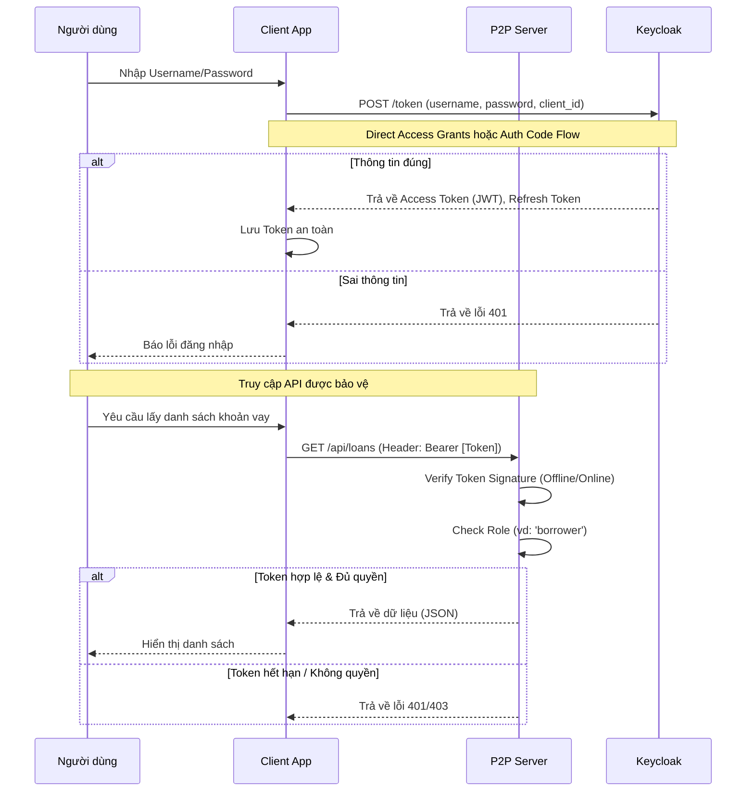

# 🔐 Xác thực & Keycloak

Module xác thực của hệ thống P2P sử dụng **Keycloak**, một giải pháp Quản lý Định danh và Truy cập (IAM) mã nguồn mở hàng đầu. Việc này giúp tách biệt hoàn toàn logic bảo mật khỏi logic nghiệp vụ, tăng cường độ an toàn và khả năng mở rộng.

## Cấu hình Keycloak

### 1. Realm
Hệ thống sử dụng một Realm riêng biệt (ví dụ: `fineract` hoặc `p2p-realm`) để quản lý người dùng cho ứng dụng P2P, tách biệt với realm `master` (dùng cho quản trị hệ thống Keycloak).

### 2. Clients
Các ứng dụng (Clients) được định nghĩa trong Realm để cho phép kết nối:

- **`mobile-app` / `p2p-client`**:
  - **Type**: Public Client (không lưu client secret).
  - **Mục đích**: Dùng cho Mobile App/Web App của người dùng cuối.
  - **Flow**: Direct Access Grants (Resource Owner Password Credentials) hoặc Standard Flow (Authorization Code).

- **`server-app` / `admin-cli`**:
  - **Type**: Confidential Client (có client secret).
  - **Mục đích**: Dùng cho P2P Backend Server để giao tiếp với Keycloak (tạo user, reset password, gán role).
  - **Mục đích 2**: Service Account để Backend gọi sang Fineract (nếu Fineract cũng dùng Keycloak).

### 3. Roles
Hệ thống phân quyền dựa trên Role (RBAC):

| Role Name | Mô tả | Quyền hạn |
| :--- | :--- | :--- |
| **`borrower`** | Người đi vay | Tạo hồ sơ vay, xem khoản vay của mình, trả nợ. |
| **`investor`** | Nhà đầu tư | Nạp tiền, xem danh sách chờ đầu tư, thực hiện đầu tư. |
| **`admin`** | Quản trị viên | Duyệt vay, quản lý hệ thống, xem báo cáo đối soát. |

## Luồng Đăng nhập (Authentication Flow)

Dưới đây là biểu đồ tuần tự mô tả quá trình đăng nhập và xác thực API:

## Tích hợp Backend (NestJS)

Backend sử dụng `KeycloakService` (như đã thấy trong mã nguồn `src/auth/keycloak/keycloak.service.ts`) để thực hiện các tác vụ quản trị:

1.  **Lấy Admin Token**: Server tự xác thực mình với Keycloak thông qua `admin-cli` để lấy token quản trị.
2.  **Quản lý User**: Dùng Admin Token để:
    - Tìm kiếm User ID theo Username.
    - Reset mật khẩu cho user.
    - Tạo user mới khi người dùng đăng ký từ App.
3.  **Validate Token**: Sử dụng thư viện (như `nest-keycloak-connect`) hoặc Guard tuỳ chỉnh để decode JWT và kiểm tra `realm_access.roles`.

## Lưu ý Bảo mật
- **Token Lifespan**: Access Token nên có thời hạn ngắn (ví dụ: 5-15 phút). Dùng Refresh Token để lấy Access Token mới mà không cần đăng nhập lại.
- **HTTPS**: Bắt buộc sử dụng HTTPS cho mọi giao tiếp với Keycloak để tránh lộ Username/Password/Token.
