# 🔐 Module Xác thực (Authentication)

## Tổng quan

Hệ thống sử dụng **Keycloak** để quản lý đăng nhập và bảo mật. Điều này đảm bảo rằng mật khẩu và thông tin nhạy cảm của người dùng được bảo vệ theo tiêu chuẩn ngân hàng, tách biệt hoàn toàn với phần mềm xử lý nghiệp vụ vay.

:::tip Tính năng chính
*   **Đăng nhập một lần (SSO)**: An toàn và tiện lợi.
*   **Bảo mật 2 lớp (Token)**: Sử dụng Token để giao tiếp, không gửi mật khẩu liên tục.
*   **Phân quyền rõ ràng**: Người vay không thể truy cập tính năng của Nhà đầu tư.
:::

---

## 🔄 Quy trình Đăng nhập

Dưới đây là sơ đồ mô tả cách hệ thống kiểm tra thông tin khi bạn đăng nhập:

_(Nhấn vào hình để xem chi tiết)_

```mermaid
sequenceDiagram
    autonumber
    
    %% Config
    participant User as 👤 Người dùng
    participant App as 📱 Client App
    participant KC as �️ Keycloak (IAM)
    participant Server as ⚡ Server P2P
    participant Store as 🔐 Secure Storage
    
    %% PHASE 1
    rect rgb(30, 35, 45)
        Note over User, App: 🟢 GIAI ĐOẠN 1: NHẬP LIỆU (USER INPUT)
        User->>App: Mở App & Nhập SĐT/Mật khẩu
        User->>App: Nhấn nút "Đăng nhập"
        activate App
        App->>App: Validate định dạng SĐT
    end
    
    %% PHASE 2
    rect rgb(45, 40, 25)
        Note over App, KC: 🟡 GIAI ĐOẠN 2: XÁC THỰC (AUTHENTICATION)
        App->>KC: POST /token (User Credentials)
        activate KC
        
        Note right of App: Gửi thông tin đã mã hóa<br/>qua kênh HTTPS an toàn
        
        KC->>KC: Kiểm tra tồn tại User?
        KC->>KC: Verify Hash Mật khẩu
        
        alt 🔴 Sai thông tin
            KC-->>App: 401 Unauthorized
            App-->>User: Báo lỗi "Sai tài khoản/mật khẩu"
        else 🟢 Hợp lệ
            KC->>KC: Ký (Sign) JWT Token (RS256)
            KC-->>App: 200 OK (Access + Refresh Token)
        end
        deactivate KC
    end
    
    %% PHASE 3
    rect rgb(25, 45, 30)
        Note over App, Server: 🔵 GIAI ĐOẠN 3: ĐỒNG BỘ & KIỂM TRA (SYNC)
        App->>Server: Gửi Token lên Server
        activate Server
        
        Server->>Server: Decode JWT Header
        Server->>Server: Verify Chữ ký điện tử (Signature)
        note right of Server: Đảm bảo Token do đúng<br/>Keycloak cấp phát
        
        alt 🔴 Token Giả/Hết hạn
            Server-->>App: 401 Invalid Token
            App->>App: Logout & Xóa Session
        else 🟢 Token Chuẩn
            Server->>Server: Lấy thông tin User (Role, ID)
            Server-->>App: Trả về Profile & Số dư
        end
        deactivate Server
    end
    
    %% PHASE 4
    rect rgb(40, 25, 45)
        Note over App, Store: 🟣 GIAI ĐOẠN 4: LƯU TRỮ AN TOÀN (SECURE)
        App->>Store: Lưu Access Token (ngắn hạn)
        App->>Store: Lưu Refresh Token (dài hạn)
        note right of Store: Mã hóa cứng bằng<br/>Keychain (iOS) / Keystore (Android)
    end
    
    %% DONE
    App-->>User: Chuyển hướng vào Màn hình chính
    deactivate App
```

### Giải thích quy trình

Quá trình này diễn ra hoàn toàn tự động trong vài giây:

1.  **Người dùng** nhập số điện thoại và mật khẩu trên App.
2.  **App** gửi thông tin này đến hệ thống bảo mật **Keycloak**.
3.  **Keycloak** kiểm tra:
    *   Nếu sai: Báo lỗi ngay lập tức.
    *   Nếu đúng: Cấp một "Chìa khóa số" (gọi là Access Token) có thời hạn ngắn.
4.  **App** dùng "Chìa khóa" này để nói chuyện với **Máy chủ P2P**, lấy thông tin tài khoản và số dư để hiển thị cho người dùng.

---

## 👥 Phân quyền Người dùng (Roles)

Hệ thống chia người dùng thành các nhóm quyền hạn khác nhau để đảm bảo an toàn nghiệp vụ:

| Vai trò (Role) | Mô tả | Quyền hạn chính |
| :--- | :--- | :--- |
| **Borrower** (Người vay) | Khách hàng có nhu cầu vay vốn | - Tạo hồ sơ vay mới - Xem lịch trả nợ - Thực hiện trả nợ |
| **Investor** (Nhà đầu tư) | Khách hàng có vốn nhàn rỗi | - Nạp tiền vào ví - Xem danh sách hồ sơ vay - Đầu tư và hưởng lãi |
| **Admin** (Quản trị viên) | Nhân viên vận hành hệ thống | - Duyệt hồ sơ vay - Xem báo cáo đối soát - Cấu hình hệ thống |

---

## 🛡️ Chính sách Mật khẩu (Password Policy)

Để đảm bảo an toàn tài sản, mật khẩu bắt buộc phải tuân thủ các quy tắc sau:

*   **Độ dài**: Tối thiểu 12 ký tự.
*   **Độ phức tạp**: Phải bao gồm chữ hoa (A-Z), chữ thường (a-z), số (0-9) và ký tự đặc biệt (@, #, $...).
*   **Không chứa khoảng trắng**.

> **Ví dụ mật khẩu hợp lệ**: `P2pLending@2024`

---

## 📱 Lưu trữ trên Điện thoại

Để bạn không phải đăng nhập lại mỗi lần mở App, chúng tôi lưu trữ "Chìa khóa số" (Token) một cách an toàn:

*   **Trên iOS**: Token được lưu trong **KeyChain** (kho bảo mật cấp cao nhất của Apple).
*   **Trên Android**: Token được lưu trong **Keystore** (kho mã hóa phần cứng).
*   **Tuyệt đối không lưu mật khẩu**: Chúng tôi không bao giờ lưu mật khẩu gốc của bạn trên điện thoại.
