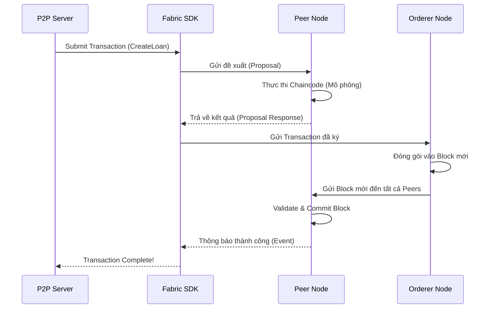

# ⛓️ Blockchain Ledger (Hyperledger Fabric)

P2P Lending Platform sử dụng **Hyperledger Fabric** - một nền tảng Blockchain doanh nghiệp (Permissioned Blockchain) để xây dựng Sổ Cái Bất Biến (Immutable Ledger), tăng cường sự minh bạch và niềm tin giữa các bên.

## Tại sao cần Blockchain?

Trong mô hình P2P truyền thống, dữ liệu nằm hoàn toàn trong Database của công ty vận hành sàn. Điều này dấy lên lo ngại:
*   Liệu sàn có sửa đổi dữ liệu khoản vay?
*   Liệu Investor có thực sự sở hữu phần vốn góp đó?
*   Lịch sử trả nợ có bị làm giả để làm đẹp hồ sơ tín dụng (Credit Scoring)?

Blockchain giải quyết vấn đề này bằng cách:
1.  **Tính Bất Biến (Immutability)**: Dữ liệu một khi đã ghi vào Block thì không thể sửa đổi hoặc xóa bỏ.
2.  **Chia Sẻ Chân Thật (Shared Truth)**: Các Node tham gia mạng lưới (Ví dụ: Sàn P2P, Ngân hàng giám sát, Auditor) đều giữ một bản sao giống hệt nhau của cuốn sổ cái.
3.  **Hợp Đồng Thông Minh (Chaincode)**: Logic nghiệp vụ (ví dụ: Thay đổi trạng thái khoản vay) được thực thi tự động và minh bạch.

## Dữ Liệu Lưu Trữ (Data Structure)

Chúng tôi không lưu toàn bộ dữ liệu (ảnh, video) lên Blockchain mà chỉ lưu các thông tin nghiệp vụ cốt lõi (Metadata & Status) để tối ưu hiệu năng.

### 1. Loan Contract (Hợp Đồng Vay)
Đây là "Tài sản" (Asset) chính được quản lý trên Ledger.

```json
{
  "assetType": "LoanContract",
  "loanId": "LOAN_UUID_123456",
  "borrowerId": "USER_789",
  "loanAmount": 50000000,
  "interestRate": 12.5,
  "durationMonths": 12,
  "status": "DISBURSED",
  "investors": [
    { "investorId": "INV_001", "amount": 20000000 },
    { "investorId": "INV_002", "amount": 30000000 }
  ],
  "disbursementTxHash": "0xabc123..."
}
```

### 2. Transactions (Các Giao Dịch Ghi Nhận)
Các hành động sau đây sẽ kích hoạt ghi Block mới:
*   `CreateLoanRequest`: Khi hồ sơ vay được tạo.
*   `ApproveLoan`: Khi Admin duyệt.
*   `RecordInvestment`: Khi Investor cam kết vốn (ghi nhận quyền sở hữu).
*   `RecordDisbursement`: Nghiệp vụ quan trọng nhất - chứng minh tiền đã rời khỏi Escrow để sang Borrower.
*   `RecordRepayment`: Ghi nhận lịch trả nợ -> Xây dựng Credit Score uy tín.

## Quy Trình Tích Hợp

Hệ thống P2P Server giao tiếp với Blockchain thông qua **Fabric Node SDK**.



> **Lưu ý**: Việc ghi vào Blockchain diễn ra **bất đồng bộ (Async)** hoặc song song với việc ghi vào Database chính (PostgreSQL/MongoDB) để không làm chậm trải nghiệm người dùng, nhưng vẫn đảm bảo tính nhất quán cuối cùng (Eventual Consistency).
