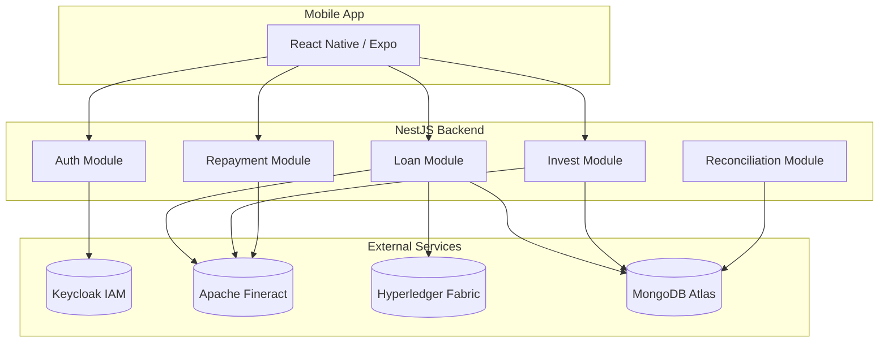

# Kiến trúc hệ thống

Hệ thống P2P Lending bao gồm các thành phần chính sau:

## Sơ đồ kiến trúc

---

## Thành phần

### Mobile App (React Native)
- **Framework**: React Native + Expo
- **State Management**: React Context
- **UI**: Glassmorphism Design
- **Auth**: Keycloak OAuth2

### Backend (NestJS)
- **Framework**: NestJS + TypeScript
- **Database**: MongoDB Atlas
- **Auth**: JWT + Keycloak
- **Modules**:
  - `LoanModule`: Tạo, quản lý khoản vay
  - `InvestModule`: Xử lý đầu tư
  - `RepaymentModule`: Xử lý trả nợ
  - `ReconciliationModule`: Đối soát dữ liệu

### External Services

| Service | Chức năng |
|---------|-----------|
| **Apache Fineract** | Core Banking - Quản lý tài khoản, giao dịch, lãi suất |
| **Hyperledger Fabric** | Blockchain - Audit trail, smart contracts |
| **Keycloak** | Identity & Access Management |
| **MongoDB Atlas** | NoSQL Database |

---

## Luồng dữ liệu

1. **User Authentication**: Mobile → Keycloak → JWT Token
2. **Loan Creation**: Mobile → Backend → MongoDB + Fineract + Blockchain
3. **Investment**: Mobile → Backend → Escrow → Fixed Deposit
4. **Repayment**: Mobile → Backend → Fineract → Distribution to Lenders
