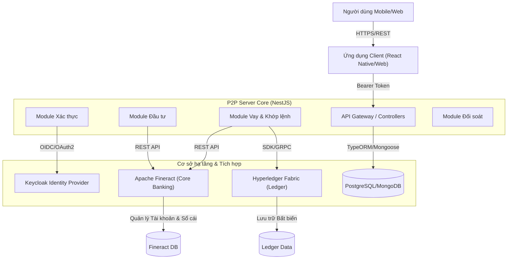

# 🏗️ Tổng quan Kiến trúc Hệ thống

Hệ thống P2P Lending được xây dựng dựa trên kiến trúc Microservices hiện đại, đảm bảo tính mở rộng, bảo mật và khả năng tích hợp cao. Hệ thống kết hợp giữa các nghiệp vụ tài chính truyền thống (thông qua Core Banking Fineract) và công nghệ sổ cái phân tán tiên tiến (Blockchain Hyperledger Fabric).

## Sơ đồ Kiến trúc Cấp cao

Dưới đây là sơ đồ tổng quan về cách các thành phần trong hệ thống tương tác với nhau:

## Các Thành phần Chính

### 1. P2P Server (Backend)
- **Công nghệ**: Node.js với Framework NestJS.
- **Vai trò**: Là trung tâm xử lý logic nghiệp vụ của sàn P2P.
- **Chức năng**:
  - Quản lý người dùng, hồ sơ vay, hồ sơ đầu tư.
  - **Matching Engine**: Thuật toán tự động khớp lệnh giữa người vay và nhà đầu tư.
  - Tích hợp và điều phối các dịch vụ bên dưới.

### 2. Apache Fineract (Core Banking)
- **Vai trò**: Đóng vai trò là hệ thống lõi ngân hàng (Core Banking System).
- **Chức năng**:
  - Quản lý Tài khoản (Loan Account, Savings Account).
  - Tính toán lịch trả nợ, lãi suất, phí phạt.
  - Quản lý giao dịch tài chính (Giải ngân, Trả nợ, Chuyển tiền).
  - **Ledger**: Ghi nhận bút toán kế toán (Accounting entries) chuẩn mực.

### 3. Keycloak (IAM)
- **Vai trò**: Quản lý định danh và quyền truy cập (Identity and Access Management).
- **Chức năng**:
  - Đăng ký, Đăng nhập, Quên mật khẩu (SSO).
  - Quản lý Roles (Admin, Investor, Borrower).
  - Bảo mật API thông qua JWT (JSON Web Tokens).

### 4. Hyperledger Fabric (Blockchain)
- **Vai trò**: Sổ cái phi tập trung, bất biến (Immutable Ledger).
- **Chức năng**:
  - Lưu trữ "hash" của các hợp đồng vay để chống chối bỏ.
  - Ghi nhận lịch sử giao dịch quan trọng (Giải ngân, Trả nợ) để tạo niềm tin minh bạch.
  - Cho phép các bên thứ 3 (Auditor) tham gia xác thực dữ liệu mà không cần truy cập vào CSDL nội bộ.

### 5. Client Application
- **Công nghệ**: React Native (Mobile) và ReactJS (Web Admin).
- **Vai trò**: Giao diện tương tác cho người dùng cuối.
- **Chức năng**:
  - Đăng ký vay vốn.
  - Duyệt danh sách hồ sơ vay để đầu tư.
  - Theo dõi dòng tiền và tài sản.

## Luồng Dữ liệu Chính

1. **Xác thực**: Client lấy Token từ Keycloak -> Gửi kèm Token trong mỗi Request lên Server.
2. **Vay vốn**:
   - Hồ sơ vay được tạo trên Server P2P.
   - Khi được duyệt và giải ngân -> Server gọi Fineract để tạo Loan Account và giải ngân tiền thực.
   - Đồng thời, thông tin hợp đồng được ghi (commit) lên Blockchain để lưu trữ bằng chứng.
3. **Đầu tư**:
   - Nhà đầu tư nạp tiền (tạo Savings Account trên Fineract).
   - Khi đầu tư -> Tiền được chuyển từ Savings Account của NĐT sang tài khoản trung gian hoặc tài khoản người vay (thông qua Fineract Transfer).
