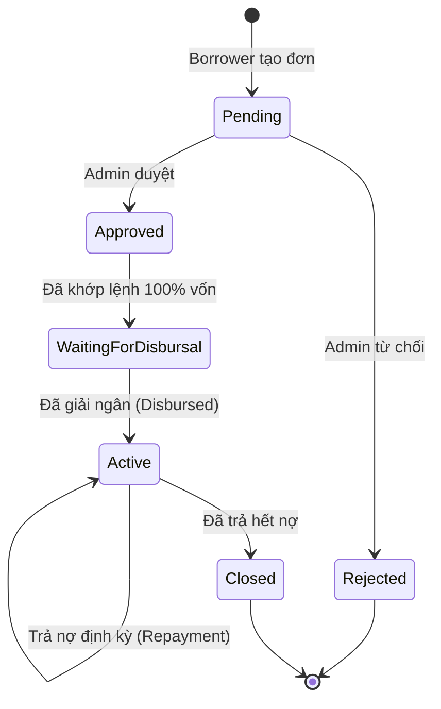
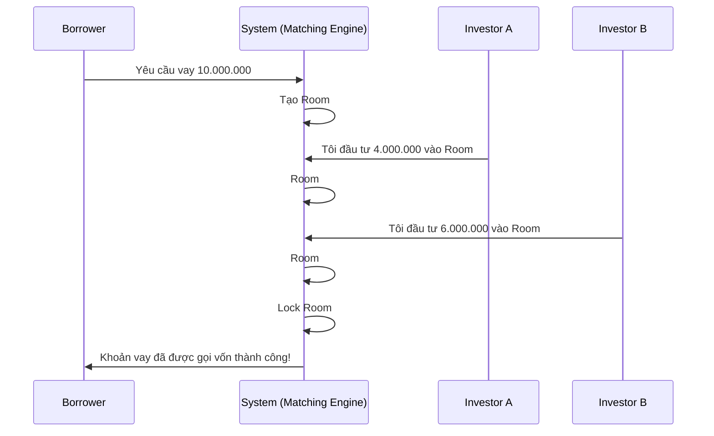

# ⚙️ Luồng Nghiệp vụ (Business Logic)

Hệ thống P2P Lending hoạt động dựa trên một quy trình khép kín từ khi Người vay nộp hồ sơ, Hệ thống khớp lệnh với Nhà đầu tư, cho đến khi Giải ngân và Hoàn nợ.

## 1. Vòng Đời Khoản Vay (Loan Lifecycle)

Chúng tôi sử dụng mô hình máy trạng thái (State Machine) để quản lý vòng đời khoản vay một cách chặt chẽ.

### Chi tiết Trạng thái
*   **Pending (Chờ duyệt)**: Hồ sơ đã được nộp, chờ nhân viên thẩm định (Credit Assessment).
*   **Approved (Đã duyệt)**: Hồ sơ đạt chuẩn, được đưa lên "Sàn giao dịch" (Marketplace) để kêu gọi vốn.
*   **WaitingForDisbursal (Chờ giải ngân)**: Đã có đủ nhà đầu tư cam kết vốn (đủ 100% số tiền). Hồ sơ chuyển sang trạng thái chờ Admin bấm nút "Giải ngân".
*   **Active (Đang hoạt động)**: Tiền đã về tài khoản người vay. Hệ thống bắt đầu tính lãi hàng ngày.

## 2. Cơ Chế Khớp Lệnh (Matching Engine)

Hệ thống sử dụng cơ chế **Room-based Matching** (Khớp lệnh theo phòng) để kết nối Borrower và Investor.

### Nguyên tắc hoạt động
1.  Mỗi khoản vay (Loan Request) khi được duyệt (Approved) sẽ tạo ra một **Waiting Room**.
2.  Waiting Room có "sức chứa" bằng đúng số tiền cần vay (ví dụ: 50.000.000 VNĐ).
3.  Investor tham gia vào Room bằng cách "Cam kết vốn" (Commit Capital).
4.  Khi Room đầy (Total Committed = Loan Amount) -> Room đóng lại (Locked) và chuyển trạng thái Khoản vay sang `WaitingForDisbursal`.

### Sơ đồ Khớp lệnh

## 3. Quy trình Trả Nợ & Phân Phối (Repayment Logic)

Khi Borrower trả nợ, hệ thống không trả trực tiếp cho từng Investor (vì phí chuyển tiền cao và phức tạp). Thay vào đó, hệ thống gom toàn bộ tiền trả nợ và xử lý theo lô.

1.  **Thu Nợ**: Borrower chuyển khoản một cục (Gốc + Lãi) vào tài khoản thu hộ của Admin.
2.  **Tính Toán Phân Phối**:
    - Hệ thống tính xem khoản vay này có bao nhiêu Investor tham gia.
    - Tỷ lệ góp vốn của từng Investor là bao nhiêu.
    - Tiền lãi được chia theo tỷ lệ góp vốn.
3.  **Thực Thi (Execution)**:
    - Gọi Fineract để thực hiện giao dịch trả nợ (Repayment) trên Loan Account -> Giảm dư nợ Borrower.
    - Gọi Fineract để đóng các FD (Fixed Deposit) tương ứng của Investor -> Tiền Gốc + Lãi đổ về ví Investor.

> **Lưu ý**: Admin sẽ giữ lại một phần lãi suất chênh lệch (Spread) như phí dịch vụ trước khi chia lãi cho Investor.
