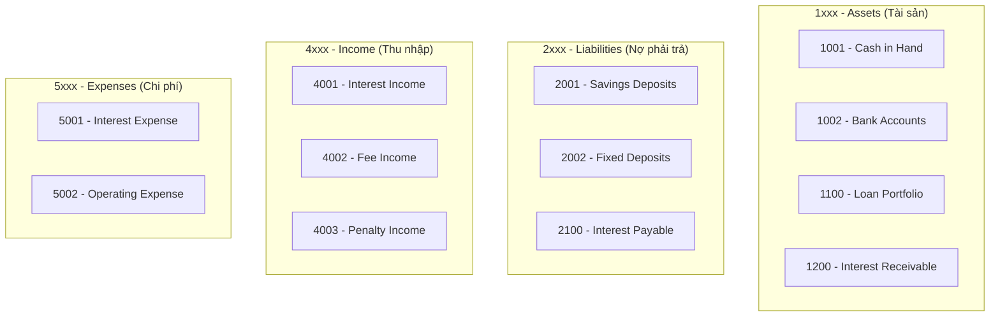
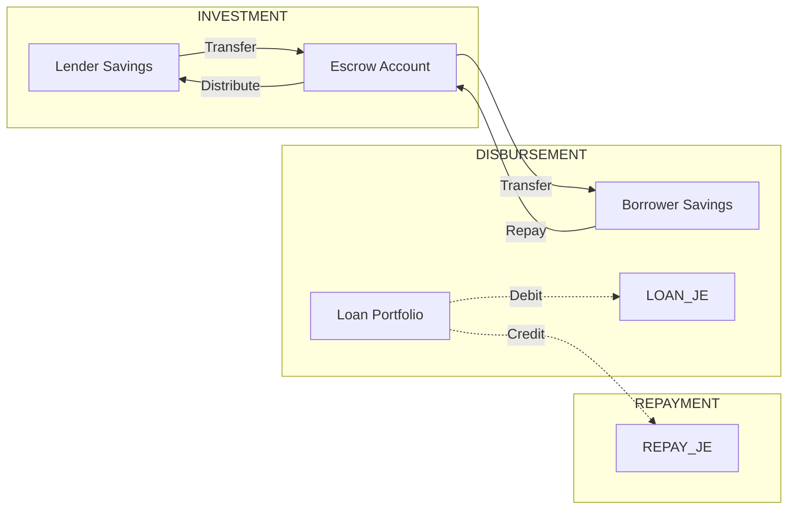

# 📒 Module Kế Toán Fineract (Accounting)

Fineract tích hợp module kế toán hoàn chỉnh theo chuẩn **Double-Entry Bookkeeping** (Ghi sổ kép), tự động sinh bút toán cho mọi giao dịch.

---

## 1. Chart of Accounts (Hệ thống Tài khoản GL)

Fineract sử dụng cấu trúc GL Accounts theo chuẩn kế toán quốc tế:



### Các GL Account chính trong P2P

| Code | Tên | Loại | Mô tả |
|------|-----|------|-------|
| 1001 | Cash | Asset | Tiền mặt |
| 1100 | Loan Portfolio | Asset | Dư nợ cho vay |
| 1200 | Interest Receivable | Asset | Lãi phải thu |
| 2001 | Savings Control | Liability | Số dư tiết kiệm khách hàng |
| 2002 | FD Control | Liability | Số dư FD khách hàng |
| 4001 | Interest on Loans | Income | Thu nhập từ lãi vay |
| 4002 | Processing Fee | Income | Phí xử lý hồ sơ |
| 5001 | Interest on Deposits | Expense | Chi phí trả lãi tiết kiệm/FD |

---

## 2. GL Account Mappings (Product → GL)

Mỗi Product phải được cấu hình mapping với GL Accounts để Fineract biết ghi bút toán vào đâu.

### Loan Product Accounting

| Accounting Entry | GL Account |
|------------------|------------|
| **Fund Source** | 1001 - Cash |
| **Loan Portfolio** | 1100 - Loan Portfolio |
| **Interest Receivable** | 1200 - Interest Receivable |
| **Interest Income** | 4001 - Interest on Loans |
| **Losses Written Off** | 5999 - Bad Debt Expense |

### Savings Product Accounting

| Accounting Entry | GL Account |
|------------------|------------|
| **Savings Reference** | 1001 - Cash |
| **Savings Control** | 2001 - Savings Control |
| **Interest on Savings** | 5001 - Interest Expense |

### Fixed Deposit Accounting

| Accounting Entry | GL Account |
|------------------|------------|
| **Savings Reference** | 1001 - Cash |
| **FD Control** | 2002 - FD Control |
| **Interest on Deposits** | 5001 - Interest Expense |

---

## 3. Journal Entries (Bút Toán Kế Toán)

Fineract tự động sinh Journal Entries cho mọi giao dịch theo nguyên tắc **Debit = Credit**.

### Loan Transactions

#### 🔹 Giải ngân (Disbursement)
Khi tiền được chuyển cho Borrower:

| Debit (Nợ) | Credit (Có) | Số tiền |
|------------|-------------|---------|
| 1100 - Loan Portfolio | 1001 - Cash | Principal |

> **Giải thích:** Tài sản "Dư nợ cho vay" tăng, Tiền mặt giảm.

#### 🔹 Trả gốc (Principal Repayment)
Khi Borrower trả gốc:

| Debit (Nợ) | Credit (Có) | Số tiền |
|------------|-------------|---------|
| 1001 - Cash | 1100 - Loan Portfolio | Principal Paid |

> **Giải thích:** Tiền mặt tăng, Dư nợ cho vay giảm.

#### 🔹 Thu lãi (Interest Payment)
Khi Borrower trả lãi:

| Debit (Nợ) | Credit (Có) | Số tiền |
|------------|-------------|---------|
| 1001 - Cash | 4001 - Interest Income | Interest Paid |

> **Giải thích:** Tiền mặt tăng, Thu nhập từ lãi tăng.

---

### Savings Transactions

#### 🔹 Nạp tiền (Deposit)

| Debit (Nợ) | Credit (Có) | Số tiền |
|------------|-------------|---------|
| 1001 - Cash | 2001 - Savings Control | Deposit Amount |

> **Giải thích:** Tiền mặt tăng, Nợ phải trả (số dư khách hàng) tăng.

#### 🔹 Rút tiền (Withdrawal)

| Debit (Nợ) | Credit (Có) | Số tiền |
|------------|-------------|---------|
| 2001 - Savings Control | 1001 - Cash | Withdrawal Amount |

> **Giải thích:** Nợ phải trả giảm, Tiền mặt giảm.

#### 🔹 Chuyển khoản (Transfer)

| Debit (Nợ) | Credit (Có) | Số tiền |
|------------|-------------|---------|
| 2001 - Savings Control (From) | 2001 - Savings Control (To) | Transfer Amount |

> **Lưu ý:** Đối với P2P, khi Lender đầu tư vào khoản vay, tiền chuyển từ Lender Savings → Admin Escrow.

---

### Fixed Deposit Transactions

#### 🔹 Mở FD (Activation)

| Debit (Nợ) | Credit (Có) | Số tiền |
|------------|-------------|---------|
| 1001 - Cash | 2002 - FD Control | Deposit Amount |

#### 🔹 Đóng FD (Maturity/Premature Close)

| Debit (Nợ) | Credit (Có) | Số tiền |
|------------|-------------|---------|
| 2002 - FD Control | 1001 - Cash | Principal |
| 5001 - Interest Expense | 1001 - Cash | Interest Earned |

> **Giải thích:** Nợ FD giảm, Chi phí lãi tăng, Tiền mặt giảm (trả cho khách).

---

## 4. Accrual vs Cash Accounting

Fineract hỗ trợ 3 phương pháp kế toán:

| Phương pháp | Mô tả | Khi ghi nhận thu nhập |
|-------------|-------|----------------------|
| **None** | Không dùng Accounting | Không tự động sinh JE |
| **Cash** | Kế toán tiền mặt | Khi thực nhận tiền |
| **Accrual (Periodic)** | Kế toán dồn tích | Khi phát sinh (dù chưa nhận tiền) |

### Ví dụ Accrual Accounting

Với Accrual, lãi được ghi nhận **hàng ngày** dù chưa thu:

**Interest Accrual Entry (hàng ngày):**

| Debit (Nợ) | Credit (Có) |
|------------|-------------|
| 1200 - Interest Receivable | 4001 - Interest Income |

**Interest Cash Receipt (khi thực nhận):**

| Debit (Nợ) | Credit (Có) |
|------------|-------------|
| 1001 - Cash | 1200 - Interest Receivable |

---

## 5. Xem Journal Entries trong Fineract

### API Endpoint

```bash
GET /fineract-provider/api/v1/journalentries?loanId={loanId}
GET /fineract-provider/api/v1/journalentries?savingsId={savingsId}
```

### Response mẫu

```json
{
  "pageItems": [
    {
      "id": 1234,
      "officeId": 1,
      "officeName": "Head Office",
      "glAccountId": 1100,
      "glAccountCode": "1100",
      "glAccountName": "Loan Portfolio",
      "entryDate": [2025, 12, 29],
      "type": { "id": 2, "value": "DEBIT" },
      "amount": 10000000,
      "transactionId": "L147"
    }
  ]
}
```

---

## Tóm tắt Luồng Tiền P2P



> **Mọi giao dịch tiền trong P2P đều có bút toán kế toán tương ứng được Fineract tự động ghi nhận.**
