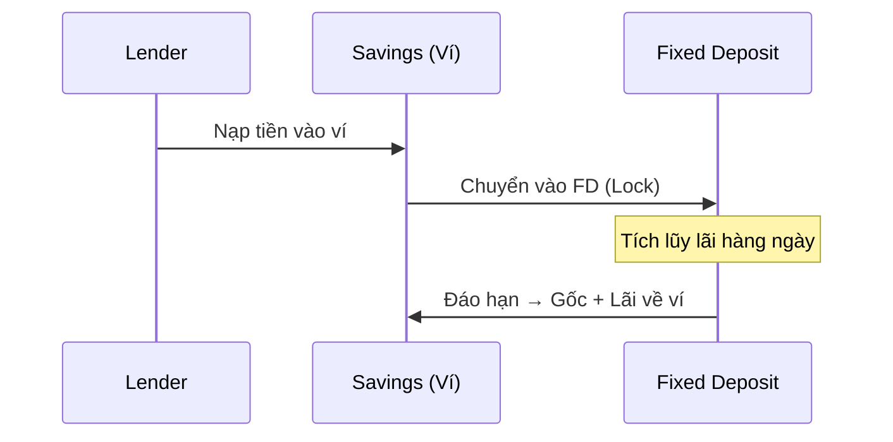
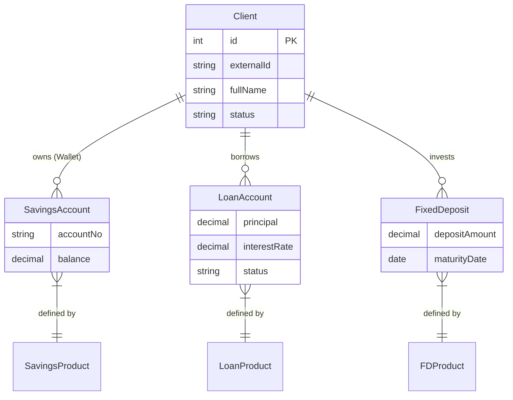

# 🏦 Ngân hàng Lõi (Fineract Core)

Hệ thống P2P ủy quyền cho **Apache Fineract** - giải pháp Core Banking mã nguồn mở chuẩn mực - để quản lý sổ cái kế toán và tính toán lãi suất.

## Vai Trò của Fineract

Fineract đóng vai trò **"Sổ cái Tài chính & Bộ máy Tính lãi"** (Financial Ledger & Interest Engine):

1. **Quản lý Tài Khoản**: Lưu trữ số dư, lịch sử giao dịch
2. **Tính Toán Lãi Suất**: Tự động tính lãi vay và lãi tiết kiệm
3. **Lập Lịch Trả Nợ**: Tạo Payment Schedule (gốc + lãi) chính xác
4. **Bút Toán Kế Toán**: Ghi nhận Debit/Credit cho mọi giao dịch

---

## Các Loại Tài Khoản (Account Types)

### 1. Loan Account (Tài khoản Vay)

Quản lý khoản vay của **Borrower** với đầy đủ vòng đời:

| Trạng thái | Mô tả |
|------------|-------|
| `Submitted` | Chờ duyệt |
| `Approved` | Đã duyệt, chờ giải ngân |
| `Active` | Đã giải ngân, đang tính lãi |
| `Closed - Obligations Met` | Đã trả hết nợ |
| `Closed - Written Off` | Xóa nợ xấu |

**Thành phần chính:**
- **Principal** - Số tiền gốc vay
- **Interest** - Lãi suất (Flat hoặc Declining Balance)
- **Repayment Schedule** - Lịch trả nợ tự động sinh
- **Charges** - Phí (phí xử lý hồ sơ, phí phạt trễ hạn...)

### 2. Savings Account (Tài khoản Tiết kiệm)

Đóng vai trò **Ví thanh toán** cho cả Borrower và Lender:

| Loại | Mục đích |
|------|----------|
| **User Wallet** | Ví cá nhân để nạp/rút tiền |
| **Escrow Account** | Tài khoản trung gian của Admin giữ tiền tạm |

**Đặc điểm:**
- Nạp/Rút tiền tự do
- Có thể đặt minimum balance
- Interest có thể = 0% (ví thanh toán)

### 3. Fixed Deposit Account (Tài khoản Tiền gửi Có kỳ hạn)

Quản lý **đầu tư của Lender** - mô hình hóa như tiền gửi tiết kiệm có kỳ hạn:

**Thành phần chính:**
- **Deposit Amount** - Số tiền gửi ban đầu
- **Interest Rate** - Lãi suất FD (thường = Borrower Rate - Admin Spread)
- **Maturity Date** - Ngày đáo hạn
- **Charts/Slabs** - Biểu lãi suất theo kỳ hạn

---

## Mô Hình Tích Hợp P2P

---

## Tại sao chọn Fineract?

> **Độ Tin Cậy**: Thay vì viết hàng ngàn dòng code tính lãi suất dễ sai sót, Fineract đã được kiểm chứng bởi hàng trăm ngân hàng trên thế giới.

> **Khả Năng Mở Rộng**: Hỗ trợ hàng triệu tài khoản và giao dịch mỗi ngày.

> **Chuẩn Hóa API**: Giao tiếp hoàn toàn qua RESTful API, dễ dàng tích hợp với NestJS Backend.
