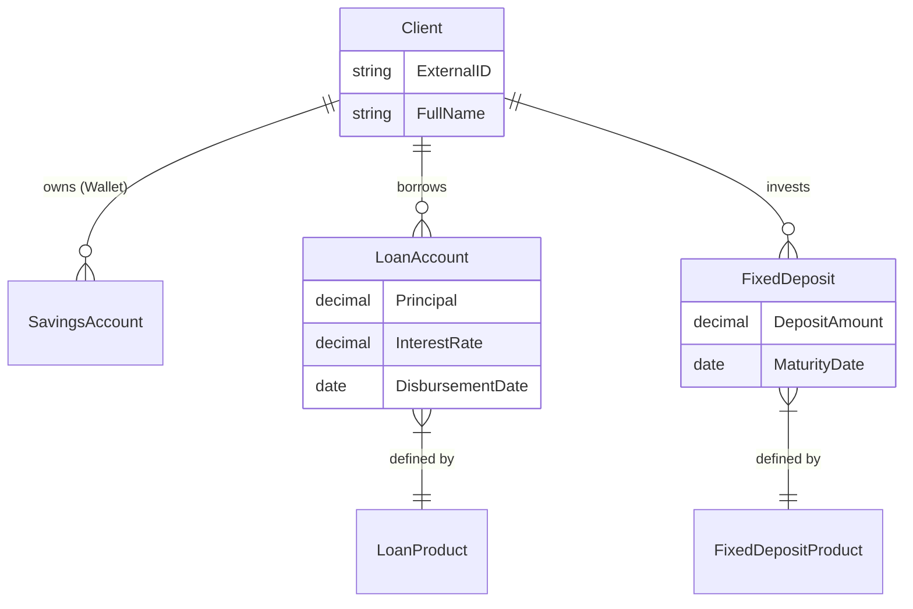

# 🏦 Ngân hàng Lõi (Fineract Core)

Hệ thống P2P không tự mình quản lý sổ cái kế toán phức tạp mà ủy quyền cho **Apache Fineract** - một giải pháp Core Banking mã nguồn mở chuẩn mực. Điều này đảm bảo tính chính xác tuyệt đối trong tính toán lãi suất và tuân thủ các nguyên tắc kế toán (GAAP/IFRS).

## Vai Trò của Fineract

Trong kiến trúc tổng thể, Fineract đóng vai trò như một **"Sổ cái Tài chính & Bộ máy Tính lãi"** (Financial Ledger & Interest Engine).

1.  **Quản lý Tài Khoản**: Lưu trữ số dư, lịch sử giao dịch của từng người dùng.
2.  **Tính Toán Lãi Suất**: Tự động tính lãi vay (cho Borrower) và lãi tiết kiệm (cho Investor) theo công thức cấu hình sẵn.
3.  **Lập Lịch Trả Nợ**: Tạo ra Payment Schedule (gốc + lãi) chính xác đến từng ngày.
4.  **Bút Toán Kế Toán**: Ghi nhận các bút toán Nợ/Có (Debit/Credit) cho mọi giao dịch tiền tệ.

## Các Loại Tài Khoản (Account Types)

Để mô hình hóa nghiệp vụ P2P, chúng tôi ánh xạ các thực thể kinh doanh vào các loại tài khoản Fineract như sau:

| Đối Tượng | Loại Tài Khoản Fineract | Mục Đích |
| :--- | :--- | :--- |
| **Borrower** | `Loan Account` | Quản lý khoản vay, dư nợ gốc, lãi phải trả. |
| **Investor** | `Fixed Deposit (FD)` | Quản lý khoản đầu tư. P2P coi đầu tư như một khoản "Gửi tiết kiệm có kỳ hạn". |
| **System** | `Savings Account` | Tài khoản trung gian (Escrow) để giữ tiền tạm thời. |

### 1. Loan Account (Tài khoản Vay)
Đây là sản phẩm cốt lõi. Khi Borrower được duyệt vay, một `Loan Account` được mở.
- **Product ID**: Cấu hình các tham số như lãi suất trần, phí phạt.
- **Repayment Schedule**: Fineract tự động sinh lịch trả nợ (ví dụ: trả góp hàng tháng).
- **Trạng thái**:
    - `Submitted`: Chờ duyệt.
    - `Approved`: Đã duyệt, chờ giải ngân.
    - `Active`: Đã giải ngân, đang tính lãi.
    - `Closed (Obligations Met)`: Đã trả hết nợ.

### 2. Fixed Deposit Account (Tài khoản Đầu tư)
Điểm sáng tạo của hệ thống là sử dụng FD để quản lý đầu tư.
- **Tại sao?**: Đầu tư P2P có tính chất giống tiền gửi tiết kiệm: Gửi một cục (Principal) và nhận về gốc + lãi sau một kỳ hạn (Maturity).
- **Lợi ích**: Fineract tự động tính lãi tích lũy (Accrued Interest) hàng ngày cho Investor mà không cần P2P Server can thiệp code.
- **Quy trình**:
    1. Investor chuyển tiền -> Tạo FD Account.
    2. Đến ngày đáo hạn (hoặc khi Borrower trả nợ) -> Đóng FD Account -> Tiền gốc + lãi chuyển về ví Investor.

### 3. Savings Account (Ví thanh toán)
Mỗi User (Borrower/Investor) đều có một `Savings Account` mặc định đóng vai trò là "Ví Nhật Thanh".
- Đây là nơi tiền nạp vào đầu tiên và là nơi tiền rút ra cuối cùng.
- Luồng tiền luôn là: `Bank` -> `Savings` -> `Investment/Loan`.

## Mô Hình Tích Hợp

## Tại sao chọn Fineract?

> **Độ Tin Cậy**: Thay vì viết hàng ngàn dòng code `if-else` để tính lãi suất (rất dễ sai sót làm trôi tiền), chúng tôi dùng Fineract đã được kiểm chứng bởi hàng trăm ngân hàng trên thế giới.

> **Khả Năng Mở Rộng**: Fineract hỗ trợ hàng triệu tài khoản và giao dịch mỗi ngày.

> **Chuẩn Hóa API**: Giao tiếp hoàn toàn qua RESTful API, dễ dàng tích hợp với NestJS Backend.
