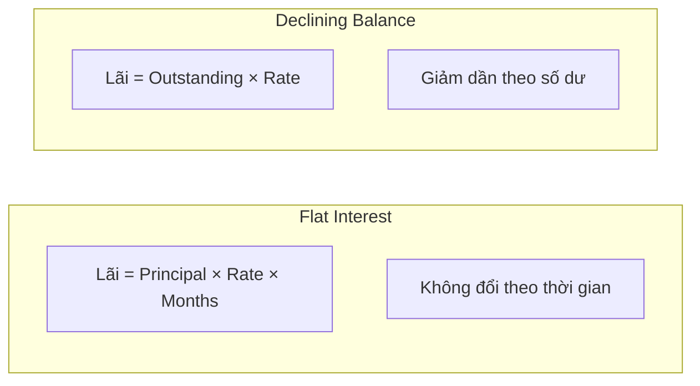

# 📦 Các Sản Phẩm Fineract (Products)

Fineract sử dụng khái niệm **Product** như template để tạo tài khoản. Mỗi sản phẩm định nghĩa các tham số mặc định (lãi suất, kỳ hạn, phí...).

---

## 1. Loan Product (Sản phẩm Vay)

**Environment Variable:** `FINERACT_P2P_LOAN_PRODUCT_ID`

| Tham số | Giá trị mẫu | Mô tả |
|---------|-------------|-------|
| `name` | P2P Personal Loan | Tên sản phẩm |
| `shortName` | P2PLoan | Mã viết tắt |
| `currency` | VND | Đơn vị tiền tệ |
| `principal` | 1,000,000 - 100,000,000 | Min/Max số tiền vay |
| `numberOfRepayments` | 1 - 60 | Min/Max kỳ trả nợ |
| `repaymentEvery` | 1 Month | Chu kỳ trả nợ |

### Cấu hình Lãi suất

| Tham số | Giá trị | Mô tả |
|---------|---------|-------|
| `interestRatePerPeriod` | 1.5% | Lãi suất mỗi tháng |
| `interestRateFrequencyType` | Per Month | Đơn vị tính lãi |
| `interestType` | **Flat** hoặc **Declining Balance** | Phương pháp tính lãi |
| `amortizationType` | Equal Installments | Trả góp đều hàng tháng |

### Phương pháp tính lãi



**Ví dụ vay 10 triệu, 12 tháng, lãi suất 1.5%/tháng:**

| Phương pháp | Tổng lãi phải trả |
|-------------|-------------------|
| Flat | 10,000,000 × 1.5% × 12 = **1,800,000 VND** |
| Declining Balance | ~ **975,000 VND** (giảm dần) |

---

## 2. Savings Product (Sản phẩm Tiết kiệm)

**Environment Variable:** `FINERACT_INVESTMENT_SAVINGS_PRODUCT_ID`

| Tham số | Giá trị mẫu | Mô tả |
|---------|-------------|-------|
| `name` | P2P Investment Wallet | Tên sản phẩm |
| `currency` | VND | Đơn vị tiền tệ |
| `nominalAnnualInterestRate` | 0% | Lãi suất (0% cho ví thanh toán) |
| `interestCompoundingPeriodType` | Daily | Chu kỳ tính lãi kép |
| `interestPostingPeriodType` | Monthly | Chu kỳ đăng lãi |
| `minRequiredOpeningBalance` | 0 | Số dư tối thiểu mở TK |
| `allowOverdraft` | false | Cho phép số dư âm? |

### Loại Savings trong P2P

| Loại | Interest Rate | Withdrawal |
|------|---------------|------------|
| **User Wallet** | 0% | Tự do |
| **Escrow Account** | 0% | Chỉ Admin |

---

## 3. Fixed Deposit Product (Sản phẩm Tiền gửi)

**Environment Variable:** `FINERACT_FD_PRODUCT_ID`

| Tham số | Giá trị mẫu | Mô tả |
|---------|-------------|-------|
| `name` | P2P Investment FD | Tên sản phẩm |
| `currency` | VND | Đơn vị tiền tệ |
| `minDepositAmount` | 500,000 | Min số tiền gửi |
| `minDepositTerm` | 1 | Min kỳ hạn (tháng) |
| `maxDepositTerm` | 60 | Max kỳ hạn (tháng) |

### Interest Rate Chart (Biểu Lãi suất)

FD Product sử dụng **Interest Chart** để định nghĩa lãi suất theo kỳ hạn:

```typescript
// Ví dụ cấu hình charts trong code
charts: [{
  fromDate: "01 January 2025",
  chartSlabs: [
    { periodType: 2, fromPeriod: 1, toPeriod: 6, annualInterestRate: 8.0 },
    { periodType: 2, fromPeriod: 7, toPeriod: 12, annualInterestRate: 9.0 },
    { periodType: 2, fromPeriod: 13, toPeriod: 60, annualInterestRate: 10.0 },
  ]
}]
```

| Kỳ hạn | Lãi suất/năm |
|--------|--------------|
| 1-6 tháng | 8.0% |
| 7-12 tháng | 9.0% |
| 13-60 tháng | 10.0% |

### Premature Closure (Đóng sớm)

Khi đóng FD trước hạn:
- Có thể áp dụng **Penalty** (phí phạt)
- Hoặc **Interest Rate Reduction** (giảm lãi suất)

---

## So sánh 3 Loại Product

| Đặc điểm | Loan | Savings | Fixed Deposit |
|----------|------|---------|---------------|
| **Mục đích** | Cho vay | Ví thanh toán | Đầu tư có kỳ hạn |
| **Interest** | Người vay trả | Ngân hàng trả | Ngân hàng trả |
| **Lock** | Không | Không | **Có** (theo kỳ hạn) |
| **Rút tiền** | Không áp dụng | Tự do | Cần đóng TK |
| **Repayment Schedule** | Có | Không | Không |

---

## Cấu hình trong P2P Server

```bash
# .env file
FINERACT_P2P_LOAN_PRODUCT_ID=1
FINERACT_INVESTMENT_SAVINGS_PRODUCT_ID=1
FINERACT_FD_PRODUCT_ID=1
```

> **Lưu ý:** Các Product ID phải tồn tại trong Fineract database. Thường được tạo sẵn khi setup hệ thống.
