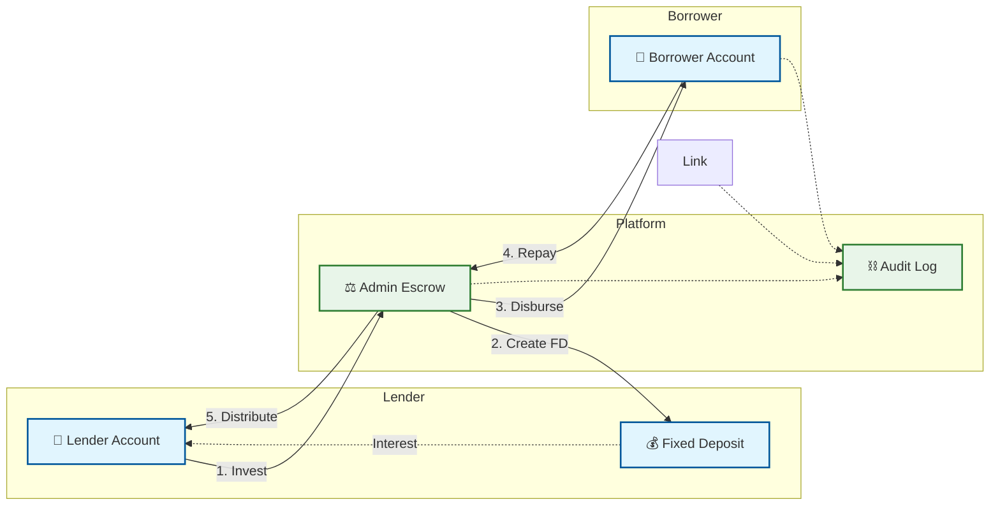
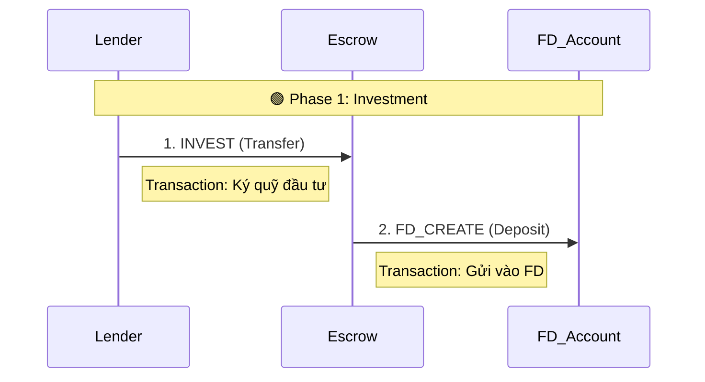
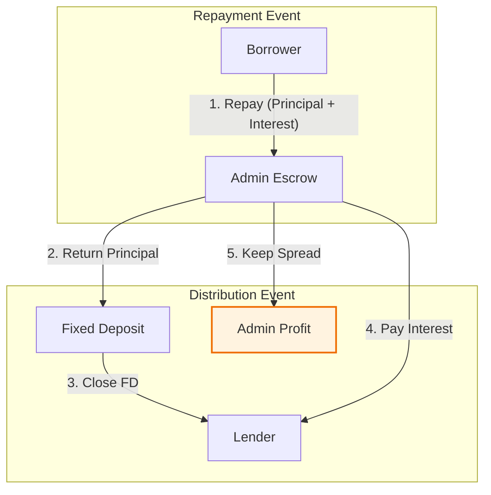

# Money Flow & Reconciliation (Business Logic)

> **Core Logic**: Logic trong trang này được map trực tiếp với `Frequency Deployment (FD) Reconciliation Service` của hệ thống.

## 1. Tổng Quan Luồng Tiền (Overview)

Hệ thống P2P sử dụng mô hình **Escrow-first** (Tiền trung gian) để đảm bảo an toàn. Tiền của Lender không vào trực tiếp Borrower mà phải qua **Admin Escrow**.

---

## 2. Chi Tiết Giao Dịch & Đối Soát (Reconciliation)

Dưới đây là bảng đối chiếu **Mã Code - Hành Động Trực Tế** trên Fineract.

### 2.1. Đầu tư (Investment Phase)

Khi Lender đầu tư, hệ thống thực hiện 2 bước chuyển tiền để tạo **Fixed Deposit (FD)**.

*   **Logic Code**: `InvestService.invest()`
*   **Fineract Action**: 
    1.  Transfer `Lender -> Escrow` (Ký quỹ).
    2.  Escrow tạo tài khoản FD cho Lender.

### 2.2. Giải ngân (Disbursement Phase)

Khi khoản vay được gom đủ (100%), Admin giải ngân từ Escrow sang Borrower.

*   **Logic Code**: `LoanService.disburse()`
*   **Fineract Action**:
    1.  Approve Loan.
    2.  Disburse `Escrow -> Borrower`.

### 2.3. Trả nợ & Phân phối (Repayment & Distribution)

Đây là phần phức tạp nhất, được xử lý bởi `FDReconciliationService`.

*   **Công thức lợi nhuận Admin**:
    $$
    Profit = (BorrowerRepay) - (Principal + LenderInterest)
    $$
    
    Hệ thống giữ lại phần chênh lệch lãi suất (Spread) tại Escrow Account.

*   **Logic Code**: `RepaymentService.distribute()`

---

## 3. Cơ Chế "Fuzzy Matching" (Đối Soát Thông Minh)

Do Fineract đôi khi không trả về đúng ID chuyển khoản (Transfer ID) trong bản tin Transaction, hệ thống sử dụng thuật toán **Fuzzy Matching** để tự động khớp lệnh.

> **File Code**: `fd-reconciliation.service.ts` -> `getAdminTransactions()`

### Logic Thuật Toán:

Nếu không tìm thấy khớp 1-1 theo ID, hệ thống sẽ tìm giao dịch có:
1.  **Cùng Số Tiền** (`Amount`).
2.  **Cùng Ngày** (`Date` - sai số 24h).
3.  **Khớp Loại Giao Dịch**:
    *   Fineract `Withdrawal` = P2P `DISTRIBUTION` (Phân phối).
    *   Fineract `Deposit` = P2P `FD_RETURN` (Hoàn vốn).

### Ví dụ Thực Tế:

| Fineract Transaction | P2P Log (MongoDB) | Kết quả |
|----------------------|-------------------|---------|
| ID: 101, Amount: 50k, **No Transfer ID** | ID: ???, Amount: 50k, Type: DISTRIBUTION | **✅ MATCHED** |
| ID: 102, Amount: 50k | ID: 999, Amount: 40k | ❌ IGNORIED |

---

## 4. Bảng Tổng Hợp Transaction (P2P Context)

Các nhãn này được hiển thị trực tiếp trên Fineract UI sau khi reconciliation thành công.

| Loại Giao Dịch | Nhãn hiển thị (Context) | Ý nghĩa |
| :--- | :--- | :--- |
| **LOAN_CREATION** | `Tạo khoản vay` | Borrower tạo yêu cầu |
| **INVEST** | `Ký quỹ đầu tư` | Lender chuyển tiền vào Escrow |
| **FD_CREATE** | `Gửi vào FD` | Tiền từ Escrow vào tài khoản tiết kiệm chờ |
| **DISBURSE** | `Giải ngân` | Tiền từ Escrow chuyển cho Borrower |
| **REPAY** | `Người vay trả nợ` | Borrower chuyển tiền trả lại Escrow |
| **FD_CLOSE** | `Hoàn vốn FD` | Rút tiền gốc từ FD trả về Lender |
| **DISTRIBUTION** | `Phân phối gốc & lãi` | Chia lãi cho Lender (Admin giữ lại Spread) |

:::tip Professional Tip
Nhờ cơ chế **Transaction Tagging** này, nhân viên vận hành có thể nhìn vào Fineract và hiểu ngay bản chất giao dịch mà không cần tra cứu Database.
:::
