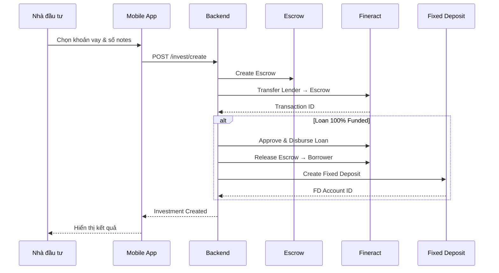

# Luồng đầu tư

Hướng dẫn chi tiết quy trình đầu tư vào khoản vay trên hệ thống P2P Lending.

## Yêu cầu

- Tài khoản nhà đầu tư (Lender) đã đăng ký
- Wallet có đủ số dư trên Fineract Savings Account
- Khoản vay đang ở trạng thái `waiting`

---

## Luồng nghiệp vụ



---

## Note System

Mỗi khoản vay được chia thành các **Notes** để nhiều nhà đầu tư có thể tham gia:

```
Note Price = 500,000 VND

Ví dụ: Khoản vay 10,000,000 VND
→ Total Notes = 10,000,000 / 500,000 = 20 Notes

Nhà đầu tư A: Mua 5 notes = 2,500,000 VND (25%)
Nhà đầu tư B: Mua 15 notes = 7,500,000 VND (75%)
```

---

## Lợi nhuận dự kiến

| Số Notes | Vốn đầu tư | Lãi suất/năm | Lợi nhuận/12 tháng |
|----------|------------|--------------|-------------------|
| 1 | 500,000 | 12.129% | ~61,876 VND |
| 5 | 2,500,000 | 12.129% | ~309,374 VND |
| 10 | 5,000,000 | 12.129% | ~618,751 VND |
| 20 | 10,000,000 | 12.129% | ~1,237,499 VND |

---

## API Endpoint

### POST /invest/create

**Request:**
```json
{
  "loanContractId": "LOAN_1766810197512",
  "capital": 10000000,
  "numNotes": 20
}
```

**Response:**
```json
{
  "success": true,
  "data": {
    "contractId": "INV_1766810240026",
    "loanContractId": "LOAN_1766810197512",
    "capital": 10000000,
    "lenderRate": 12.129,
    "escrowId": "ESCROW_1766810239510",
    "fixedDepositAccountId": 45,
    "expectedProfit": 1237499
  }
}
```

---

## Fixed Deposit

Sau khi khoản vay được đầu tư 100%, hệ thống tự động:

1. Approve Loan trên Fineract
2. Disburse tiền từ Escrow → Borrower
3. Tạo Fixed Deposit Account cho Lender

Fixed Deposit lưu trữ:
- Vốn gốc của nhà đầu tư
- Lãi suất guaranteed (lenderRate)
- Kỳ hạn = Khoản vay kỳ hạn

---

## Lưu ý

:::warning Đầu tư tối thiểu
- Minimum: 1 Note (500,000 VND)
- Maximum: Tổng số notes còn lại của khoản vay
:::

:::info Auto-Disbursement
Khi khoản vay đạt 100% vốn, hệ thống tự động approve, giải ngân và tạo Fixed Deposit.
:::
