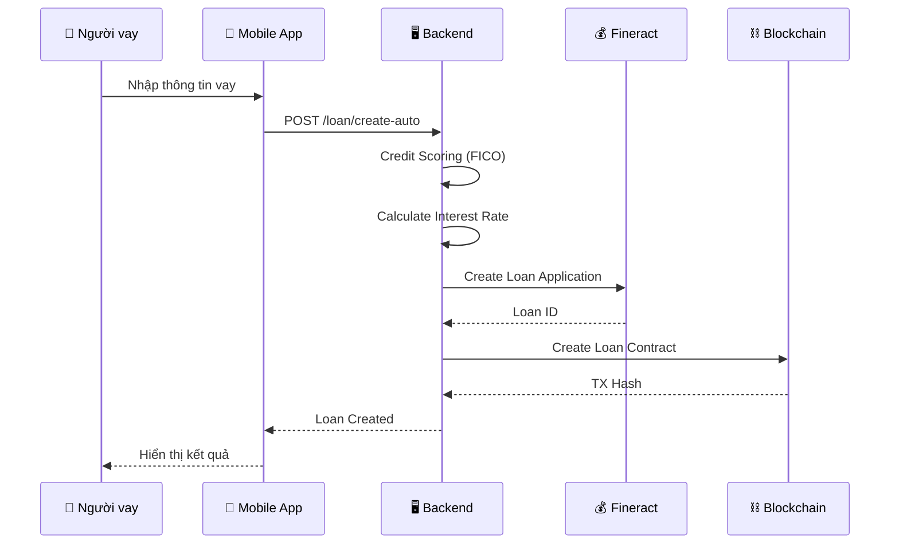

# Luồng tạo khoản vay

Hướng dẫn chi tiết quy trình tạo khoản vay trên hệ thống P2P Lending.

## 📋 Yêu cầu

- Tài khoản người vay đã đăng ký và xác thực
- Wallet đã liên kết với Fineract Client
- Thông tin cá nhân đầy đủ (để tính Credit Score)

## 🔄 Luồng nghiệp vụ



## 📊 Credit Score & Lãi suất

### Tính Credit Score (FICO 300-850)

| Yếu tố | Trọng số | Mô tả |
|--------|----------|-------|
| `paymentHistory` | 35% | Lịch sử thanh toán các khoản vay trước |
| `debtToIncome` | 30% | Tỷ lệ nợ/thu nhập |
| `creditAge` | 15% | Tuổi tài khoản tín dụng |
| `creditUtilization` | 10% | Tỷ lệ sử dụng hạn mức |
| `recentInquiries` | 10% | Số yêu cầu vay gần đây |

### Công thức lãi suất

```typescript
// Lãi suất vay (Borrower Rate)
borrowerRate = RATE_FACTOR + (FICO_COEFFICIENT * creditScore) + (MONTH_COEFFICIENT * periodMonth)

// Lãi suất cho lender (sau khi trừ spread)
lenderRate = borrowerRate - ADMIN_SPREAD (3%)

// Ví dụ: Credit Score 520, khoản vay 12 tháng
// borrowerRate = 15 + (0.00005 * 520) + (0.01 * 12) = 15.129%
// lenderRate = 15.129% - 3% = 12.129%
```

## 🧪 API Endpoint

### POST /loan/create-auto

```json
// Request
{
  "capital": 10000000,      // Số tiền vay (VND)
  "periodMonth": 12,        // Kỳ hạn (tháng)
  "willing": "Tiêu dùng cá nhân",  // Mục đích vay
  "disbursementDate": "2025-12-28"  // Ngày giải ngân dự kiến
}
```

```json
// Response
{
  "success": true,
  "data": {
    "contractId": "LOAN_1766810197512",
    "fineractLoanId": 124,
    "status": "waiting",
    "creditAssessment": {
      "score": 520,
      "grade": "C",
      "approved": true
    },
    "rates": {
      "borrowerAnnualRate": 15.129,
      "lenderAnnualRate": 12.129,
      "adminSpread": 3
    },
    "repaymentSchedule": {
      "monthlyPayment": 958408,
      "totalPayment": 11500896
    }
  }
}
```

## ⚠️ Lưu ý

:::warning Giới hạn khoản vay
- **Tối thiểu**: 1,000,000 VND
- **Tối đa**: 100,000,000 VND
- **Kỳ hạn**: 1-60 tháng
:::

:::info Trạng thái khoản vay
- `waiting`: Chờ nhà đầu tư
- `success`: Đã được đầu tư đầy đủ
- `active`: Đang hoạt động (đã giải ngân)
- `closed`: Đã tất toán
:::
