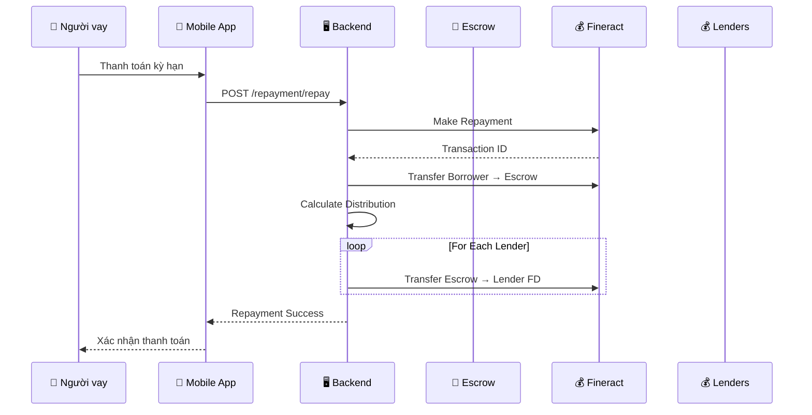
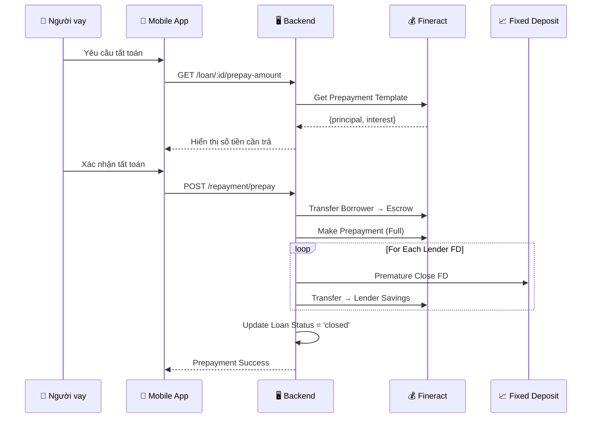

# Luồng trả nợ & Tất toán

Hướng dẫn chi tiết quy trình trả nợ định kỳ và tất toán sớm trên hệ thống P2P Lending.

## 🔄 Luồng trả nợ định kỳ



## 💰 Phân phối tiền trả nợ

Mỗi kỳ trả nợ bao gồm:
- **Gốc (Principal)**: Phân phối theo tỷ lệ đầu tư
- **Lãi (Interest)**: Phân phối sau khi trừ Admin Spread

### Công thức phân phối

```typescript
// Tỷ lệ đầu tư của lender
lenderShare = lenderCapital / totalLoanCapital

// Gốc lender nhận
lenderPrincipal = monthlyPrincipal * lenderShare

// Lãi lender nhận (sau khi trừ spread)
totalInterest = borrowerPays × (lenderRate / borrowerRate)
// = borrowerPays × 83.33% (nếu lenderRate=15%, borrowerRate=18%)
lenderInterest = totalInterest * lenderShare

// Admin spread
adminSpread = monthlyInterest - lenderInterest
```

### Ví dụ phân phối

| Người nhận | Gốc | Lãi | Tổng |
|------------|-----|-----|------|
| Lender A (25%) | 208,333 | 31,250 | 239,583 |
| Lender B (75%) | 625,000 | 93,750 | 718,750 |
| Admin Spread | - | 25,000 | 25,000 |
| **Tổng** | 833,333 | 150,000 | 983,333 |

---

## 🚀 Luồng tất toán sớm (Prepayment)



## 🧪 API Endpoints

### POST /repayment/repay

```json
// Request
{
  "loanId": "LOAN_1766810197512",
  "amount": 958408  // Số tiền kỳ hạn
}
```

```json
// Response
{
  "success": true,
  "loanId": "LOAN_1766810197512",
  "amount": 958408,
  "distribution": {
    "lendersCount": 2,
    "totalDistributed": 933408,
    "adminSpread": 25000
  }
}
```

### GET /loan/:id/prepay-amount

```json
// Response
{
  "totalAmount": 10500000,
  "principalOutstanding": 10000000,
  "interestPortion": 500000,
  "penaltyCharges": 0
}
```

### POST /repayment/prepay

```json
// Request
{
  "loanId": "LOAN_1766810197512"
}
```

```json
// Response
{
  "success": true,
  "loanId": "LOAN_1766810197512",
  "prepaymentAmount": 10500000,
  "distribution": {
    "lendersCount": 2,
    "totalDistributed": 10500000,
    "distributions": [
      { "lenderId": "lender_a", "amount": 2625000 },
      { "lenderId": "lender_b", "amount": 7875000 }
    ]
  },
  "loanStatus": "closed"
}
```

## ⚠️ Lưu ý

:::warning Fixed Deposit Closure
Khi tất toán sớm, Fixed Deposit của các lenders sẽ bị đóng **premature** (trước hạn). Tiền sẽ được chuyển về Savings Account của lender.
:::

:::info Transaction Log
Tất cả giao dịch trả nợ được ghi nhận trong `TransactionLog` collection để audit trail:
- `REPAY`: Trả nợ định kỳ
- `PREPAY`: Tất toán sớm
:::
