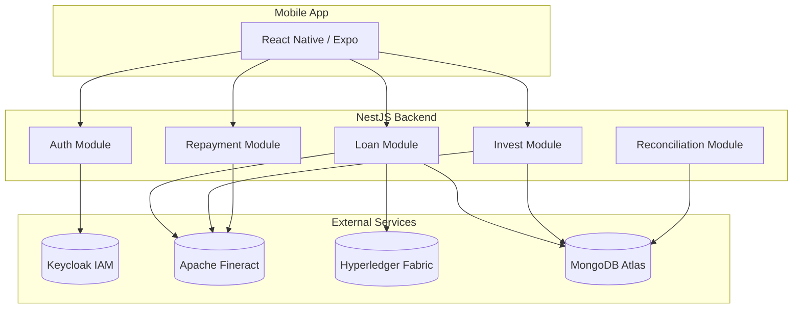

# Giới thiệu P2P Lending Platform

Chào mừng bạn đến với **P2P Lending Platform** - Nền tảng cho vay ngang hàng tích hợp **Blockchain Hyperledger Fabric** và **Apache Fineract**.

## Tổng quan

P2P Lending Platform là một ứng dụng cho vay ngang hàng hoàn chỉnh, kết nối trực tiếp người vay với các nhà đầu tư mà không cần thông qua ngân hàng truyền thống.

### Tính năng chính

| Tính năng | Mô tả |
|-----------|-------|
| **Đánh giá tín dụng** | Tự động tính Credit Score (FICO 300-850) |
| **Lãi suất động** | Tính toán dựa trên điểm tín dụng và khoản vay |
| **Multi-Lender** | Nhiều nhà đầu tư có thể đầu tư vào một khoản vay |
| **Fixed Deposit** | Tạo tài khoản tiết kiệm có kỳ hạn cho nhà đầu tư |
| **Blockchain Audit** | Ghi nhận giao dịch lên Hyperledger Fabric |
| **Fineract Integration** | Core banking với Apache Fineract |

---

## Kiến trúc hệ thống



---

## Bắt đầu nhanh

### Yêu cầu hệ thống

- Node.js 18+
- MongoDB Atlas
- Docker (cho Fineract & Hyperledger)
- React Native CLI / Expo

### Khởi động dự án

```bash
# 1. Clone repository
git clone https://github.com/TruonggGiangg/p2p-iuh-vlu.git

# 2. Start Blockchain & Fineract
cd fabric-network && ./start.sh
docker-compose up -d fineract

# 3. Start Backend
cd server_do_an && npm install && npm run start:dev

# 4. Start Mobile App
cd client_app && npm install && npx expo start
```

---

## Mục lục Documentation

- [**Kiến trúc**](/docs/architecture/overview) - Tổng quan kiến trúc hệ thống
- [**Luồng nghiệp vụ**](/docs/features/loan-creation) - Quy trình tạo khoản vay, đầu tư, trả nợ
- [**API Reference**](/docs/category/api-reference) - Tài liệu API endpoints

---

## Liên hệ

- **GitHub**: [TruonggGiangg/p2p-iuh-vlu](https://github.com/TruonggGiangg/p2p-iuh-vlu)
