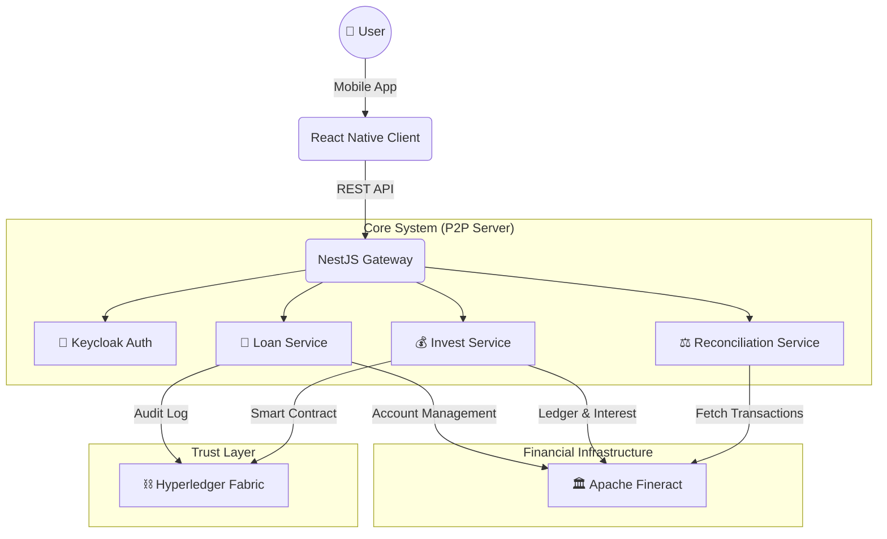

# Technology Stack

Our platform is not just a simple CRUD application. It is architected to mimic a **Real-world Fintech System**, prioritizing **Security**, **Consistency**, and **Auditability**.

## Architecture Overview

The system follows a modern **Microservices-inspired** architecture, separating concerns between the User Facing App, the Business Logic Orchestrator, the Banking Ledger, and the Audit Layer.

---

## 1. 🏛️ Core Banking: Apache Fineract

Most P2P projects simply use a database (SQL/NoSQL) to store balances. We chose **Apache Fineract** - a top-level Apache project used by financial institutions worldwide.

### Why Fineract?
*   **Bank-Grade Ledger**: Guarantees simple/double-entry accounting standards.
*   **Complex Interest Calculation**: Out-of-the-box support for Declining Balance, Flat rates, and Penalty logic.
*   **Reliability**: Eliminates floating-point errors common in custom-built logic.

> **Project Highlight**: We implemented a custom **"Fixed Deposit"** module within Fineract to automate capital holding for investors, ensuring their idle money is safe and tracked separately.

---

## 2. ⛓️ Trust Layer: Hyperledger Fabric

We use **Hyperledger Fabric**, a private, permissioned blockchain frameworks, to create an immutable audit trail.

### Why not Ethereum/Public Chain?
*   **Privacy**: Loan details are sensitive. In Fabric, data is visible only to authorized peers (Org1, Org2), not the whole world.
*   **Identity**: All participants are known (KYC), fitting regulatory requirements for Lending.
*   **No Gas Fees**: Ideal for high-frequency transaction logging without unpredictable costs.

> **Project Highlight**: Every **Loan Contract** and **Investment** is hashed and stored on the ledger. This means even if the DB Admin tries to change a loan amount in MongoDB, the Blockchain hash will mismatch, alerting the system of fraud.

---

## 3. 🚀 Backend: NestJS

The backbone of our application is built with **NestJS**, a progressive Node.js framework.

### Key Features
*   **TypeScript**: Ensures type safety across the entire codebase, reducing runtime errors.
*   **Modular Architecture**: Allows us to separate `Loan`, `Invest`, and `Auth` modules cleanly.
*   **Dependency Injection**: Makes testing and components swapping seamless.

---

## 4. 📱 Mobile Client: React Native (Expo)

We deliver a seamless mobile experience using **React Native**.

*   **Cross-Platform**: One codebase for iOS and Android.
*   **Glassmorphism UI**: A custom-designed, premium UI kit that stands out from standard Bootstrap/Material designs.
*   **Real-time Updates**: Integration with socket/polling for live notification of loan matches.

---

## 5. 🔐 Security: Keycloak

We don't roll our own crypto. We rely on **Keycloak** for Identity and Access Management (IAM).

*   **SSO** (Single Sign-On).
*   **Role-Based Access Control (RBAC)**: Distinct permissions for `Borrower`, `Lender`, and `Admin`.
*   **Standard Protocols**: Full OIDC and OAuth2 compliance.
