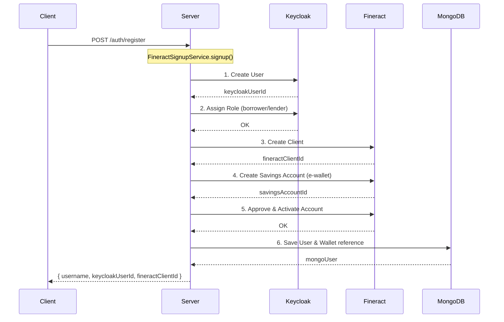
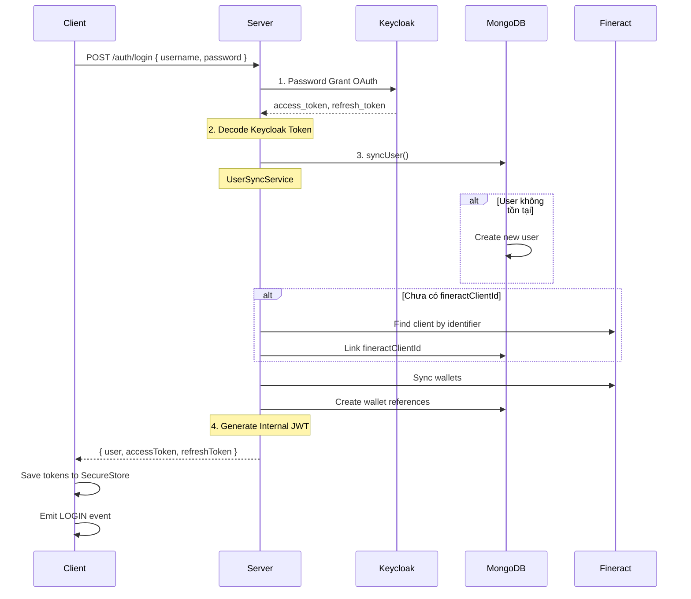
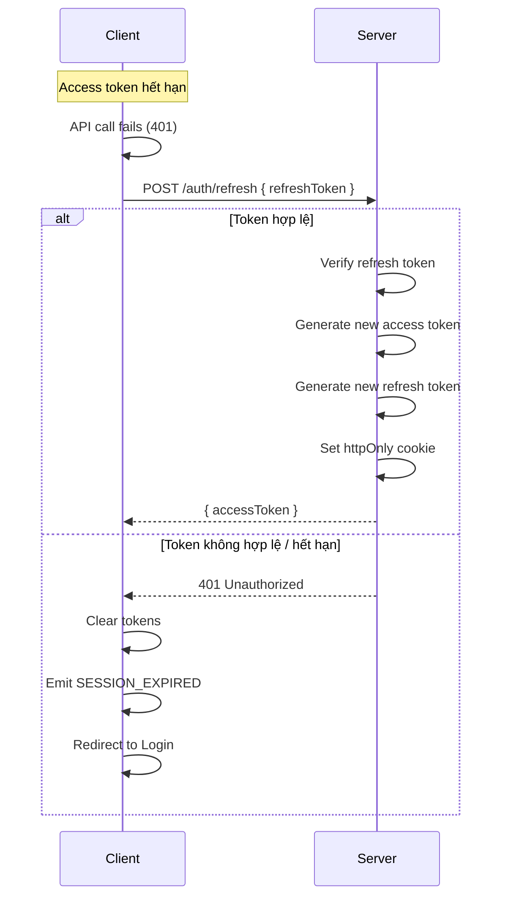

# Auth Module - Complete Flow Documentation

## 📋 Tổng quan

Module Auth quản lý toàn bộ quy trình xác thực và phân quyền trong hệ thống P2P Lending, bao gồm:

- Đăng ký người dùng mới (tích hợp Keycloak, Fineract, MongoDB)
- Đăng nhập và quản lý phiên
- JWT Token management (Access Token + Refresh Token)
- Đồng bộ dữ liệu giữa các hệ thống

**Last Updated**: 2026-02-09

---

## 🏗️ Kiến trúc Module

### Server (NestJS)

```
src/modules/auth/
├── auth.controller.ts          # REST API endpoints
├── auth.service.ts             # JWT token management
├── auth.module.ts              # Module definition
├── dto/
│   ├── register.dto.ts         # Registration validation
│   └── login.dto.ts            # Login validation
├── guards/
│   └── jwt-auth.guard.ts       # Route protection
├── strategies/
│   └── jwt.strategy.ts         # Passport JWT strategy
├── interfaces/
│   └── auth.interface.ts       # Type definitions
└── services/
    ├── keycloak.service.ts         # Keycloak Admin API
    ├── keycloak-auth.service.ts    # Keycloak OAuth flows
    ├── fineract-signup.service.ts  # Registration orchestration
    └── user-sync.service.ts        # Data synchronization
```

### Client (React Native)

```
src/features/auth/
├── api/
│   └── auth.api.ts             # API calls
├── screens/
│   ├── LoginScreen.tsx         # Login UI
│   └── RegisterScreen.tsx      # Registration UI
└── index.ts                    # Feature exports

src/core/
├── storage/
│   └── auth.storage.ts         # Token persistence
└── events/
    └── auth.events.ts          # Event emitter
```

---

## 🔐 Luồng Đăng Ký (Registration Flow)



### Chi tiết các bước

| Bước | Service | Mô tả |
|------|---------|-------|
| 1 | KeycloakService | Tạo user trong Keycloak với credentials |
| 2 | KeycloakService | Gán role (borrower hoặc lender) |
| 3 | FineractService | Tạo Client trong core banking |
| 4 | FineractService | Tạo tài khoản tiết kiệm (e-wallet) |
| 5 | FineractService | Duyệt và kích hoạt tài khoản |
| 6 | MongoDB | Lưu User và Wallet reference |

---

## 🔑 Luồng Đăng Nhập (Login Flow)



### Chi tiết các bước

| Bước | Component | Mô tả |
|------|-----------|-------|
| 1 | KeycloakAuthService | Xác thực qua Keycloak OAuth (Password Grant) |
| 2 | AuthController | Decode token để lấy thông tin user |
| 3 | UserSyncService | Đồng bộ user với MongoDB và Fineract |
| 4 | AuthService | Tạo internal JWT (Access + Refresh Token) |

---

## 🔄 Luồng Refresh Token



---

## 🪪 JWT Token Structure

### Access Token Payload

```typescript
interface UserPayload {
  _id: string;              // MongoDB user ID
  email: string;
  name: string;
  username: string;
  roles: string[];          // e.g., ['borrower', 'lender']
  keycloakUserId: string;
  fineractClientId: string;
}
```

### Token Configuration

| Token Type | Expiration | Storage |
|------------|------------|---------|
| Access Token | 15 phút | Client memory / SecureStore |
| Refresh Token | 7 ngày | httpOnly Cookie + SecureStore |

---

## 🛡️ Guards & Decorators

### JWT Auth Guard

```typescript
@UseGuards(JwtAuthGuard)
export class WalletsController {
  // Tất cả endpoints đều yêu cầu authentication
}
```

### Public Decorator

```typescript
@Public()
@Post('register')
async register(@Body() body: RegisterDto) {
  // Endpoint không yêu cầu authentication
}
```

### Current User Decorator

```typescript
@Get('me')
async getProfile(@CurrentUser() user: UserPayload) {
  return { data: user };
}
```

---

## 📱 Client-Side Implementation

### Auth API

```typescript
export const authAPI = {
  register: (data) => api.post('/api/auth/register', data),
  
  login: async (credentials) => {
    const response = await api.post('/api/auth/login', credentials);
    await authStorage.saveAuthData(response.data.data, {
      accessToken: response.data.accessToken,
      refreshToken: response.data.refreshToken,
    });
    authEvents.emitLogin();
    return response.data.data;
  },
  
  logout: async () => {
    await api.post('/api/auth/logout');
    await authStorage.clearAll();
    authEvents.emitLogout();
  },
};
```

### Auth Storage

```typescript
// Platform-agnostic storage
const authStorage = {
  saveAccessToken: (token) => storage.setItem('accessToken', token),
  getAccessToken: () => storage.getItem('accessToken'),
  saveRefreshToken: (token) => storage.setItem('refreshToken', token),
  getRefreshToken: () => storage.getItem('refreshToken'),
  clearAll: () => storage.clear(),
};
```

### Auth Events

```typescript
// Observer pattern for auth state changes
authEvents.onLogin(() => navigation.navigate('Home'));
authEvents.onLogout(() => navigation.navigate('Login'));
authEvents.onSessionExpired(() => {
  Alert.alert('Phiên đăng nhập hết hạn');
  navigation.navigate('Login');
});
```

---

## 🔗 Tích hợp hệ thống

### Keycloak (Identity Provider)

- **URL**: Cấu hình qua `KEYCLOAK_URL`
- **Realm**: Cấu hình qua `KEYCLOAK_REALM`
- **Client**: Confidential client với client_secret
- **Grant Type**: Password Grant (Resource Owner)

### Fineract (Core Banking)

- **Client**: Đại diện cho khách hàng
- **Savings Account**: E-wallet của khách hàng
- **Product ID**: Cấu hình qua `DEFAULT_EWALLET_PRODUCT_ID`

### MongoDB (Application Data)

- **User Collection**: Thông tin user, mapping với Keycloak/Fineract
- **Wallet Collection**: Reference đến Fineract savings accounts

---

## 🚨 Error Handling

| Error Code | Mô tả | Xử lý Client |
|------------|-------|--------------|
| 400 | Dữ liệu không hợp lệ | Hiển thị validation errors |
| 401 | Sai credentials / Token hết hạn | Thử refresh hoặc redirect login |
| 409 | User đã tồn tại | Thông báo và gợi ý đăng nhập |
| 500 | Lỗi server | Thông báo thử lại sau |

---

## 📊 API Endpoints

| Method | Endpoint | Auth | Mô tả |
|--------|----------|------|-------|
| POST | `/auth/register` | ❌ | Đăng ký user mới |
| POST | `/auth/login` | ❌ | Đăng nhập |
| POST | `/auth/refresh` | ❌ | Làm mới token |
| GET | `/auth/me` | ✅ | Lấy thông tin user hiện tại |
| POST | `/auth/logout` | ❌ | Đăng xuất |

---

## 🔧 Configuration

### Environment Variables

```env
# JWT
JWT_SECRET=your-jwt-secret
JWT_EXPIRES_IN=15m
JWT_REFRESH_SECRET=your-refresh-secret
JWT_REFRESH_EXPIRES_IN=7d

# Keycloak
KEYCLOAK_URL=http://localhost:8080
KEYCLOAK_REALM=p2p-realm
KEYCLOAK_CLIENT_ID=p2p-client
KEYCLOAK_CLIENT_SECRET=your-client-secret

# Defaults
DEFAULT_EMAIL_DOMAIN=p2p-lending.local
DEFAULT_EWALLET_PRODUCT_ID=1
```
