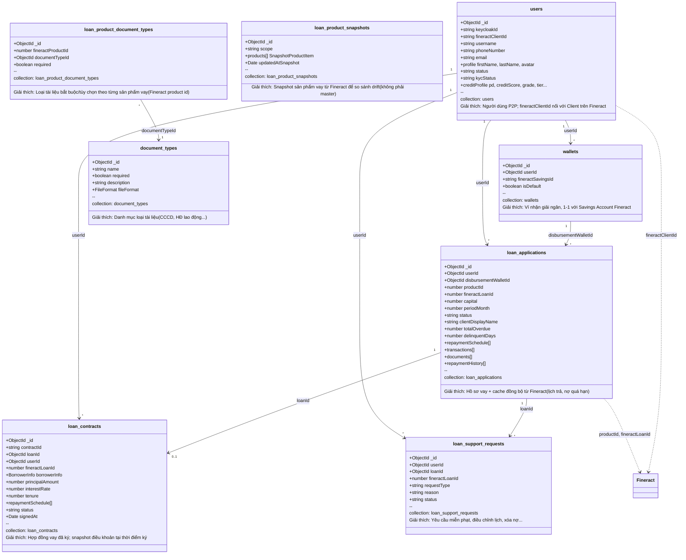

# Class Diagram – Các collection Mongo liên quan đến khoản vay

Tài liệu mô tả các collection trong MongoDB liên quan đến **người dùng**, **khoản vay**, **sản phẩm vay**, **hợp đồng vay** và **yêu cầu hỗ trợ**, kèm quan hệ và gợi ý trường dư thừa.

---

## 1. Sơ đồ quan hệ (Mermaid)

**Lưu ý:** **Loan (khoản vay)** và **Loan Product (sản phẩm vay)** master data nằm trên **Fineract**. Mongo chỉ lưu:
- `loan_applications`: hồ sơ vay + đồng bộ chi tiết từ Fineract.
- `productId` (number): tham chiếu tới Fineract product.
- `loan_product_snapshots`: snapshot sản phẩm để so sánh thay đổi; không thay thế API Fineract.

---

## 2. Bảng chi tiết từng collection

### 2.1. users (collection: `users`)

| Trường | Kiểu | Bắt buộc | Giải thích |
|--------|------|----------|------------|
| _id | ObjectId | (auto) | Id document. |
| keycloakId | string | ✓ | Id user trên Keycloak (SSO). |
| fineractClientId | string | | Id client trên Fineract; dùng để sync khoản vay, hiển thị tên. |
| username | string | ✓ | Số điện thoại (unique). |
| phoneNumber | string | | SĐT (có thể trùng username). |
| email | string | | Email. |
| profile | { firstName, lastName, avatar } | | Tên hiển thị, avatar. |
| status | enum | ✓ | active \| inactive \| suspended. |
| kycStatus | string | | NONE \| PENDING \| VERIFIED \| REJECTED. |
| kycData | object | | Dữ liệu KYC (CCCD, ảnh...). |
| creditProfile | object | | Điểm tín dụng AI (pd, creditScore, grade, tier...). |
| pin, smartOTP, twoFactor | object | | Bảo mật đăng nhập. |

**Quan hệ:** 1 user → nhiều `wallets`, nhiều `loan_applications`, nhiều `loan_contracts`, nhiều `loan_support_requests`.

---

### 2.2. wallets (collection: `wallets`)

| Trường | Kiểu | Bắt buộc | Giải thích |
|--------|------|----------|------------|
| _id | ObjectId | (auto) | Id document. |
| userId | ObjectId | ✓ | Ref → users._id. |
| fineractSavingsId | string | ✓ | Id savings account trên Fineract. |
| isDefault | boolean | | Ví mặc định nhận giải ngân. |

**Quan hệ:** N wallets thuộc 1 user. Loan application có `disbursementWalletId` → ref wallets.

---

### 2.3. loan_applications (collection: `loan_applications`)

| Trường | Kiểu | Bắt buộc | Giải thích |
|--------|------|----------|------------|
| _id | ObjectId | (auto) | Id document. |
| userId | ObjectId | ✓ | Ref → users._id (người vay). |
| productId | number | ✓ | Id sản phẩm vay trên Fineract (không có collection product trong Mongo). |
| capital | number | ✓ | Số tiền gốc vay. |
| periodMonth | number | ✓ | Số kỳ trả (tháng). |
| monthlyRatePercent | number | ✓ | Lãi suất %/tháng. |
| interestType | string | | Cách tính lãi (Dư nợ giảm dần...). |
| disbursementDate | string | ✓ | Ngày giải ngân. |
| disbursementWalletId | ObjectId | ✓ | Ref → wallets._id. |
| status | string | ✓ | pending \| approved \| rejected \| disbursed \| cancelled \| closed. |
| schedulePreview | array | | Lịch trả ước tính lúc tạo hồ sơ. |
| monthlyPay, entirelyPay | number | | Số tiền trả/kỳ và tổng trả (ước tính). |
| documents | array | | Tài liệu đính kèm (documentTypeId, name, fineractDocumentId, reviewStatus...). |
| fineractLoanId | number | | Id khoản vay trên Fineract (sau khi tạo loan bên Fineract). |
| clientDisplayName | string | | Tên khách hàng từ Fineract (denormalized cho danh sách nợ quá hạn). |
| lastSyncedAt | Date | | Lần cuối sync từ Fineract. |
| outstandingAmount, totalOverdue, delinquentDays, delinquencyClassification | number/string | | Số dư, nợ quá hạn (từ Fineract). |
| repaymentSchedule | array | | Lịch trả chi tiết từ Fineract (raw). |
| transactions | array | | Giao dịch từ Fineract. |
| charges, collateral, guarantors | array | | Phí, TSBĐ, bảo lãnh từ Fineract. |
| delinquencyRange, delinquencyTags, installmentLevelDelinquency | object/array | | Thông tin nợ quá hạn từ Fineract. |
| repaymentHistory | array | | Lịch sử trả nợ ghi nhận trên app (amount, date, fineractTransactionId). |
| aiScore | object | | Điểm AI lúc tạo khoản vay (pd, grade, decision...). |

**Quan hệ:** N loan_applications thuộc 1 user; 1 loan_application có 0..1 loan_contract; N loan_support_requests trỏ tới 1 loan_application.

---

### 2.4. loan_contracts (collection: `loan_contracts`)

| Trường | Kiểu | Bắt buộc | Giải thích |
|--------|------|----------|------------|
| _id | ObjectId | (auto) | Id document. |
| contractId | string | ✓ | Mã hợp đồng unique (P2P-LC-...). |
| loanId | ObjectId | ✓ | Ref → loan_applications._id. |
| userId | ObjectId | ✓ | Ref → users._id. |
| fineractLoanId | number | | Id Fineract (trùng loan_application). |
| borrowerInfo | object | ✓ | fullName, idNumber, address, phone, email. |
| principalAmount | number | ✓ | Gốc vay (snapshot lúc ký). |
| interestRate | number | ✓ | Lãi %/tháng. |
| tenure | number | ✓ | Số tháng. |
| repaymentSchedule | array | | Lịch trả (snapshot lúc ký). |
| totalPayable, monthlyPayment | number | ✓ | Tổng trả, trả/tháng. |
| feeStructure | array | | Cấu trúc phí. |
| productName | string | | Tên sản phẩm (hiển thị). |
| status | string | ✓ | pending_signature \| signed \| active \| completed \| cancelled. |
| signedAt | Date | | Thời điểm ký. |
| signatureData | string | | Chữ ký (base64/hash). |

**Quan hệ:** 1 loan_contract thuộc 1 loan_application (và 1 user). Dữ liệu số (principal, interest, schedule) là bản snapshot lúc ký, có thể trùng với loan_application tại thời điểm đó nhưng độc lập về mặt pháp lý.

---

### 2.5. loan_support_requests (collection: `loan_support_requests`)

| Trường | Kiểu | Bắt buộc | Giải thích |
|--------|------|----------|------------|
| _id | ObjectId | (auto) | Id document. |
| userId | ObjectId | ✓ | Ref → users._id. |
| loanId | ObjectId | ✓ | Ref → loan_applications._id. |
| fineractLoanId | number | ✓ | Id Fineract (để xử lý bên Fineract). |
| requestType | enum | ✓ | WAIVE_PENALTY \| RESCHEDULE \| WRITE_OFF \| WAIVE_INTEREST. |
| reason | string | ✓ | Lý do. |
| proposedRescheduleDate / proposedExtraPeriods | string/number | | Cho RESCHEDULE. |
| status | enum | ✓ | PENDING \| APPROVED \| REJECTED. |
| adminNote, resolvedBy, resolvedAt | | | Xử lý bởi admin. |

**Quan hệ:** N request thuộc 1 user và 1 loan_application.

---

### 2.6. loan_product_snapshots (collection: `loan_product_snapshots`)

| Trường | Kiểu | Bắt buộc | Giải thích |
|--------|------|----------|------------|
| _id | ObjectId | (auto) | Id document. |
| scope | string | ✓ | Phạm vi snapshot (ví dụ "default"), 1 document cho toàn bộ products. |
| products | array | ✓ | Mảng sản phẩm đã flatten (id, name, shortName, interestRatePerPeriod, ...). |
| updatedAtSnapshot | Date | ✓ | Thời điểm chụp snapshot. |

**Quan hệ:** Không ref trực tiếp tới loan_applications. Dùng để so sánh drift với Fineract (sync product thay đổi). **Sản phẩm vay master** vẫn ở Fineract; `loan_applications.productId` là number tham chiếu tới đó.

---

### 2.7. loan_product_document_types (collection: `loan_product_document_types`)

| Trường | Kiểu | Bắt buộc | Giải thích |
|--------|------|----------|------------|
| _id | ObjectId | (auto) | Id document. |
| fineractProductId | number | ✓ | Id sản phẩm vay trên Fineract. |
| documentTypeId | ObjectId | ✓ | Ref → document_types._id. |
| required | boolean | | Loại tài liệu bắt buộc cho sản phẩm này hay không. |

**Quan hệ:** N bản ghi (product + documentType) → 1 document_types. Link giữa **Fineract product** (id) và **loại tài liệu** trong Mongo.

---

### 2.8. document_types (collection: `document_types`)

| Trường | Kiểu | Bắt buộc | Giải thích |
|--------|------|----------|------------|
| _id | ObjectId | (auto) | Id document. |
| name | string | ✓ | Tên loại tài liệu (CCCD, HĐ lao động...). |
| required | boolean | | Mặc định bắt buộc hay không. |
| description | string | | Mô tả. |
| fileFormat | enum | | image \| pdf \| any. |

**Quan hệ:** Được tham chiếu bởi `loan_applications.documents[].documentTypeId` và `loan_product_document_types.documentTypeId`.

---

## 3. Các collection liên quan khác (không vẽ trong diagram chính)

| Collection | Vai trò |
|------------|--------|
| **loan_sync_runs** | Log mỗi lần chạy batch đồng bộ khoản vay từ Fineract (cron / manual). |
| **notifications** | Thông báo (nhắc trả nợ, nhắc quá hạn...). |
| **sync_drift_logs** | Log khác biệt sản phẩm vay giữa Fineract và snapshot. |

---

## 4. Xem xét dư thừa & gợi ý

### 4.1. Có thể chấp nhận (redundancy có chủ đích)

| Hiện tượng | Giải thích |
|------------|------------|
| **LoanContract** lặp principal, interest, tenure, repaymentSchedule so với **LoanApplication** | Hợp đồng là bản snapshot pháp lý tại thời điểm ký; application là bản “sống” và đồng bộ Fineract. Giữ cả hai. |
| **clientDisplayName** trong loan_application | Denormalized từ Fineract client để danh sách nợ quá hạn không cần gọi thêm API. Hợp lý. |
| **schedulePreview** vs **repaymentSchedule** trong loan_application | Preview: ước tính lúc tạo hồ sơ; repaymentSchedule: dữ liệu thật từ Fineract. Hai mục đích khác nhau. |

### 4.2. Nên rà soát / dọn dẹp

| Hiện tượng | Gợi ý |
|------------|--------|
| **delinquencyTag** (array) vs **delinquencyTags** (array) trong loan_application | Trong doc mẫu: delinquencyTag = [], delinquencyTags = có data. Có khả năng một trường legacy; nên thống nhất dùng một tên (ví dụ chỉ **delinquencyTags**) và deprecate trường kia. |
| **totalOutstanding** vs **outstandingAmount** | Cả hai đều có thể mang nghĩa “dư nợ hiện tại”. Kiểm tra API Fineract trả field nào; nếu trùng nghĩa thì chỉ lưu một (ví dụ **outstandingAmount**) và bỏ hoặc không ghi vào Mongo trường còn lại. |
| **fineractLoanId** lặp ở **loan_contracts** và **loan_applications** | Hợp lý vì contract cần tra cứu nhanh; có thể bỏ trên contract và luôn lấy qua loan_application nếu muốn giảm duplicate. |

### 4.3. Tóm tắt

- **users**, **wallets**, **loan_applications**, **loan_contracts**, **loan_support_requests**: quan hệ rõ, không thừa collection.
- **Loan product**: không lưu master trong Mongo; chỉ **productId** (number) và **loan_product_snapshots** (snapshot để drift). Ổn.
- Nên thống nhất **delinquencyTag** / **delinquencyTags** và **outstandingAmount** / **totalOutstanding** để tránh nhầm lẫn và dữ liệu lặp không cần thiết.

---

*Tài liệu tham chiếu schema tại: server_do_an_new/src/modules/loan/schemas, server_do_an_new/src/modules/admin/schemas, server_do_an_new/src/modules/users/schemas.*
