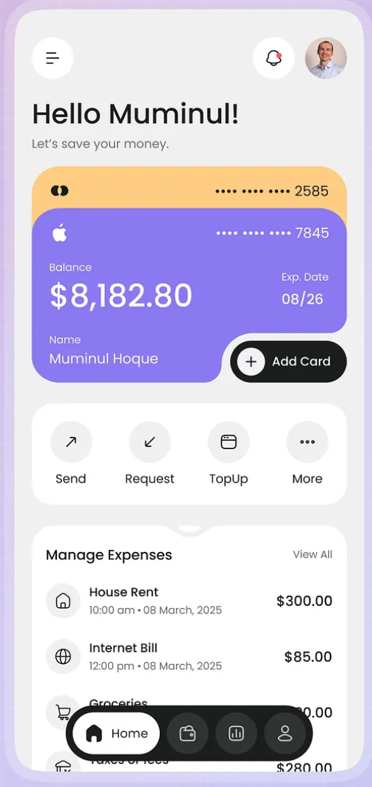

# 📘 Chương 2: Thuật toán mã hóa — Từ Zero đến Expert

## 2.1. Bài toán gốc: Tại sao cần mã hóa?

Khi bạn chuyển 50.000đ qua Internet, gói tin đi qua **hàng chục máy chủ trung gian**. Bất kỳ ai trên đường đi đều có thể:
- **Đọc** nội dung (đánh cắp thông tin)
- **Sửa** nội dung (đổi số tiền / người nhận)
- **Giả mạo** người gửi (mạo danh bạn)

Mã hóa giải quyết 3 bài toán này.

---

## 2.2. Mã hóa đối xứng vs Bất đối xứng

### 2.2.1. Mã hóa đối xứng (Symmetric Encryption)

```
Khóa chung: 🔑 = "MyS3cretK3y"

Người gửi: "Hello" + 🔑 → encrypt → "x7Ks9#mL"
Người nhận: "x7Ks9#mL" + 🔑 → decrypt → "Hello"
```

**Vấn đề:** Làm sao truyền 🔑 an toàn qua Internet? Nếu kẻ xấu bắt được 🔑, toàn bộ hệ thống sụp đổ.

**Thuật toán phổ biến:** AES-256, ChaCha20

### 2.2.2. Mã hóa bất đối xứng (Asymmetric Encryption)

```
Cặp khóa:
  🔓 Public Key  (ai cũng biết) = ổ khóa
  🔐 Private Key (chỉ mình biết) = chìa khóa

Mã hóa:   "Hello" + 🔓 → "x7Ks9#mL"     (bất kỳ ai)
Giải mã:  "x7Ks9#mL" + 🔐 → "Hello"      (chỉ chủ sở hữu)
```

**Giải quyết:** Không cần trao đổi khóa bí mật. Public Key có thể công khai mà không sợ.

**Thuật toán phổ biến:** RSA, ECDSA, Ed25519

---

## 2.3. Hàm băm (Hash Function)

### 2.3.1. Khái niệm

Hàm băm biến **bất kỳ dữ liệu nào** thành **chuỗi có độ dài cố định**:

```
Input: "Hello"           → SHA256 → 185f8db32271fe25f561a6fc938b2e26...  (64 hex = 256 bit)
Input: "Hello!"          → SHA256 → 334d016f755cd6dc58c53a86e183882f...  (64 hex = 256 bit)
Input: Toàn bộ bộ Doraemon → SHA256 → a1b2c3d4e5f6...                   (64 hex = 256 bit)
```

### 2.3.2. Tính chất quan trọng

| Tính chất | Giải thích | Ví dụ |
|-----------|-----------|-------|
| **Deterministic** | Cùng input → cùng output | SHA256("Hello") luôn = `185f8db3...` |
| **One-way** | Không thể đảo ngược | Biết hash, KHÔNG THỂ tìm lại input |
| **Avalanche** | Thay 1 bit → hash thay đổi hoàn toàn | "Hello" vs "hello" → hash khác 100% |
| **Collision-resistant** | Gần như không thể tìm 2 input có cùng hash | Xác suất: 1/2²⁵⁶ ≈ 0 |

### 2.3.3. SHA-256 trong Smart OTP

```
Dùng tại 3 nơi:

1. Tạo Device ID:
   SHA256("iPhone 15|Apple|iOS|18.0|com.p2p.app|1743889200000")
   → "d4ecf17695448b8eeed660a196ef4669a202bf7972aaeb1f7bbea4cc1e9b7164"

2. Ký chữ ký số ECDSA:
   SHA256("214606:1775323142:TRANSFER")
   → hash 32 bytes → input cho ECDSA sign

3. TOTP (nội bộ):
   HMAC-SHA1(secret, counter) → cắt lấy 6 chữ số
```

### 2.3.4. Code thực tế trong hệ thống

**Client (React Native):** Sử dụng `expo-crypto`
```typescript
// Tạo Device ID — file: smart-otp.service.ts dòng 73
const deviceId = await Crypto.digestStringAsync(
  Crypto.CryptoDigestAlgorithm.SHA256,
  deviceInfo, // "iPhone 15|Apple|iOS|18.0|..."
);
// → "d4ecf17695448b8eeed660a196ef4669..."
```

**Server (NestJS):** Sử dụng `node:crypto`
```typescript
// Xác thực chữ ký — file: signature.service.ts dòng 38
const hash = crypto.createHash('sha256').update(payload).digest();
// payload = "214606:1775323142:TRANSFER"
// → Buffer<32 bytes>
```

---

## 2.4. HMAC (Hash-based Message Authentication Code)

### 2.4.1. Vấn đề: Hash không đủ

Nếu bạn gửi `{"amount": 50000}` kèm `SHA256({"amount": 50000})`, kẻ xấu có thể:
1. Sửa thành `{"amount": 5000000}`
2. Tính lại `SHA256({"amount": 5000000})`
3. Server không phát hiện được vì hash khớp!

### 2.4.2. Giải pháp: HMAC = Hash + Secret Key

```
HMAC(key, message) = Hash( key ⊕ opad || Hash( key ⊕ ipad || message ) )

Trong đó:
  key    = khóa bí mật (chỉ client + server biết)
  opad   = 0x5c5c5c...5c (64 bytes)
  ipad   = 0x363636...36 (64 bytes)
  ⊕      = XOR
  ||     = nối chuỗi
```

**Kẻ xấu không có `key` → không thể tạo HMAC hợp lệ → Server phát hiện giả mạo.**

### 2.4.3. HMAC trong TOTP

```
HMAC-SHA1 được dùng làm nền tảng của TOTP:

HMAC-SHA1(totpSecret, timeCounter)
→ 20 bytes raw output
→ Dynamic Truncation
→ 6 chữ số OTP
```

---

## 2.5. RSA vs ECDSA — Tại sao chọn ECDSA?

### 2.5.1. RSA (Rivest-Shamir-Adleman)

**Nguyên lý toán học:** Dựa trên độ khó của bài toán **phân tích thừa số nguyên tố**.

```
Tạo khóa RSA:
1. Chọn 2 số nguyên tố lớn: p = 61, q = 53
2. Tính n = p × q = 3233
3. Tính φ(n) = (p-1)(q-1) = 60 × 52 = 3120
4. Chọn e sao cho gcd(e, φ(n)) = 1 → e = 17
5. Tìm d sao cho e × d ≡ 1 (mod φ(n)) → d = 2753

Public Key:  (e=17, n=3233)
Private Key: (d=2753, n=3233)

Mã hóa:   c = m^e mod n = 65^17 mod 3233 = 2790
Giải mã:  m = c^d mod n = 2790^2753 mod 3233 = 65

Ký:       sig = hash^d mod n    (Private Key)
Verify:   hash = sig^e mod n    (Public Key)
```

**Vấn đề của RSA trong mobile:**

| Tiêu chí | RSA-2048 | ECDSA P-256 |
|----------|----------|-------------|
| Kích thước khóa | 2048 bit | 256 bit |
| Kích thước chữ ký | 256 bytes | 64 bytes |
| Tốc độ ký | Chậm | **Nhanh gấp 10x** |
| Bảo mật tương đương | 112 bit | **128 bit** |
| Phù hợp mobile | ❌ Nặng | ✅ Nhẹ |

### 2.5.2. ECDSA (Elliptic Curve Digital Signature Algorithm)

**Nguyên lý toán học:** Dựa trên độ khó của bài toán **Elliptic Curve Discrete Logarithm Problem (ECDLP)**.

#### Đường cong Elliptic là gì?

```
Phương trình: y² = x³ + ax + b (mod p)

Với NIST P-256 (secp256r1):
  p = 2²⁵⁶ - 2²²⁴ + 2¹⁹² + 2⁹⁶ - 1  (số nguyên tố 256-bit)
  a = -3
  b = 0x5ac635d8...  (hằng số chuẩn NIST)
  G = (Gx, Gy)       (điểm cơ sở - Generator Point)
  n = order của G     (số lượng điểm trên đường cong)
```

#### Phép nhân điểm (Point Multiplication)

```
Đây là phép toán cốt lõi:

Q = k × G

Trong đó:
  k = số nguyên (Private Key)
  G = Generator Point (hằng số, ai cũng biết)
  Q = điểm kết quả (Public Key)

Tính chất QUAN TRỌNG:
  ✅ Biết k và G → tính Q DỄ (microseconds)
  ❌ Biết Q và G → tìm k CỰC KHÓ (hàng tỷ năm)

→ Đây chính là "cánh cửa một chiều" (trapdoor function)
```

#### Quá trình tạo khóa ECDSA P-256

```
Bước 1: Tạo Private Key
  k = random 32 bytes (256 bit)
  k phải nằm trong [1, n-1] (n là order của curve)

Bước 2: Tính Public Key
  Q = k × G
  Q là một điểm (x, y) trên đường cong
  Biểu diễn uncompressed: 04 || x || y (65 bytes = 130 hex chars)
  Prefix 04 = uncompressed point marker
```

**Code thực tế (Client):**
```typescript
// File: smart-otp.service.ts dòng 107-132
const generateKeyPair = async () => {
  // Bước 1: Tạo 32 bytes random (Private Key)
  const randomBytes = await Crypto.getRandomBytesAsync(32);
  const privateKeyHex = Array.from(randomBytes)
    .map(c => c.toString(16).padStart(2, '0'))
    .join('');
  // privateKeyHex = "a1b2c3d4..." (64 hex chars = 256 bit)

  // Bước 2: Tính Public Key = privateKey × G
  const key = ec.keyFromPrivate(privateKeyHex, 'hex');
  const privateKey = key.getPrivate('hex');  // "a1b2c3d4..." (64 hex)
  const publicKey = key.getPublic('hex');    // "04aeee59..." (130 hex)
  //                                           ^^
  //                                     prefix 04 = uncompressed

  // Bước 3: Lưu vào SecureStore (hardware-encrypted)
  await SecureStore.setItemAsync('smart_otp_private_key', privateKey);
  await SecureStore.setItemAsync('smart_otp_public_key', publicKey);
};
```

#### Quá trình ký (Sign)

```
Input:
  m = message (payload giao dịch)
  k_priv = Private Key (256 bit)

Bước 1: Hash message
  z = SHA256(m)   → 256 bit

Bước 2: Chọn số ngẫu nhiên
  r_rand = random number ∈ [1, n-1]

Bước 3: Tính điểm trên curve
  R = r_rand × G
  r = R.x mod n   (lấy tọa độ x)

Bước 4: Tính s
  s = r_rand⁻¹ × (z + r × k_priv) mod n

Output:
  signature = (r, s)
  Mã hóa DER → Base64 để truyền qua HTTP
```

**Code thực tế (Client):**
```typescript
// File: smart-otp.service.ts dòng 138-182
const signPayload = async (otp, timestamp, actionType) => {
  const privateKeyHex = await SecureStore.getItemAsync('smart_otp_private_key');
  const key = ec.keyFromPrivate(privateKeyHex, 'hex');

  // Bước 1: Xây dựng payload
  const payload = `${otp}:${timestamp}:${actionType}`;
  // payload = "214606:1775323142:TRANSFER"

  // Bước 2: Hash bằng SHA256
  const hash = await Crypto.digestStringAsync(
    Crypto.CryptoDigestAlgorithm.SHA256,
    payload,
    { encoding: Crypto.CryptoEncoding.HEX }
  );
  // hash = "7a8b9c..." (64 hex chars)

  // Bước 3: Ký bằng ECDSA (elliptic tự chọn r_rand)
  const signature = key.sign(hash);
  // signature = { r: BigNumber, s: BigNumber }

  // Bước 4: Encode DER → Base64
  const derSign = signature.toDER();
  return Buffer.from(derSign).toString('base64');
  // → "MEYCIQC4iGo/Zs3rydQv..."
};
```

#### Quá trình xác thực (Verify)

```
Input:
  m = message gốc
  (r, s) = chữ ký
  Q = Public Key

Bước 1: Hash message (giống bên sign)
  z = SHA256(m)

Bước 2: Tính các giá trị trung gian
  w = s⁻¹ mod n
  u1 = z × w mod n
  u2 = r × w mod n

Bước 3: Tính điểm verification
  R' = u1 × G + u2 × Q

Bước 4: So sánh
  Nếu R'.x mod n == r → ✅ Chữ ký hợp lệ
  Ngược lại → ❌ Giả mạo
```

**Code thực tế (Server):**
```typescript
// File: signature.service.ts dòng 28-43
verify(payload: string, signature: string, publicKeyHex: string): boolean {
  // Nạp Public Key từ DB
  const key = ec.keyFromPublic(publicKeyHex, 'hex');
  // publicKeyHex = "040aeee59c257c03...7215d21e" (130 hex)

  // Hash payload (giống client)
  const hash = crypto.createHash('sha256').update(payload).digest();
  // payload = "214606:1775323142:TRANSFER"

  // Decode chữ ký từ Base64 → DER buffer
  const sigBuffer = Buffer.from(signature, 'base64');

  // Verify: dùng phép toán đường cong elliptic
  return key.verify(hash, sigBuffer);
  // → true nếu chữ ký do đúng Private Key tạo ra
}
```

#### Tại sao ECDSA an toàn?

```
Bài toán ECDLP (Elliptic Curve Discrete Logarithm Problem):

  Cho: Q (Public Key) và G (Generator Point)
  Tìm: k (Private Key) sao cho Q = k × G

  Với P-256:
  • Kẻ tấn công cần ~2¹²⁸ phép tính
  • Siêu máy tính nhanh nhất thế giới: ~10¹⁸ phép/giây
  • Thời gian: 2¹²⁸ / 10¹⁸ = 10²⁰ giây ≈ 3.4 × 10¹² năm
  • Tuổi vũ trụ: 1.38 × 10¹⁰ năm
  • → Cần 245 LẦN tuổi vũ trụ để phá!
```

---

## 2.6. DER Encoding (Distinguished Encoding Rules)

Chữ ký ECDSA gồm 2 số `(r, s)`. Để truyền qua HTTP, cần encode thành byte stream:

```
DER Structure of ECDSA Signature:

30 <total_length>      ← SEQUENCE tag
  02 <r_length> <r>    ← INTEGER r
  02 <s_length> <s>    ← INTEGER s

Ví dụ thực tế:
30 44                           ← SEQUENCE, 68 bytes
  02 20                         ← INTEGER, 32 bytes
    7a8b9c...                   ← giá trị r (32 bytes)
  02 20                         ← INTEGER, 32 bytes
    1d2e3f...                   ← giá trị s (32 bytes)

→ Base64: "MEQCIHqLnIV...HR4/w=="
```

---

## 2.7. Base32 Encoding (dùng cho TOTP Secret)

```
Base32 Alphabet: A-Z và 2-7 (32 ký tự)

Tại sao dùng Base32 thay vì Base64 cho TOTP?
• Không phân biệt HOA/thường → dễ nhập tay
• Không có ký tự đặc biệt (+, /, =)
• Tương thích với QR code và Google Authenticator

Ví dụ: 42KX6PQI3IKNVGCHIBZOY55YCAPOJLBTADYQND35LH3WOUJ52I3Q
```

---

> **Tiếp theo:** [Chương 3: TOTP — Time-based One-Time Password](./03-totp-chi-tiet.md)
