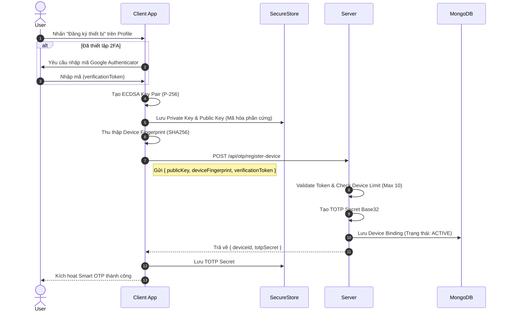

# 📘 Chương 4: Luồng Device Binding (Đăng ký thiết bị)

## 4.1. Tổng quan

Device Binding là quá trình **gắn chặt** một thiết bị vật lý với tài khoản người dùng thông qua mô hình mã hóa phi đối xứng. Sau khi bind:
- Chỉ thiết bị **đã đăng ký** mới được phép tạo và ký giao dịch (Zero-Trust).
- Server chỉ lưu **Public Key** & **TOTP Secret** của thiết bị.
- Client lưu **Private Key** & **TOTP Secret** trong Hardware-Encrypted Storage (SecureStore).

## 4.2. Sơ đồ trình tự (Sequence Diagram)



## 4.3. Chi tiết từng bước

### Bước 1: Xác thực 2FA (nếu có)
- Tránh việc kẻ gian lấy cắp JWT và tự ý gắn thiết bị lạ vào tài khoản.
- Yêu cầu nhập 2FA code (từ Google Auth) trước khi cho phép đăng ký thiết bị mới.

### Bước 2: Tạo ECDSA Key Pair trên Client
Ứng dụng tạo cặp khóa phi đối xứng ECDSA ngay trên thiết bị:
- Tạo entropy 32 bytes từ `expo-crypto.getRandomBytesAsync`.
- Khởi tạo key từ đường cong elliptic P-256 (`ec.keyFromPrivate`).
- **Lưu ý tối quan trọng**: `Private Key` được giữ rịt trên SecureStore (vùng nhớ mã hóa cấp phần cứng), **tuyệt đối không gửi lên mạng**.

### Bước 3: Thu thập Device Fingerprint
Client thu thập thông số nhận diện và băm SHA-256:
```json
{
  "deviceId": "d4ecf176...", /* SHA256(deviceName|model|os|...) */
  "deviceName": "iPhone 15 Pro Max",
  "model": "iPhone16,2",
  "brand": "Apple",
  "os": "iOS",
  "osVersion": "18.0"
}
```

### Bước 4: Gửi dữ liệu đăng ký
```http
POST /api/otp/register-device
Authorization: Bearer <JWT>
Content-Type: application/json

{
  "publicKey": "040aeee59c257c03...7215d21e",
  "deviceFingerprint": { ... },
  "verificationToken": "695139" 
}
```

### Bước 5-6: Server xử lý và lưu DB
- Server sẽ kiểm tra: user tồn tại? Số thiết bị active `< 10`? ...
- Nếu đã từng đăng ký trùng `deviceId`, server sẽ **re-activate** thiết bị cũ và phát hành lại token.
- Server sinh `totpSecret` bằng module sinh chuỗi ngẫu nhiên Base32.
- Lưu bản ghi vào mongo collection `device_bindings`.

### Bước 7-8: Client nhận và lưu TOTP Secret
Client nhận `totpSecret` từ server, sau đó lưu trực tiếp vào SecureStore cùng Private Key. Giao dịch kế tiếp sẽ được cấp phép bởi sự kết hợp của 2 khóa này.

## 4.4. Dữ liệu sau khi Binding thành công

**TẠI CLIENT (SecureStore / Keychain)**:
- `smart_otp_private_key`: 64 ký tự hex (Bí mật)
- `smart_otp_public_key`: 130 ký tự hex
- `smart_otp_totp_secret`: 32 ký tự Base32 (Bí mật)
- `smart_otp_device_id`: 64 ký tự hash
- ⚠️ **Server không hề biết Private Key**. Nếu server bị compromise, kẻ tấn công cũng không thể giả mạo được chữ ký giao dịch từ phía app.

**TẠI SERVER (MongoDB - device_bindings)**:
- `userId`
- `deviceId` (chỉ đóng vai trò mã định danh public)
- `publicKey` (chỉ dùng để xác thực chữ ký ECDSA do client gửi lên)
- `totpSecret` (được dùng sinh TOTP check ±2 windows)

## 4.5. Phân tích bảo mật

| Kịch bản | Rủi ro | Chốt chặn bảo mật (Giải pháp) |
|----------|---------|-----------|
| **Database bị leak** | Hacker có `publicKey` + `totpSecret` | Hacker câm nín vì **không thể ký** (thiếu `privateKey` của người dùng). |
| **JWT Access Token bị chôm** | Hacker có quyền gọi API | Server kiểm tra `deviceId` không khớp hoặc phát hiện chữ ký ảo → **BLOCK**. |
| **Thiết bị điện thoại bị vào tay kẻ xấu** | Kẻ xấu cầm full key trong SecureStore | Ngay lập tức người dùng đăng nhập trên máy khác và gọi lệnh **Revoke Device**. |
| **Re-install app** | Mất SecureStore | Bắt buộc phải Bind lại thiết bị mới. |

> **Tiếp theo:** [Chương 5: Luồng Verify OTP](./05-luong-verify-otp.md)
