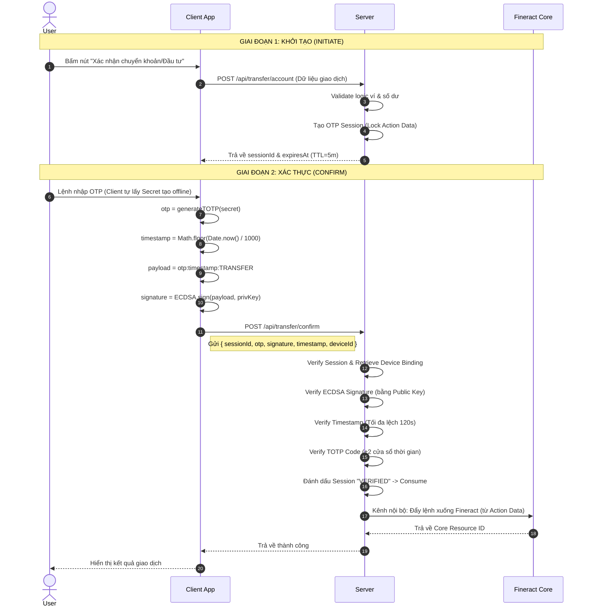
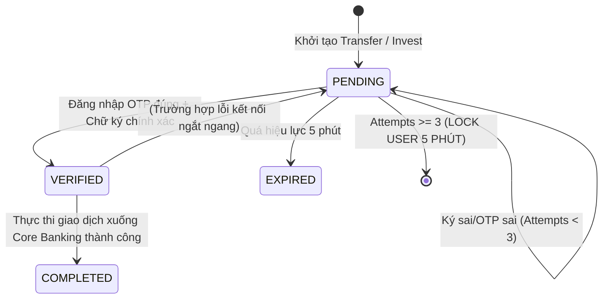

# 📘 Chương 5: Luồng Verify OTP (Xác thực 2 bước 2FA / Smart OTP)

## 5.1. Tổng quan luồng giao dịch 2 Bước

Hệ thống P2P bảo vệ giao dịch tiền tệ/đầu tư qua quy trình xác thực song song (Initiate - Confirm) bằng thuật toán ECDSA và hàm băm TOTP.



## 5.2. Bước 1: Khởi tạo giao dịch (Initiate)

Khi ứng dụng gọi `/transfer/account` hoặc `/invest/create-contract`, API **không thực thi ngay**. Thay vào đó, nó đóng băng lại Payload gọi là **Action Data**.

**Client Request:**
```http
POST /api/wallets/transfer/account
Authorization: Bearer <JWT>

{
  "fromWalletId": "1",
  "recipientAccountNo": "0999000002",
  "amount": 50000,
  "deviceId": "d4ecf17695448b8e..."
}
```

**Server Xử lý:**
1. Validate các ràng buộc nghiệp vụ (Sở hữu ví, đủ số dư, người nhận hợp lệ).
2. Tạo **OTP Session ID** (trạng thái `pending`).
3. Dữ liệu gốc (`actionData`) bị khóa cứng phía server. Hacker lúc gửi OTP Confirm không thể lén sửa số tiền `amount`.

## 5.3. Bước 2: Xác thực (Confirm)

Đây là lúc ứng dụng chứng minh _quyền kiểm soát thiết bị_ thông qua cặp mã số bí mật kết hợp chữ ký Private Key.

### 5.3.1. Phía Client (Ký giao dịch)
```typescript
// 1. Tạo OTP
otp = TOTP.generate(totpSecret); // Ví dụ: "214606"

// 2. Ký chữ ký số ECDSA Payload
const timestamp = Math.floor(Date.now() / 1000);
const payload = `${otp}:${timestamp}:TRANSFER`;
const hash = SHA256(payload);
const signature = ECDSA.sign(hash, privateKey);

// 3. Gửi Confirm Request
await api.post('/wallets/transfer/confirm', {
    sessionId,
    otp,
    signature,
    deviceId,
    timestamp
});
```

### 5.3.2. Phía Server (Kiểm duyệt Pipeline 7 Lớp)
1. **Kiểm tra Session**: Có tồn tại chưa? Đã hết thời gian thao tác (5 phút)? Sai quá 3 lần?
2. **Kiểm tra Device**: `deviceId` này có được liên kết và đang ACTIVE không?
3. **Phê duyệt Chữ Ký ECDSA (⭐ Cốt lõi)**: Tái tạo Hash payload từ dữ liệu đầu vào. Dùng `device.publicKey` để giải mã Verify `signature`. Tạch chữ ký = tạch request.
4. **Phê duyệt Thời gian thực (Replay Attack Shield)**: Kiểm tra `Date.now() / 1000 - timestamp` chênh lệch tối đa 120 giây. Bất kỳ request chặn bắt nào gửi lặp lại đều bị phát hiện.
5. **Phê duyệt OATH TOTP (⭐)**: Dùng `device.totpSecret` sinh ra mã TOTP server, trượt qua 5 cửa sổ thời gian (±60 giây) để bù trừ lệch đồng hồ. So sánh với `otp` gửi lên.
6. **Rate Limit Xử phạt**: Quá 3 lần sai hoặc sai mã OTP, lập tức Lock User trong 5 phút.
7. **Bàn giao Core Banking**: Nếu hợp lệ toàn bộ, đẩy `session.actionData` xuống service của Fineract xử lý giải ngân/chuyển khoản và chốt trạng thái `COMPLETED`.

## 5.4. Vòng Đời Phiên Giao Dịch (Session Lifecycle)



## 5.5. Phân tích tấn công

| Lỗ hổng / Kịch bản | Lá chắn bảo mật (Fix) |
|-------------------|----------|
| **Kích trái phép (Man-In-The-Middle)** sửa số tiền chuyển. | **Action Data Lock**: Tham số giao dịch bị khóa ở Server sau khi Initiate. Bước confirm hacker không đụng tới được giá trị giao dịch. |
| **Bắt gói tin request** lặp lại liên tục nhiều lần (Replay Request). | **Timestamp + Window OTP**: Request chỉ có tuổi thọ 120 giây (timestamp check). Phép thử cũ bị loại bỏ. |
| **Phá bằng Bruteforce** (quét dải số 000000 -> 999999). | **Rule: Sai quá 3 lần -> Khóa thao tác vĩnh viễn trong 5 phút**. |
| **Shoulder Surfing** (đứng sau lưng nhìn trộm mã OTP). | Vô dụng! API Confirm đòi hỏi phải có ECDSA Signature từ đúng PrivateKey cài dưới thiết bị thật. Dù có thuộc mã OTP nhưng không có PrivateKey thì không bypass API được. |
| **Dịch ngược code Source (Decompile)** vọc cấu hình API. | Cặp Key P256 sinh bằng chuỗi ngẫu nhiên phần cứng và ghim cứng vào Hardware Keystore (Android Keystore / iOS Keychain). Không thể đọc hay trích xuất bằng mã máy thông thường. |

---

> **Tiếp theo:** [README — Tổng hợp tất cả](./README.md)
