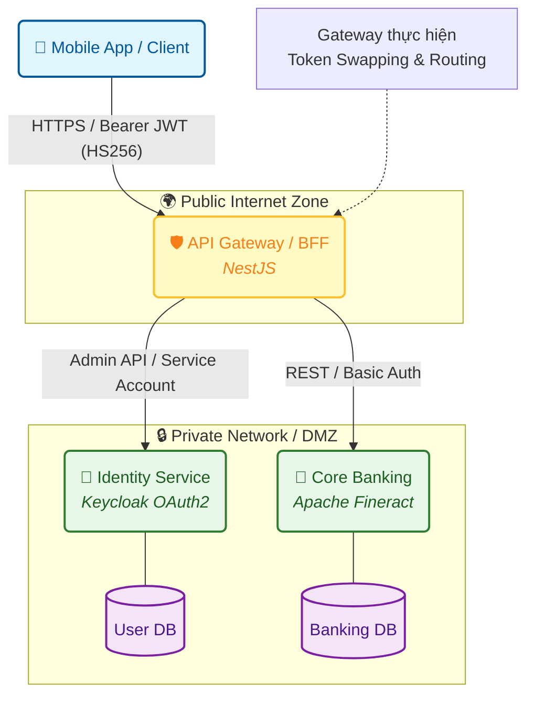
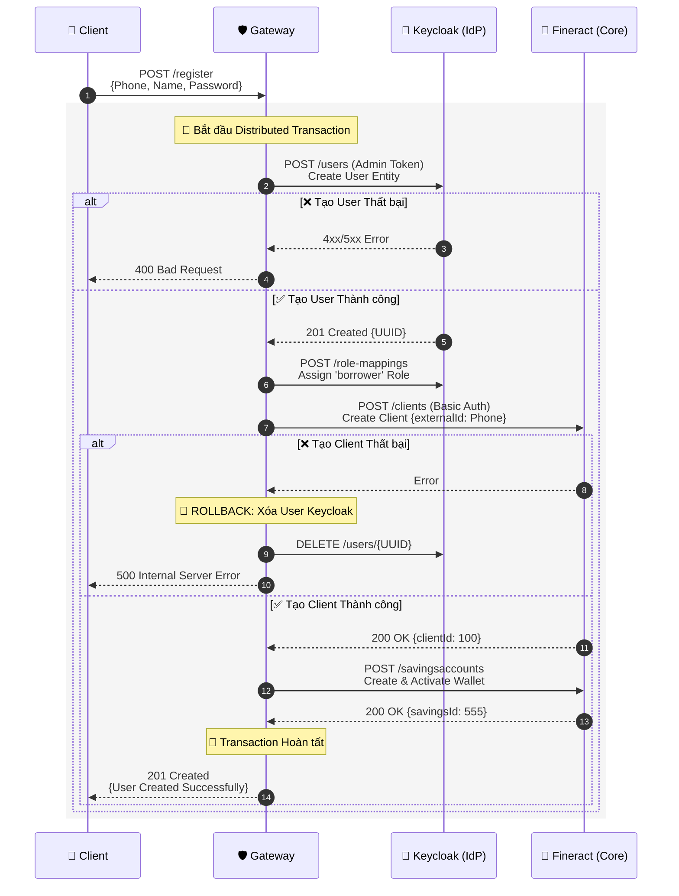
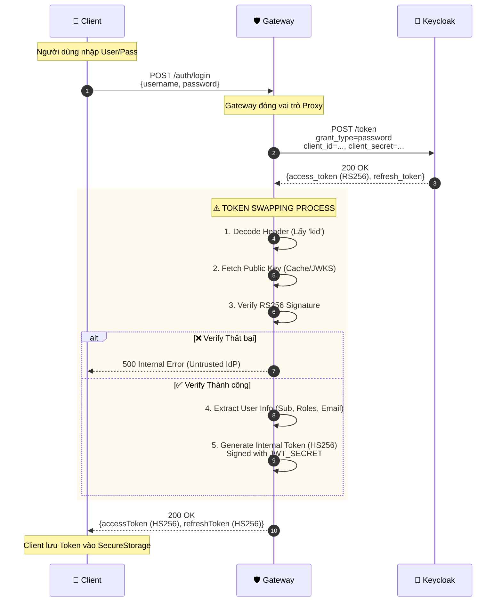
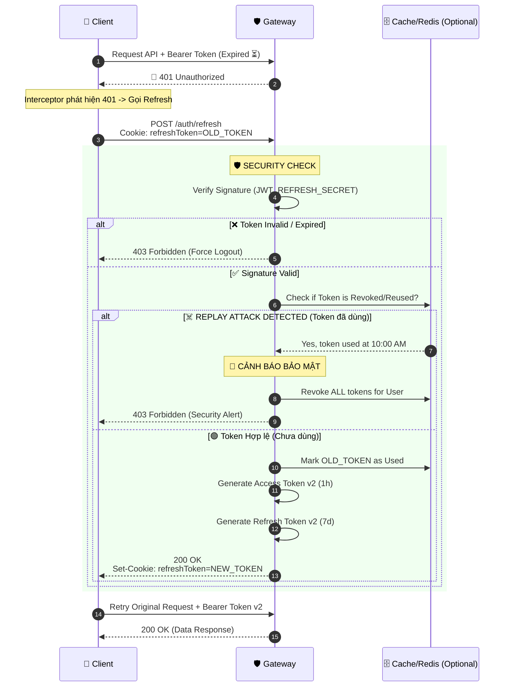

# 🔐 Hệ thống Xác thực: Kiến trúc Microservices & Luồng Nghiệp vụ

> **Tài liệu kỹ thuật chuyên sâu (Deep Dive)**
>
> *   **Phiên bản:** 4.0 (Enhanced Visuals & Detailed Flows)
> *   **Cập nhật:** 18/01/2026
> *   **Phạm vi:** Bảo mật, Quản lý Token, Luồng dữ liệu liên server.

---

## 📋 Mục lục

| STT | Nội dung chính |
|:---:|:---|
| **1** | [Tổng quan Kiến trúc](#1-tổng-quan-kiến-trúc) |
| **2** | [Tiêu chuẩn Kỹ thuật & Mật mã](#2-tiêu-chuẩn-kỹ-thuật--mật-mã) |
| **3** | [Chi tiết Luồng: Đăng Ký](#3-chi-tiết-luồng-đăng-ký-registration) |
| **4** | [Chi tiết Luồng: Đăng Nhập & Token Swap](#4-chi-tiết-luồng-đăng-nhập--token-swap) |
| **5** | [Chi tiết Luồng: Làm mới Token](#5-chi-tiết-luồng-làm-mới-token-refresh) |
| **6** | [Tổng kết Bảo mật](#6-tổng-kết-bảo-mật) |

---

## 1. Tổng quan Kiến trúc

Hệ thống vận hành theo mô hình **API Gateway (BFF)** đóng vai trò trung gian bảo mật, che giấu hạ tầng Microservices phức tạp bên dưới.

### Sơ đồ Kiến trúc Hệ thống



### Nguyên lý Cốt lõi
1.  **Client Ignorance:** Client chỉ biết Gateway, không biết Keycloak hay Fineract tồn tại.
2.  **Token Swapping:** Gateway chuyển đổi Token nặng (OAuth2) thành Token nhẹ (Internal) để tối ưu hiệu năng.
3.  **Stateless:** Không lưu Session vào Database, sử dụng JWT để xác thực từng request.

---

## 2. Tiêu chuẩn Kỹ thuật & Mật mã

Chúng tôi sử dụng mô hình **Lai (Hybrid)** giữa mã hóa Bất đối xứng và Đối xứng.

### 2.1. Phân loại Token & Thuật toán

| Đặc tính | Token Ngoại (Keycloak) | Token Nội (Gateway) |
|:---|:---|:---|
| **Mục đích** | Xác thực danh tính gốc (Identity) | Quản lý phiên làm việc (Session) |
| **Thuật toán** | **RS256** (RSA Signature) | **HS256** (HMAC SHA-256) |
| **Loại khóa** | Bất đối xứng (Public/Private Key) | Đối xứng (Shared Secret) |
| **Ưu điểm** | Bảo mật cao, chuẩn OAuth2 | Nhanh, nhẹ (~200 bytes), dễ quản lý |

### 2.2. Cơ chế Tìm & Xác thực Khóa (Key Lookup)

Quy trình Gateway xác thực Token RS256 từ Keycloak:

1.  **Trích xuất Header:** Gateway đọc header của JWT nhận được để lấy `kid` (Key ID).
    ```json
    { "alg": "RS256", "kid": "U5wS-xyz..." }
    ```
2.  **JWKS Lookup:** Gateway gọi endpoint `/certs` của Keycloak để lấy danh sách Public Keys.
3.  **Matching:**
    *   Tìm Public Key có `kid` trùng khớp.
    *   Dùng Public Key đó để verify chữ ký của Token.
    *   Nếu khớp: Token hợp lệ.

### 2.3. Quản lý Bí mật (Secret Management)

| Biến môi trường (`.env`) | Mục đích | Lưu ý Bảo mật |
|:---|:---|:---|
| `JWT_SECRET` | Ký Access Token nội bộ | Thay đổi sẽ làm rớt toàn bộ phiên đăng nhập |
| `JWT_REFRESH_SECRET` | Ký Refresh Token nội bộ | Phải khác `JWT_SECRET` |
| `KEYCLOAK_PUBLIC_KEY` | (Tùy chọn) Public Key hardcode | Dùng nếu không muốn gọi JWKS (ít linh hoạt hơn) |

---

## 3. Chi tiết Luồng: Đăng Ký (Registration)

Đây là nghiệp vụ phức tạp nhất, yêu cầu tính toàn vẹn dữ liệu trên nhiều service (**Distributed Transaction**).

### Sơ đồ Tuần tự Chi tiết



---

## 4. Chi tiết Luồng: Đăng Nhập & Token Swap

Minh họa kỹ thuật **Token Swapping** để tối ưu hóa gói tin và bảo mật.

### Sơ đồ Tuần tự Chi tiết



---

## 5. Chi tiết Luồng: Làm mới Token (Refresh)

Cơ chế **Refresh Token Rotation** giúp duy trì phiên đăng nhập an toàn và phát hiện tấn công Replay.

### Sơ đồ Tuần tự Chi tiết



---

## 6. Tổng kết Bảo mật

Bảng tóm tắt các cơ chế phòng thủ đang áp dụng:

| Mối đe dọa | Cơ chế phòng thủ | Giải thích |
|:---|:---|:---|
| **Lộ Access Token** | Short-lived Expiration | Access token chỉ sống 1 giờ. Hacker có lấy được cũng chỉ dùng được ngắn hạn. |
| **Trộm Refresh Token** | Token Rotation | Mỗi lần refresh sẽ đổi token mới. Token cũ bị vô hiệu hóa ngay lập tức. |
| **Tấn công giả mạo** | Digital Signature | Token được ký bằng thuật toán mạnh (RSA/HMAC), không thể chỉnh sửa payload. |
| **Tấn công nội bộ** | Zero Trust | Gateway vẫn phải xác thực khi gọi các service nội bộ (Service Accounts). |
| **Replay Attack** | One-time Usage | Hệ thống phát hiện nếu một refresh token được sử dụng lần thứ 2. |

---
**Hết tài liệu.**
