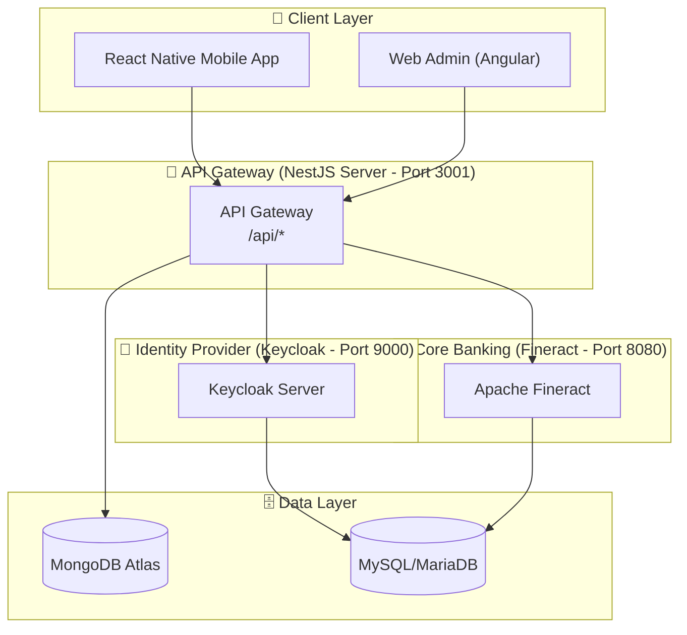
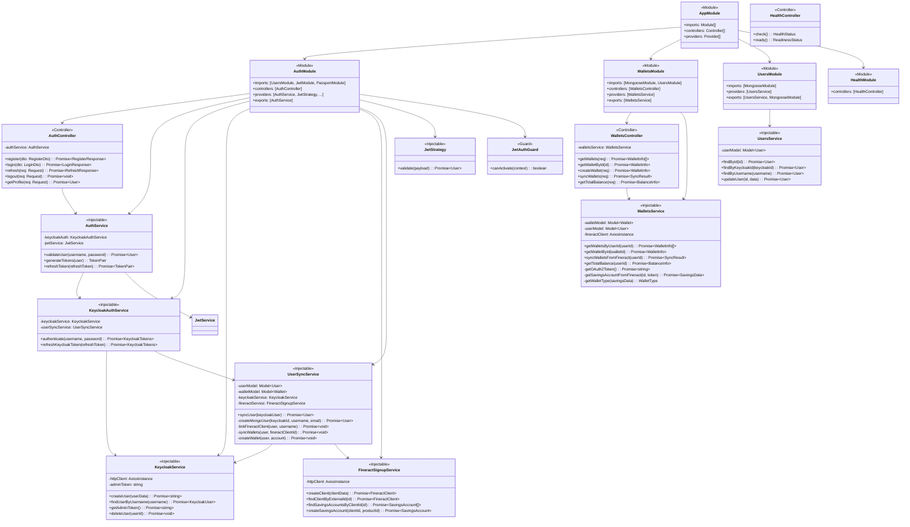
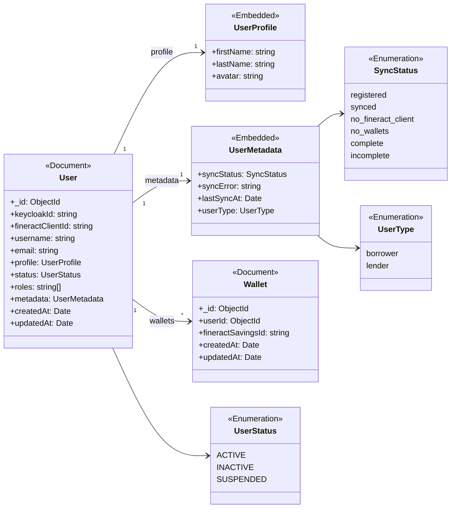
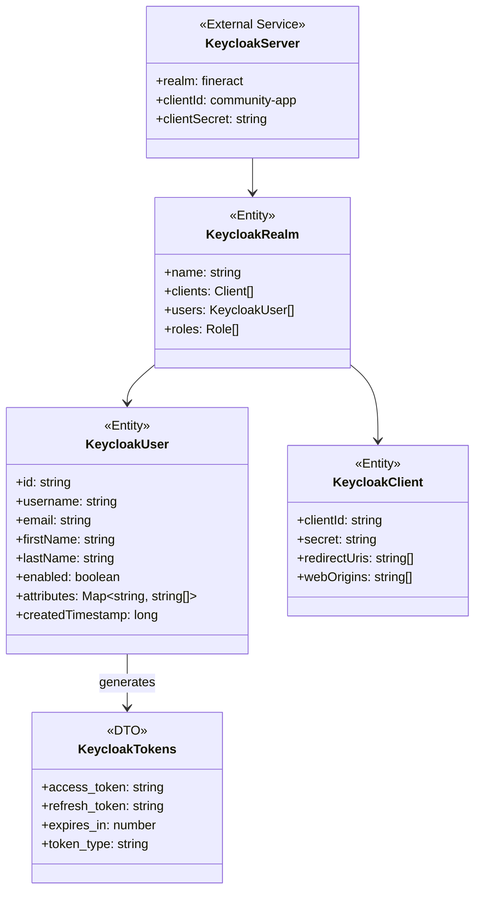
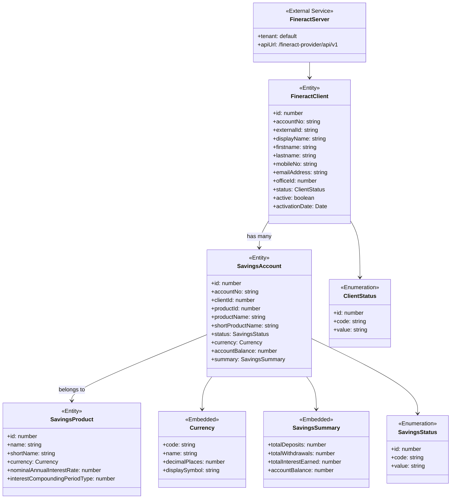
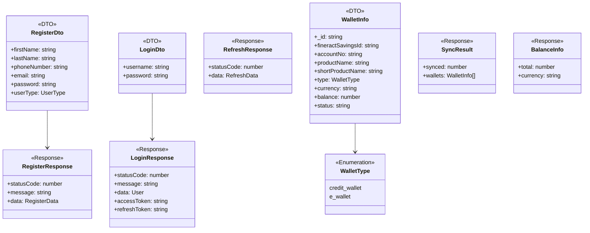
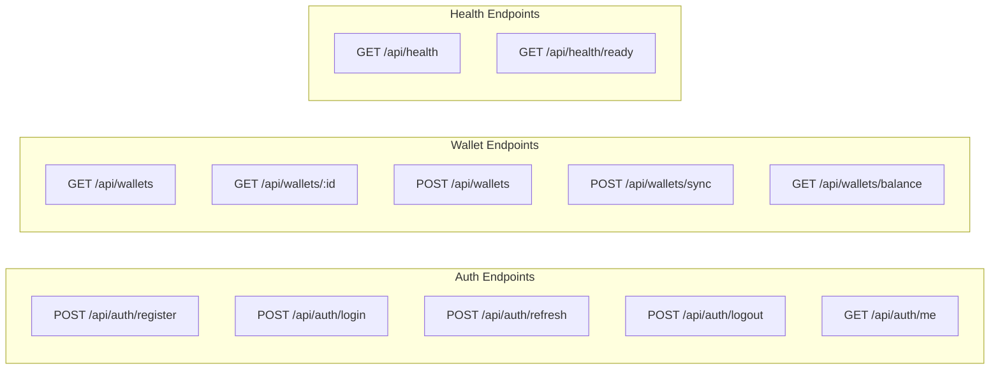

# P2P Lending System - Class Diagram (Microservice Level)

> Tài liệu chi tiết kiến trúc class diagram cho hệ thống P2P Lending với 3 microservice: **NestJS Server**, **Keycloak**, **Fineract**

---

## 📊 Overall Microservice Architecture

---

## 🏗️ NestJS Server - Module Architecture

---

## 📦 MongoDB Schema Classes

---

## 🔐 Keycloak Classes

---

## 🏦 Fineract Classes

---

## 🔄 DTO Classes (Data Transfer Objects)

---

## 🌐 API Endpoints Overview

---

## 📝 Notes

### Microservice Responsibilities

| Service | Responsibility | Database |
|---------|---------------|----------|
| **NestJS Server** | API Gateway, Business Logic, Data Aggregation | MongoDB Atlas |
| **Keycloak** | Identity Management, OAuth2/OIDC, User Authentication | MySQL/MariaDB |
| **Fineract** | Core Banking, Loans, Savings Accounts, Transactions | MySQL/MariaDB |

### Data Flow Principles

1. **Single Source of Truth**: 
   - User Identity → Keycloak
   - Financial Data → Fineract
   - Cached/Aggregated Data → MongoDB

2. **Real-time Data**: Wallet balances are always fetched from Fineract (not cached)

3. **Reference Only**: MongoDB wallets collection only stores `fineractSavingsId` reference

---

*Generated: 2026-01-19*
