# P2P Lending System - Sequence Diagrams (Microservice Level)

> Tài liệu chi tiết luồng dữ liệu giữa các microservice: **Mobile App**, **NestJS Server**, **Keycloak**, **Fineract**, **MongoDB**

---

## 📋 Table of Contents

1. [Register Flow](#1-register-flow)
2. [Login Flow](#2-login-flow)
3. [Get Wallets Flow](#3-get-wallets-flow)
4. [Sync Wallets Flow](#4-sync-wallets-flow)
5. [Refresh Token Flow](#5-refresh-token-flow)
6. [Logout Flow](#6-logout-flow)

---

## 1. Register Flow

### 1.1 High-Level Overview

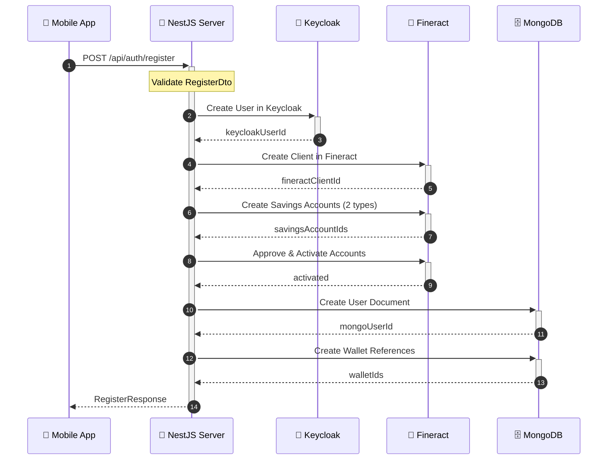

### 1.2 Detailed Flow - Keycloak User Creation

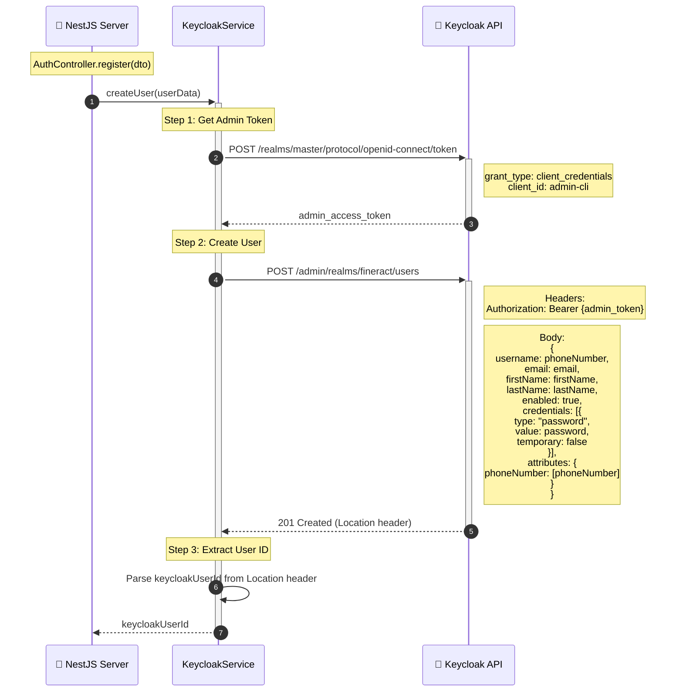

### 1.3 Detailed Flow - Fineract Client & Accounts Creation

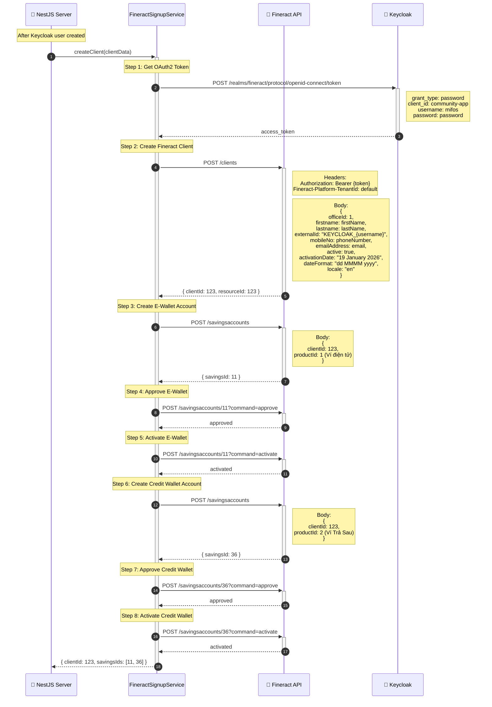

### 1.4 Detailed Flow - MongoDB Records Creation

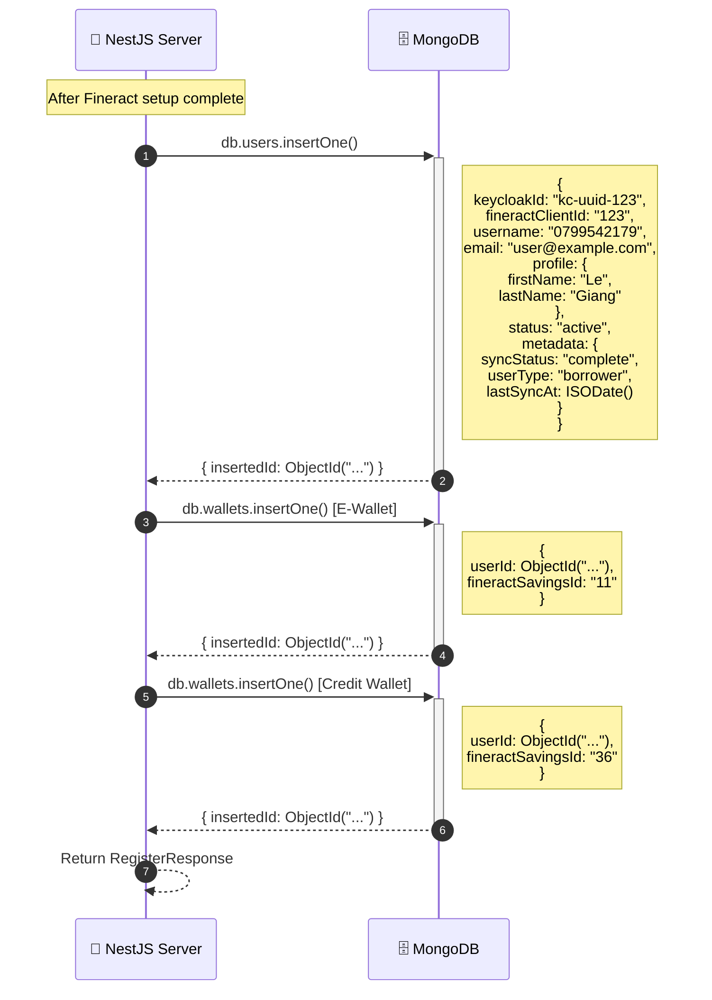

---

## 2. Login Flow

### 2.1 High-Level Overview

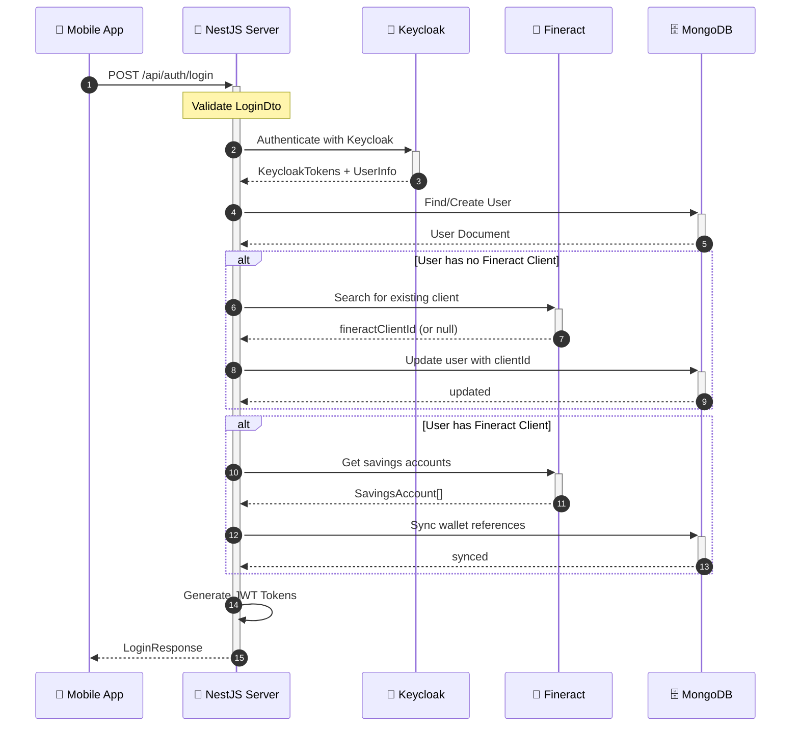

### 2.2 Detailed Flow - Keycloak Authentication

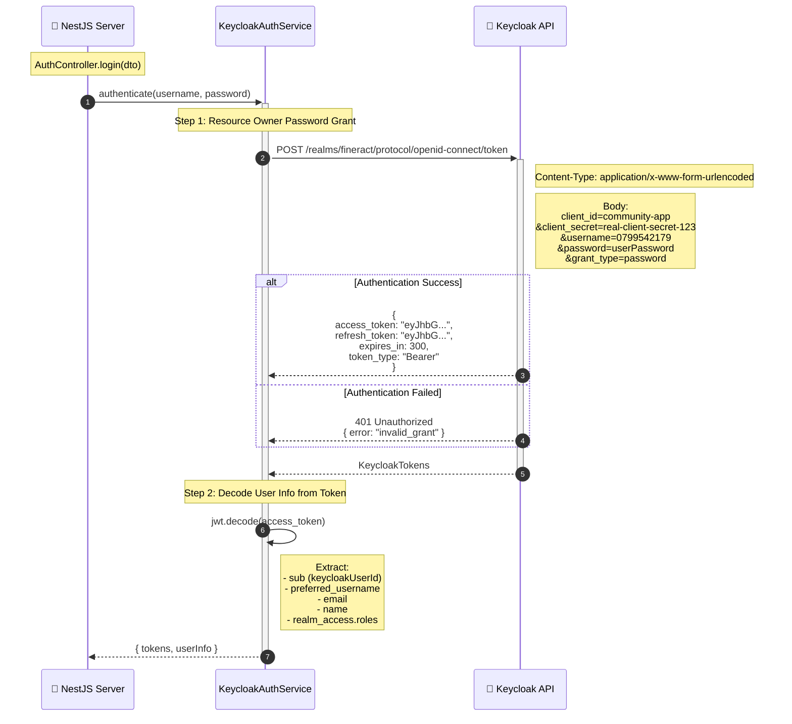

### 2.3 Detailed Flow - User Sync on Login

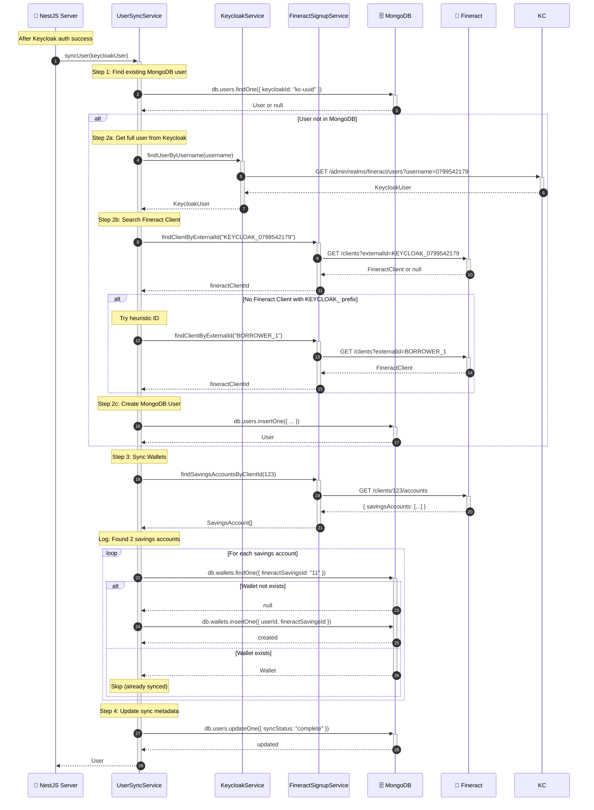

---

## 3. Get Wallets Flow

### 3.1 High-Level Overview

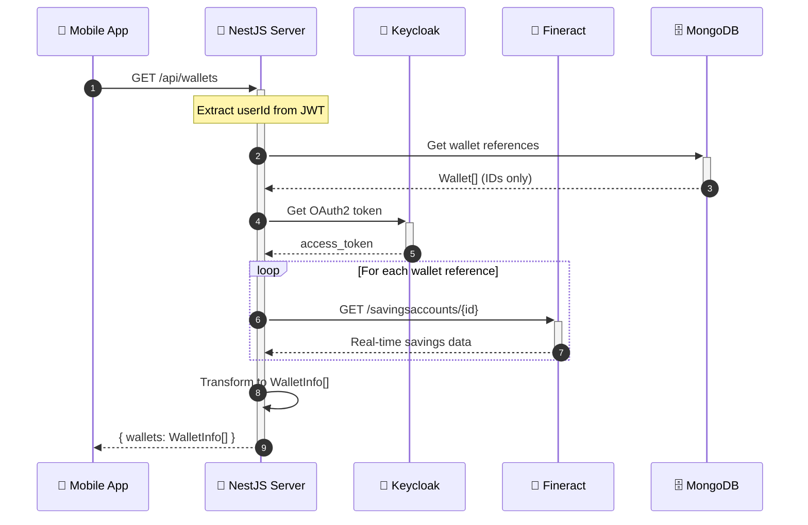

### 3.2 Detailed Flow

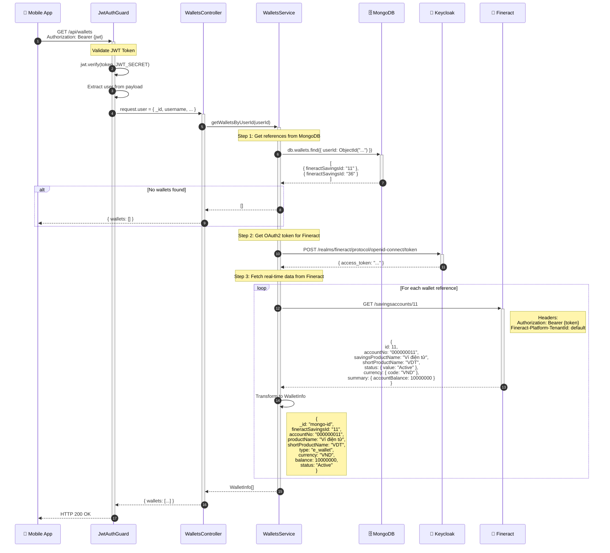

---

## 4. Sync Wallets Flow

### 4.1 High-Level Overview

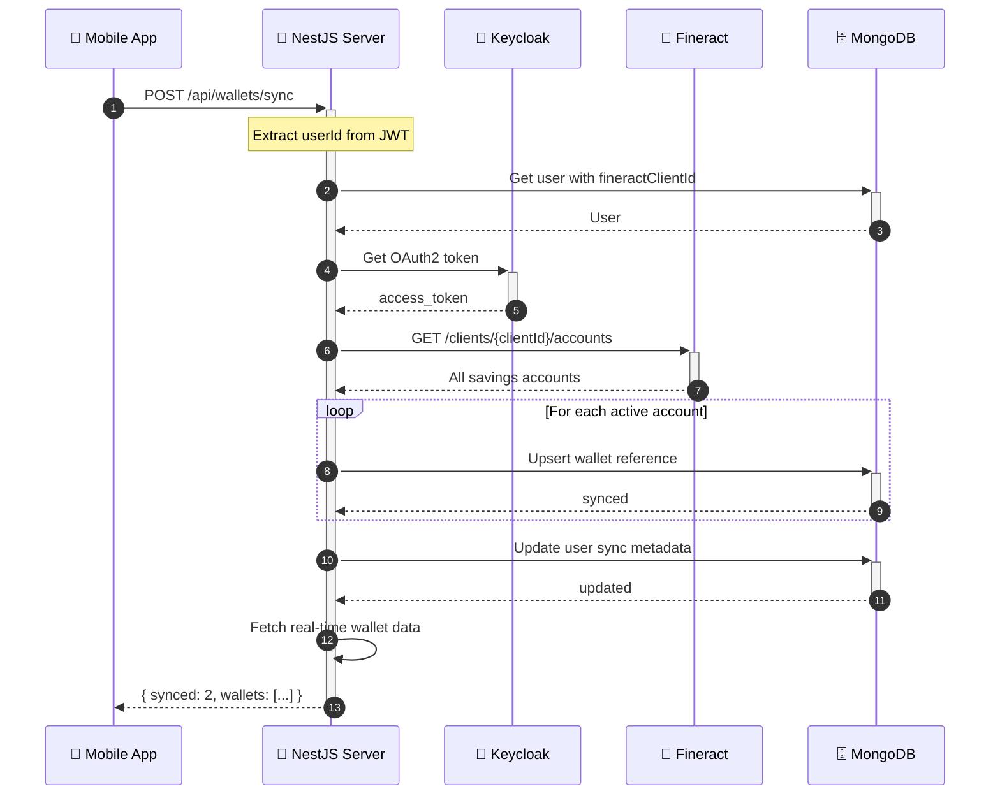

### 4.2 Detailed Flow

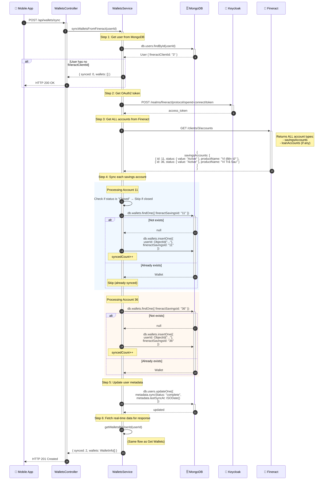

---

## 5. Refresh Token Flow

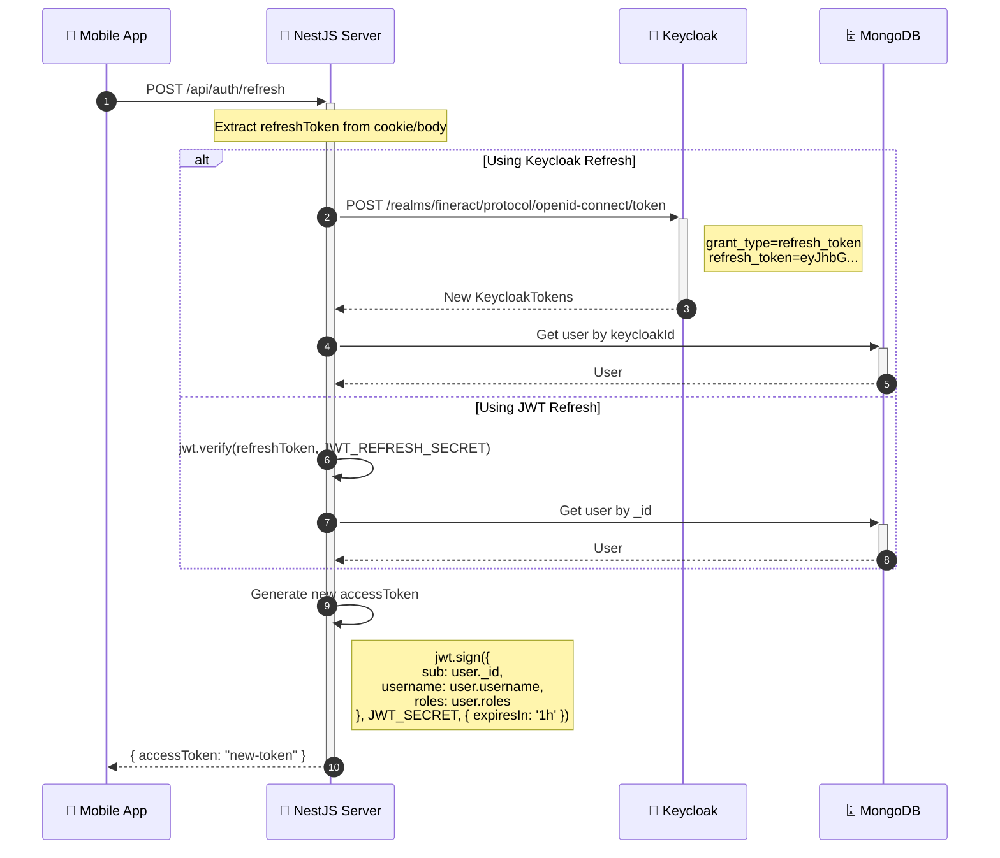

---

## 6. Logout Flow

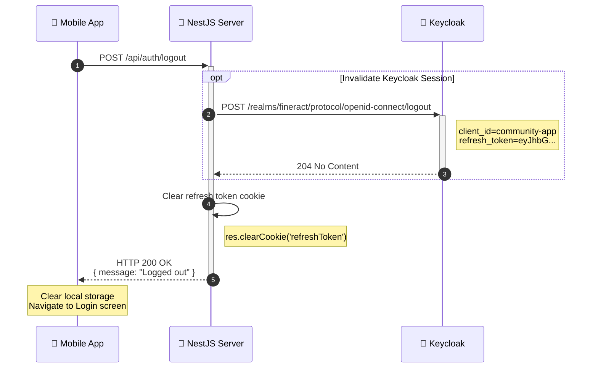

---

## 📊 Summary Matrix

| Flow | NestJS | Keycloak | Fineract | MongoDB |
|------|--------|----------|----------|---------|
| **Register** | AuthController → FineractSignupService | Create User | Create Client + 2 Accounts | Create User + 2 Wallets |
| **Login** | AuthController → UserSyncService | Authenticate User | Search/Link Client | Find/Create User, Sync Wallets |
| **Get Wallets** | WalletsController → WalletsService | Get OAuth Token | GET /savingsaccounts/{id} | Get wallet references |
| **Sync Wallets** | WalletsController → WalletsService | Get OAuth Token | GET /clients/{id}/accounts | Upsert wallet references |
| **Refresh** | AuthController | Optional refresh | - | Get user |
| **Logout** | AuthController | Invalidate session | - | - |

---

## 🔑 Key Principles

### 1. Data Ownership
- **Keycloak** owns: User credentials, authentication state
- **Fineract** owns: Client data, account balances, transactions
- **MongoDB** owns: User metadata, wallet ID references only

### 2. Real-time vs Cached
- **Real-time**: Always fetch from Fineract (balances, account status)
- **Cached**: MongoDB stores references only (fineractSavingsId)

### 3. Error Handling
- If Keycloak fails → Auth fails entirely
- If Fineract fails → User can login but wallets show empty
- If MongoDB fails → Entire system down

---

*Generated: 2026-01-19*
